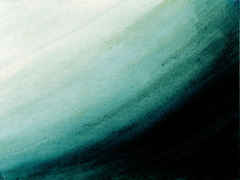
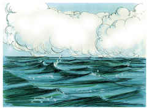
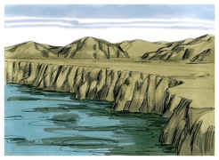
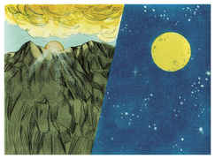
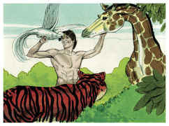
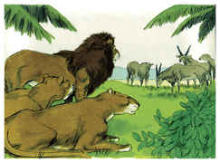
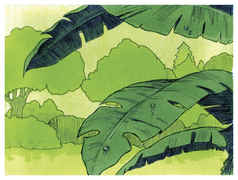
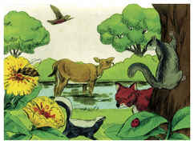
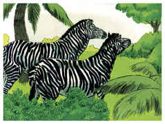
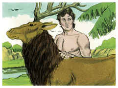

# Gênesis Capítulo 1

1	No princípio criou Deus os céus e a terra.

2	E a terra era sem forma e vazia; e havia trevas sobre a face do abismo; e o Espírito de Deus se movia sobre a face das águas.

3	E disse Deus: Haja luz; e houve luz.

4	E viu Deus que era boa a luz; e fez Deus separação entre a luz e as trevas.

5	E Deus chamou à luz Dia; e às trevas chamou Noite. E foi a tarde e a manhã, o dia primeiro.

6	E disse Deus: Haja uma expansão no meio das águas, e haja separação entre águas e águas.

7	E fez Deus a expansão, e fez separação entre as águas que estavam debaixo da expansão e as águas que estavam sobre a expansão; e assim foi.

8	E chamou Deus à expansão Céus, e foi a tarde e a manhã, o dia segundo.

9	E disse Deus: Ajuntem-se as águas debaixo dos céus num lugar; e apareça a porção seca; e assim foi.

10	E chamou Deus à porção seca Terra; e ao ajuntamento das águas chamou Mares; e viu Deus que era bom.

11	E disse Deus: Produza a terra erva verde, erva que dê semente, árvore frutífera que dê fruto segundo a sua espécie, cuja semente está nela sobre a terra; e assim foi.

12	E a terra produziu erva, erva dando semente conforme a sua espécie, e a árvore frutífera, cuja semente está nela conforme a sua espécie; e viu Deus que era bom.

13	E foi a tarde e a manhã, o dia terceiro.

14	E disse Deus: Haja luminares na expansão dos céus, para haver separação entre o dia e a noite; e sejam eles para sinais e para tempos determinados e para dias e anos.

15	E sejam para luminares na expansão dos céus, para iluminar a terra; e assim foi.

16	E fez Deus os dois grandes luminares: o luminar maior para governar o dia, e o luminar menor para governar a noite; e fez as estrelas.

17	E Deus os pôs na expansão dos céus para iluminar a terra,

18	E para governar o dia e a noite, e para fazer separação entre a luz e as trevas; e viu Deus que era bom.

19	E foi a tarde e a manhã, o dia quarto.

20	E disse Deus: Produzam as águas abundantemente répteis de alma vivente; e voem as aves sobre a face da expansão dos céus.

21	E Deus criou as grandes baleias, e todo o réptil de alma vivente que as águas abundantemente produziram conforme as suas espécies; e toda a ave de asas conforme a sua espécie; e viu Deus que era bom.

22	E Deus os abençoou, dizendo: Frutificai e multiplicai-vos, e enchei as águas nos mares; e as aves se multipliquem na terra.

23	E foi a tarde e a manhã, o dia quinto.

24	E disse Deus: Produza a terra alma vivente conforme a sua espécie; gado, e répteis e feras da terra conforme a sua espécie; e assim foi.

25	E fez Deus as feras da terra conforme a sua espécie, e o gado conforme a sua espécie, e todo o réptil da terra conforme a sua espécie; e viu Deus que era bom.

26	E disse Deus: Façamos o homem à nossa imagem, conforme a nossa semelhança; e domine sobre os peixes do mar, e sobre as aves dos céus, e sobre o gado, e sobre toda a terra, e sobre todo o réptil que se move sobre a terra.

27	E criou Deus o homem à sua imagem; à imagem de Deus o criou; homem e mulher os criou.

28	E Deus os abençoou, e Deus lhes disse: Frutificai e multiplicai-vos, e enchei a terra, e sujeitai-a; e dominai sobre os peixes do mar e sobre as aves dos céus, e sobre todo o animal que se move sobre a terra.

29	E disse Deus: Eis que vos tenho dado toda a erva que dê semente, que está sobre a face de toda a terra; e toda a árvore, em que há fruto que dê semente, ser-vos-á para mantimento.

30	E a todo o animal da terra, e a toda a ave dos céus, e a todo o réptil da terra, em que há alma vivente, toda a erva verde será para mantimento; e assim foi.

31	E viu Deus tudo quanto tinha feito, e eis que era muito bom; e foi a tarde e a manhã, o dia sexto.

