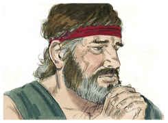
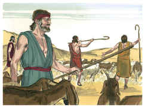
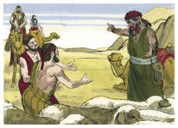
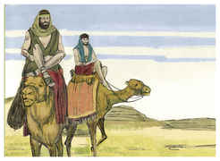
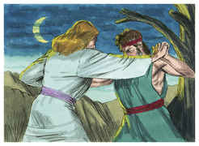
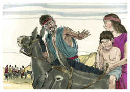

# Gênesis Capítulo 32

1	JACÓ também seguiu o seu caminho, e encontraram-no os anjos de Deus.

2	E Jacó disse, quando os viu: Este é o exército de Deus. E chamou aquele lugar Maanaim.

3	E enviou Jacó mensageiros adiante de si a Esaú, seu irmão, à terra de Seir, território de Edom.

4	E ordenou-lhes, dizendo: Assim direis a meu senhor Esaú: Assim diz Jacó, teu servo: Como peregrino morei com Labão, e me detive lá até agora;

5	E tenho bois e jumentos, ovelhas, e servos e servas; e enviei para o anunciar a meu senhor, para que ache graça em teus olhos.

6	E os mensageiros voltaram a Jacó, dizendo: Fomos a teu irmão Esaú; e também ele vem para encontrar-te, e quatrocentos homens com ele.

7	Então Jacó temeu muito e angustiou-se; e repartiu o povo que com ele estava, e as ovelhas, e as vacas, e os camelos, em dois bandos.

8	Porque dizia: Se Esaú vier a um bando e o ferir, o outro bando escapará.

9	Disse mais Jacó: Deus de meu pai Abraão, e Deus de meu pai Isaque, o Senhor, que me disseste: Torna-te à tua terra, e a tua parentela, e far-te-ei bem;

10	Menor sou eu que todas as beneficências, e que toda a fidelidade que fizeste ao teu servo; porque com meu cajado passei este Jordão, e agora me tornei em dois bandos.

11	Livra-me, peço-te, da mão de meu irmão, da mão de Esaú; porque eu o temo; porventura não venha, e me fira, e a mãe com os filhos.

12	E tu o disseste: Certamente te farei bem, e farei a tua descendência como a areia do mar, que pela multidão não se pode contar.

13	E passou ali aquela noite; e tomou do que lhe veio à sua mão, um presente para seu irmão Esaú:

14	Duzentas cabras e vinte bodes; duzentas ovelhas e vinte carneiros;

15	Trinta camelas de leite com suas crias, quarenta vacas e dez novilhos; vinte jumentas e dez jumentinhos;

16	E deu-os na mão dos seus servos, cada rebanho à parte, e disse a seus servos: Passai adiante de mim e ponde espaço entre rebanho e rebanho.

17	E ordenou ao primeiro, dizendo: Quando Esaú, meu irmão, te encontrar, e te perguntar, dizendo: De quem és, e para onde vais, e de quem são estes diante de ti?

18	Então dirás: São de teu servo Jacó, presente que envia a meu senhor, a Esaú; e eis que ele mesmo vem também atrás de nós.

19	E ordenou também ao segundo, e ao terceiro, e a todos os que vinham atrás dos rebanhos, dizendo: Conforme a esta mesma palavra falareis a Esaú, quando o achardes.

20	E direis também: Eis que o teu servo Jacó vem atrás de nós. Porque dizia: Eu o aplacarei com o presente, que vai adiante de mim, e depois verei a sua face; porventura ele me aceitará.

21	Assim, passou o presente adiante dele; ele, porém, passou aquela noite no arraial.

22	E levantou-se aquela mesma noite, e tomou as suas duas mulheres, e as suas duas servas, e os seus onze filhos, e passou o vau de Jaboque.

23	E tomou-os e fê-los passar o ribeiro; e fez passar tudo o que tinha.

24	Jacó, porém, ficou só; e lutou com ele um homem, até que a alva subiu.

25	E vendo este que não prevalecia contra ele, tocou a juntura de sua coxa, e se deslocou a juntura da coxa de Jacó, lutando com ele.

26	E disse: Deixa-me ir, porque já a alva subiu. Porém ele disse: Não te deixarei ir, se não me abençoares.

27	E disse-lhe: Qual é o teu nome? E ele disse: Jacó.

28	Então disse: Não te chamarás mais Jacó, mas Israel; pois como príncipe lutaste com Deus e com os homens, e prevaleceste.

29	E Jacó lhe perguntou, e disse: Dá-me, peço-te, a saber o teu nome. E disse: Por que perguntas pelo meu nome? E abençoou-o ali.

30	E chamou Jacó o nome daquele lugar Peniel, porque dizia: Tenho visto a Deus face a face, e a minha alma foi salva.

31	E saiu-lhe o sol, quando passou a Peniel; e manquejava da sua coxa.

32	Por isso os filhos de Israel não comem o nervo encolhido, que está sobre a juntura da coxa, até o dia de hoje; porquanto tocara a juntura da coxa de Jacó no nervo encolhido.

