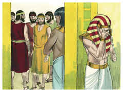
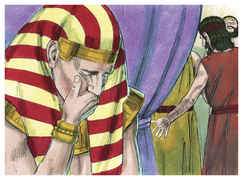
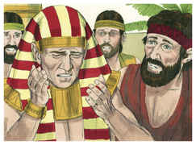
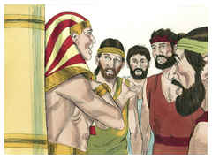
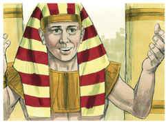
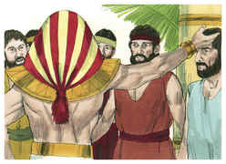
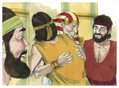
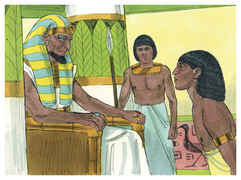
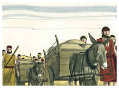
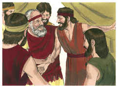

# Gênesis Capítulo 45

1	ENTÃO José não se podia conter diante de todos os que estavam com ele; e clamou: Fazei sair daqui a todo o homem; e ninguém ficou com ele, quando José se deu a conhecer a seus irmãos.

2	E levantou a sua voz com choro, de maneira que os egípcios o ouviam, e a casa de Faraó o ouviu.

3	E disse José a seus irmãos: Eu sou José; vive ainda meu pai? E seus irmãos não lhe puderam responder, porque estavam pasmados diante da sua face.

4	E disse José a seus irmãos: Peço-vos, chegai-vos a mim. E chegaram-se; então disse ele: Eu sou José vosso irmão, a quem vendestes para o Egito.

5	Agora, pois, não vos entristeçais, nem vos pese aos vossos olhos por me haverdes vendido para cá; porque para conservação da vida, Deus me enviou adiante de vós.

6	Porque já houve dois anos de fome no meio da terra, e ainda restam cinco anos em que não haverá lavoura nem sega.

7	Pelo que Deus me enviou adiante de vós, para conservar vossa sucessão na terra, e para guardar-vos em vida por um grande livramento.

8	Assim não fostes vós que me enviastes para cá, senão Deus, que me tem posto por pai de Faraó, e por senhor de toda a sua casa, e como regente em toda a terra do Egito.

9	Apressai-vos, e subi a meu pai, e dizei-lhe: Assim tem dito o teu filho José: Deus me tem posto por senhor em toda a terra do Egito; desce a mim, e não te demores;

10	E habitarás na terra de Gósen, e estarás perto de mim, tu e os teus filhos, e os filhos dos teus filhos, e as tuas ovelhas, e as tuas vacas, e tudo o que tens.

11	E ali te sustentarei, porque ainda haverá cinco anos de fome, para que não pereças de pobreza, tu e tua casa, e tudo o que tens.

12	E eis que vossos olhos, e os olhos de meu irmão Benjamim, vêem que é minha boca que vos fala.

13	E fazei saber a meu pai toda a minha glória no Egito, e tudo o que tendes visto, e apressai-vos a fazer descer meu pai para cá.

14	E lançou-se ao pescoço de Benjamim seu irmão, e chorou; e Benjamim chorou também ao seu pescoço.

15	E beijou a todos os seus irmãos, e chorou sobre eles; e depois seus irmãos falaram com ele.

16	E esta notícia ouviu-se na casa de Faraó: Os irmãos de José são vindos; e pareceu bem aos olhos de Faraó, e aos olhos de seus servos.

17	E disse Faraó a José: Dize a teus irmãos: Fazei isto: carregai os vossos animais e parti, tornai à terra de Canaã.

18	E tornai a vosso pai, e às vossas famílias, e vinde a mim; e eu vos darei o melhor da terra do Egito, e comereis da fartura da terra.

19	A ti, pois, é ordenado: Fazei isto: tomai vós da terra do Egito carros para vossos meninos, para vossas mulheres, e para vosso pai, e vinde.

20	E não vos pese coisa alguma dos vossos utensílios; porque o melhor de toda a terra do Egito será vosso.

21	E os filhos de Israel fizeram assim. E José deu-lhes carros, conforme o mandado de Faraó; também lhes deu comida para o caminho.

22	A todos lhes deu, a cada um, mudas de roupas; mas a Benjamim deu trezentas peças de prata, e cinco mudas de roupas.

23	E a seu pai enviou semelhantemente dez jumentos carregados do melhor do Egito, e dez jumentos carregados de trigo e pão, e comida para seu pai, para o caminho.

24	E despediu os seus irmãos, e partiram; e disse-lhes: Não contendais pelo caminho.

25	E subiram do Egito, e vieram à terra de Canaã, a Jacó seu pai.

26	Então lhe anunciaram, dizendo: José ainda vive, e ele também é regente em toda a terra do Egito. E o seu coração desmaiou, porque não os acreditava.

27	Porém, havendo-lhe eles contado todas as palavras de José, que ele lhes falara, e vendo ele os carros que José enviara para levá-lo, reviveu o espírito de Jacó seu pai.

28	E disse Israel: Basta; ainda vive meu filho José; eu irei e o verei antes que morra.

