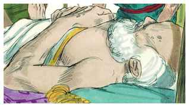

# Gênesis Capítulo 47

1	ENTÃO veio José e anunciou a Faraó, e disse: Meu pai e os meus irmãos e as suas ovelhas, e as suas vacas, com tudo o que têm, são vindos da terra de Canaã, e eis que estão na terra de Gósen.

2	E tomou uma parte de seus irmãos, a saber, cinco homens, e os pôs diante de Faraó.

3	Então disse Faraó a seus irmãos: Qual é o vosso negócio? E eles disseram a Faraó: Teus servos são pastores de ovelhas, tanto nós como nossos pais.

4	Disseram mais a Faraó: Viemos para peregrinar nesta terra; porque não há pasto para as ovelhas de teus servos, porquanto a fome é grave na terra de Canaã; agora, pois, rogamos-te que teus servos habitem na terra de Gósen.

5	Então falou Faraó a José, dizendo: Teu pai e teus irmãos vieram a ti;

6	A terra do Egito está diante de ti; no melhor da terra faze habitar teu pai e teus irmãos; habitem na terra de Gósen, e se sabes que entre eles há homens valentes, os porás por maiorais do gado, sobre o que eu tenho.

7	E trouxe José a Jacó, seu pai, e o apresentou a Faraó; e Jacó abençoou a Faraó.

8	E Faraó disse a Jacó: Quantos são os dias dos anos da tua vida?

9	E Jacó disse a Faraó: Os dias dos anos das minhas peregrinações são cento e trinta anos, poucos e maus foram os dias dos anos da minha vida, e não chegaram aos dias dos anos da vida de meus pais nos dias das suas peregrinações.

10	E Jacó abençoou a Faraó, e saiu da sua presença.

11	E José fez habitar a seu pai e seus irmãos e deu-lhes possessão na terra do Egito, no melhor da terra, na terra de Ramessés, como Faraó ordenara.

12	E José sustentou de pão a seu pai, seus irmãos e toda a casa de seu pai, segundo as suas famílias.

13	E não havia pão em toda a terra, porque a fome era muito grave; de modo que a terra do Egito e a terra de Canaã desfaleciam por causa da fome.

14	Então José recolheu todo o dinheiro que se achou na terra do Egito, e na terra de Canaã, pelo trigo que compravam; e José trouxe o dinheiro à casa de Faraó.

15	Acabando-se, pois, o dinheiro da terra do Egito, e da terra de Canaã, vieram todos os egípcios a José, dizendo: Dá-nos pão; por que morreremos em tua presença? porquanto o dinheiro nos falta.

16	E José disse: Dai o vosso gado, e eu vo-lo darei por vosso gado, se falta o dinheiro.

17	Então trouxeram o seu gado a José; e José deu-lhes pão em troca de cavalos, e das ovelhas, e das vacas e dos jumentos; e os sustentou de pão aquele ano por todo o seu gado.

18	E acabado aquele ano, vieram a ele no segundo ano e disseram-lhe: Não ocultaremos ao meu senhor que o dinheiro acabou; e meu senhor possui os animais, e nenhuma outra coisa nos ficou diante de meu senhor, senão o nosso corpo e a nossa terra;

19	Por que morreremos diante dos teus olhos, tanto nós como a nossa terra? Compra-nos a nós e a nossa terra por pão, e nós e a nossa terra seremos servos de Faraó; e dá-nos semente, para que vivamos, e não morramos, e a terra não se desole.

20	Assim José comprou toda a terra do Egito para Faraó, porque os egípcios venderam cada um o seu campo, porquanto a fome prevaleceu sobre eles; e a terra ficou sendo de Faraó.

21	E, quanto ao povo, fê-lo passar às cidades, desde uma extremidade da terra do Egito até a outra extremidade.

22	Somente a terra dos sacerdotes não a comprou, porquanto os sacerdotes tinham porção de Faraó, e eles comiam a sua porção que Faraó lhes tinha dado; por isso não venderam a sua terra.

23	Então disse José ao povo: Eis que hoje tenho comprado a vós e a vossa terra para Faraó; eis aí tendes semente para vós, para que semeeis a terra.

24	Há de ser, porém, que das colheitas dareis o quinto a Faraó, e as quatro partes serão vossas, para semente do campo, e para o vosso mantimento, e dos que estão nas vossas casas, e para que comam vossos filhos.

25	E disseram: A vida nos tens dado; achemos graça aos olhos de meu senhor, e seremos servos de Faraó.

26	José, pois, estabeleceu isto por estatuto, até ao dia de hoje, sobre a terra do Egito, que Faraó tirasse o quinto; só a terra dos sacerdotes não ficou sendo de Faraó.

27	Assim habitou Israel na terra do Egito, na terra de Gósen, e nela tomaram possessão, e frutificaram, e multiplicaram-se muito.

28	E Jacó viveu na terra do Egito dezessete anos, de sorte que os dias de Jacó, os anos da sua vida, foram cento e quarenta e sete anos.

29	Chegando-se, pois, o tempo da morte de Israel, chamou a José, seu filho, e disse-lhe: Se agora tenho achado graça em teus olhos, rogo-te que ponhas a tua mão debaixo da minha coxa, e usa comigo de beneficência e verdade; rogo-te que não me enterres no Egito,

30	Mas que eu jaza com os meus pais; por isso me levarás do Egito e me enterrarás na sepultura deles. E ele disse: Farei conforme a tua palavra.

31	E disse ele: Jura-me. E ele jurou-lhe; e Israel inclinou-se sobre a cabeceira da cama.

