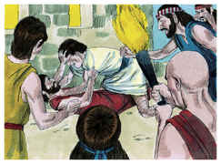
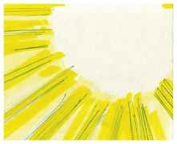
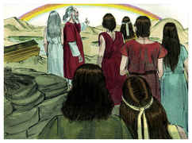
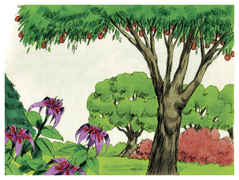
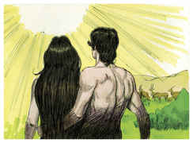

# Gênesis Capítulo 9

1	E ABENÇOOU Deus a Noé e a seus filhos, e disse-lhes: Frutificai e multiplicai-vos e enchei a terra.

2	E o temor de vós e o pavor de vós virão sobre todo o animal da terra, e sobre toda a ave dos céus; tudo o que se move sobre a terra, e todos os peixes do mar, nas vossas mãos são entregues.

3	Tudo quanto se move, que é vivente, será para vosso mantimento; tudo vos tenho dado como a erva verde.

4	A carne, porém, com sua vida, isto é, com seu sangue, não comereis.

5	Certamente requererei o vosso sangue, o sangue das vossas vidas; da mão de todo o animal o requererei; como também da mão do homem, e da mão do irmão de cada um requererei a vida do homem.

6	Quem derramar o sangue do homem, pelo homem o seu sangue será derramado; porque Deus fez o homem conforme a sua imagem.

7	Mas vós frutificai e multiplicai-vos; povoai abundantemente a terra, e multiplicai-vos nela.

8	E falou Deus a Noé e a seus filhos com ele, dizendo:

9	E eu, eis que estabeleço a minha aliança convosco e com a vossa descendência depois de vós.

10	E com toda a alma vivente, que convosco está, de aves, de gado, e de todo o animal da terra convosco; com todos que saíram da arca, até todo o animal da terra.

11	E eu convosco estabeleço a minha aliança, que não será mais destruída toda a carne pelas águas do dilúvio, e que não haverá mais dilúvio, para destruir a terra.

12	E disse Deus: Este é o sinal da aliança que ponho entre mim e vós, e entre toda a alma vivente, que está convosco, por gerações eternas.

13	O meu arco tenho posto nas nuvens; este será por sinal da aliança entre mim e a terra.

14	E acontecerá que, quando eu trouxer nuvens sobre a terra, aparecerá o arco nas nuvens.

15	Então me lembrarei da minha aliança, que está entre mim e vós, e entre toda a alma vivente de toda a carne; e as águas não se tornarão mais em dilúvio para destruir toda a carne.

16	E estará o arco nas nuvens, e eu o verei, para me lembrar da aliança eterna entre Deus e toda a alma vivente de toda a carne, que está sobre a terra.

17	E disse Deus a Noé: Este é o sinal da aliança que tenho estabelecido entre mim e entre toda a carne, que está sobre a terra.

18	E os filhos de Noé, que da arca saíram, foram Sem, Cão e Jafé; e Cão é o pai de Canaã.

19	Estes três foram os filhos de Noé; e destes se povoou toda a terra.

20	E começou Noé a ser lavrador da terra, e plantou uma vinha.

21	E bebeu do vinho, e embebedou-se; e descobriu-se no meio de sua tenda.

22	E viu Cão, o pai de Canaã, a nudez do seu pai, e fê-lo saber a ambos seus irmãos no lado de fora.

23	Então tomaram Sem e Jafé uma capa, e puseram-na sobre ambos os seus ombros, e indo virados para trás, cobriram a nudez do seu pai, e os seus rostos estavam virados, de maneira que não viram a nudez do seu pai.

24	E despertou Noé do seu vinho, e soube o que seu filho menor lhe fizera.

25	E disse: Maldito seja Canaã; servo dos servos seja aos seus irmãos.

26	E disse: Bendito seja o Senhor Deus de Sem; e seja-lhe Canaã por servo.

27	Alargue Deus a Jafé, e habite nas tendas de Sem; e seja-lhe Canaã por servo.

28	E viveu Noé, depois do dilúvio, trezentos e cinqüenta anos.

29	E foram todos os dias de Noé novecentos e cinqüenta anos, e morreu.

