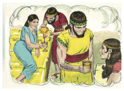
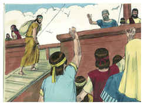
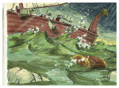
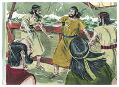
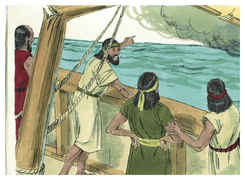
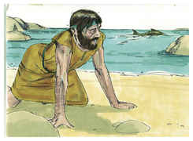

# Jonas Capítulo 1

1	E VEIO a palavra do Senhor a Jonas, filho de Amitai, dizendo:

2	Levanta-te, vai à grande cidade de Nínive, e clama contra ela, porque a sua malícia subiu até à minha presença.

3	Porém, Jonas se levantou para fugir da presença do Senhor para Társis. E descendo a Jope, achou um navio que ia para Társis; pagou, pois, a sua passagem, e desceu para dentro dele, para ir com eles para Társis, para longe da presença do Senhor.

4	Mas o Senhor mandou ao mar um grande vento, e fez-se no mar uma forte tempestade, e o navio estava a ponto de quebrar-se.

5	Então temeram os marinheiros, e clamavam cada um ao seu deus, e lançaram ao mar as cargas, que estavam no navio, para o aliviarem do seu peso; Jonas, porém, desceu ao porão do navio, e, tendo-se deitado, dormia um profundo sono.

6	E o mestre do navio chegou-se a ele, e disse-lhe: Que tens, dorminhoco? Levanta-te, clama ao teu Deus; talvez assim ele se lembre de nós para que não pereçamos.

7	E diziam cada um ao seu companheiro: Vinde, e lancemos sortes, para que saibamos por que causa nos sobreveio este mal. E lançaram sortes, e a sorte caiu sobre Jonas.

8	Então lhe disseram: Declara-nos tu agora, por causa de quem nos sobreveio este mal. Que ocupação é a tua? Donde vens? Qual é a tua terra? E de que povo és tu?

9	E ele lhes disse: Eu sou hebreu, e temo ao Senhor, o Deus do céu, que fez o mar e a terra seca.

10	Então estes homens se encheram de grande temor, e disseram-lhe: Por que fizeste tu isto? Pois sabiam os homens que fugia da presença do Senhor, porque ele lho tinha declarado.

11	E disseram-lhe: Que te faremos nós, para que o mar se nos acalme? Porque o mar ia se tornando cada vez mais tempestuoso.

12	E ele lhes disse: Levantai-me, e lançai-me ao mar, e o mar se vos aquietará; porque eu sei que por minha causa vos sobreveio esta grande tempestade.

13	Entretanto, os homens remavam, para fazer voltar o navio à terra, mas não podiam, porquanto o mar se ia embravecendo cada vez mais contra eles.

14	Então clamaram ao Senhor, e disseram: Ah, Senhor! Nós te rogamos, que não pereçamos por causa da alma deste homem, e que não ponhas sobre nós o sangue inocente; porque tu, Senhor, fizeste como te aprouve.

15	E levantaram a Jonas, e o lançaram ao mar, e cessou o mar da sua fúria.

16	Temeram, pois, estes homens ao Senhor com grande temor; e ofereceram sacrifício ao Senhor, e fizeram votos.

17	Preparou, pois, o Senhor um grande peixe, para que tragasse a Jonas; e esteve Jonas três dias e três noites nas entranhas do peixe.

