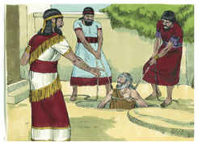
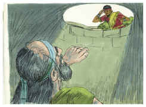
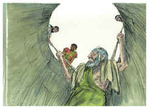

# Jeremías Capítulo 38

1	OUVIRAM, pois, Sefatias, filho de Matã, e Gedalias, filho de Pasur, e Jucal, filho de Selemias, e Pasur, filho de Malquias, as palavras que anunciava Jeremias a todo o povo, dizendo:

2	Assim diz o Senhor: O que ficar nesta cidade morrerá à espada, de fome e de pestilência; mas o que sair aos caldeus viverá; porque a sua alma lhe será por despojo, e viverá.

3	Assim diz o Senhor: Esta cidade infalivelmente será entregue na mão do exército do rei de Babilônia, e ele a tomará.

4	E disseram os príncipes ao rei: Morra este homem, visto que ele assim enfraquece as mãos dos homens de guerra que restam nesta cidade, e as mãos de todo o povo, dizendo-lhes tais palavras; porque este homem não busca a paz para este povo, porém o mal.

5	E disse o rei Zedequias: Eis que ele está na vossa mão; porque o rei nada pode fazer contra vós.

6	Então tomaram a Jeremias, e o lançaram na cisterna de Malquias, filho do rei, que estava no átrio da guarda; e desceram a Jeremias com cordas; mas na cisterna não havia água, senão lama; e atolou-se Jeremias na lama.

7	E, ouvindo Ebede-Meleque, o etíope, um eunuco que então estava na casa do rei, que tinham posto a Jeremias na cisterna (estava, porém, o rei assentado à porta de Benjamim),

8	Logo Ebede-Meleque saiu da casa do rei, e falou ao rei, dizendo:

9	Ó rei, senhor meu, estes homens agiram mal em tudo quanto fizeram a Jeremias, o profeta, lançando-o na cisterna; de certo morrerá de fome no lugar onde se acha, pois não há mais pão na cidade.

10	Então deu ordem o rei a Ebede-Meleque, o etíope, dizendo: Toma contigo daqui trinta homens, e tira a Jeremias, o profeta, da cisterna, antes que morra.

11	E tomou Ebede-Meleque os homens consigo, e foi à casa do rei, por debaixo da tesouraria, e tomou dali uns trapos velhos e rotos, e roupas velhas, e desceu-os a Jeremias na cisterna por meio de cordas.

12	E disse Ebede-Meleque, o etíope, a Jeremias: Põe agora estes trapos velhos e rotos, já apodrecidos, nas axilas, calçando as cordas. E Jeremias assim o fez.

13	E puxaram a Jeremias com as cordas, e o alçaram da cisterna; e ficou Jeremias no átrio da guarda.

14	Então o rei Zedequias mandou trazer à sua presença Jeremias, o profeta, à terceira entrada da casa do Senhor; e disse o rei a Jeremias: Pergunto-te uma coisa, não me encubras nada.

15	E disse Jeremias a Zedequias: Se eu te declarar, porventura não me matarás? E se eu te aconselhar, não me ouvirás?

16	Então jurou o rei Zedequias a Jeremias, em segredo, dizendo: Vive o Senhor, que nos fez esta alma, que não te matarei nem te entregarei na mão destes homens que procuram a tua morte.

17	Então Jeremias disse a Zedequias: Assim diz o Senhor, Deus dos Exércitos, Deus de Israel: Se voluntariamente saíres aos príncipes do rei de Babilônia, então viverá a tua alma, e esta cidade não se queimará a fogo, e viverás tu e a tua casa.

18	Mas, se não saíres aos príncipes do rei de Babilônia, então será entregue esta cidade na mão dos caldeus, e queimá-la-ão a fogo, e tu não escaparás da mão deles.

19	E disse o rei Zedequias a Jeremias: Receio-me dos judeus, que se passaram para os caldeus; que estes me entreguem na mão deles, e escarneçam de mim.

20	E disse Jeremias: Não te entregarão; ouve, peço-te, a voz do Senhor, conforme a qual eu te falo; e bem te irá, e viverá a tua alma.

21	Mas, se tu não quiseres sair, esta é a palavra que me mostrou o Senhor:

22	Eis que todas as mulheres que ficaram na casa do rei de Judá serão levadas aos príncipes do rei de Babilônia, e elas mesmas dirão: Teus pacificadores te incitaram e prevaleceram contra ti, mas agora que se atolaram os teus pés na lama, voltaram atrás.

23	Assim que a todas as tuas mulheres e a teus filhos levarão aos caldeus, e nem tu escaparás da sua mão, antes pela mão do rei de Babilônia serás preso, e esta cidade será queimada a fogo.

24	Então disse Zedequias a Jeremias: Ninguém saiba estas palavras, e não morrerás.

25	E quando os príncipes, ouvindo que falei contigo, vierem a ti, e te disserem: Declara-nos agora o que disseste ao rei e o que ele te disse, não no-lo encubras, e não te mataremos;

26	Então lhes dirás: Eu lancei a minha súplica diante do rei, que não me fizesse tornar à casa de Jônatas, para morrer ali.

27	Vindo, pois, todos os príncipes a Jeremias, e interrogando-o, declarou-lhes todas as palavras que o rei lhe havia ordenado; e calados o deixaram, porque o assunto não foi revelado.

28	E ficou Jeremias no átrio da guarda, até o dia em que Jerusalém foi tomada, e ainda ali estava quando Jerusalém foi tomada.

