# Josué Capítulo 2

1	E JOSUÉ, filho de Num, enviou secretamente, de Sitim, dois homens a espiar, dizendo: Ide reconhecer a terra e a Jericó. Foram, pois, e entraram na casa de uma mulher prostituta, cujo nome era Raabe, e dormiram ali.

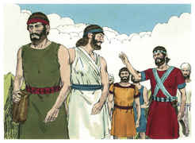

2	Então deu-se notícia ao rei de Jericó, dizendo: Eis que esta noite vieram aqui uns homens dos filhos de Israel, para espiar a terra.

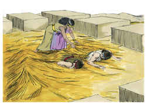

3	Por isso mandou o rei de Jericó dizer a Raabe: Tira fora os homens que vieram a ti e entraram na tua casa, porque vieram espiar toda a terra.

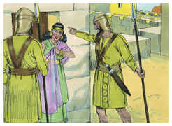

4	Porém aquela mulher tomou os dois homens, e os escondeu, e disse: É verdade que vieram homens a mim, porém eu não sabia de onde eram.

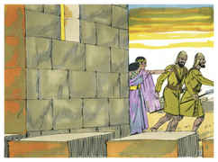

5	E aconteceu que, havendo-se de fechar a porta, sendo já escuro, aqueles homens saíram; não sei para onde aqueles homens se foram; ide após eles depressa, porque os alcançareis.

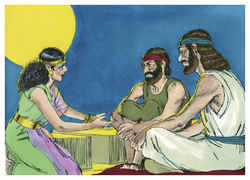

6	Porém ela os tinha feito subir ao eirado, e os tinha escondido entre as canas do linho, que pusera em ordem sobre o eirado.

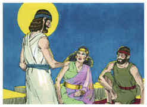

7	E foram-se aqueles homens após eles pelo caminho do Jordão, até aos vaus; e, havendo eles saído, fechou-se a porta.

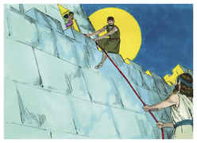

8	E, antes que eles dormissem, ela subiu a eles no eirado;

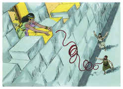

9	E disse aos homens: Bem sei que o Senhor vos deu esta terra e que o pavor de vós caiu sobre nós, e que todos os moradores da terra estão desfalecidos diante de vós.

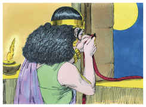

10	Porque temos ouvido que o Senhor secou as águas do Mar Vermelho diante de vós, quando saíeis do Egito, e o que fizestes aos dois reis dos amorreus, a Siom e a Ogue, que estavam além do Jordão, os quais destruístes.

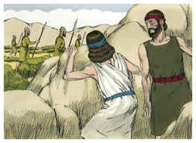

11	O que ouvindo, desfaleceu o nosso coração, e em ninguém mais há ânimo algum, por causa da vossa presença; porque o Senhor vosso Deus é Deus em cima nos céus e em baixo na terra.

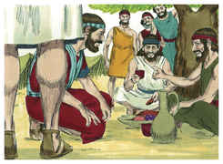

12	Agora, pois, jurai-me, vos peço, pelo Senhor, que, como usei de misericórdia convosco, vós também usareis de misericórdia para com a casa de meu pai, e dai-me um sinal seguro,

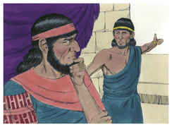

13	De que conservareis com a vida a meu pai e a minha mãe, como também a meus irmãos e a minhas irmãs, com tudo o que têm e de que livrareis as nossas vidas da morte.

14	Então aqueles homens responderam-lhe: A nossa vida responderá pela vossa até à morte, se não denunciardes este nosso negócio, e será, pois, que, dando-nos o Senhor esta terra, usaremos contigo de misericórdia e de fidelidade.

15	Ela então os fez descer por uma corda pela janela, porquanto a sua casa estava sobre o muro da cidade, e ela morava sobre o muro.

16	E disse-lhes: Ide-vos ao monte, para que, porventura, não vos encontrem os perseguidores, e escondei-vos lá três dias, até que voltem os perseguidores, e depois ide pelo vosso caminho.

17	E, disseram-lhe aqueles homens: Desobrigados seremos deste juramento que nos fizeste jurar.

18	Eis que, quando nós entrarmos na terra, atarás este cordão de fio de escarlata à janela por onde nos fizeste descer; e recolherás em casa contigo a teu pai, e a tua mãe, e a teus irmãos e a toda a família de teu pai.

19	Será, pois, que qualquer que sair fora da porta da tua casa, o seu sangue será sobre a sua cabeça, e nós seremos inocentes; mas qualquer que estiver contigo, em casa, o seu sangue seja sobre a nossa cabeça, se alguém nele puser mão.

20	Porém, se tu denunciares este nosso negócio, seremos desobrigados do juramento que nos fizeste jurar.

21	E ela disse: Conforme as vossas palavras, assim seja. Então os despediu; e eles se foram; e ela atou o cordão de escarlata à janela.

22	Foram-se, pois, e chegaram ao monte, e ficaram ali três dias, até que voltaram os perseguidores, porque os perseguidores os buscaram por todo o caminho, porém não os acharam.

23	Assim aqueles dois homens voltaram, e desceram do monte, e passaram, e chegaram a Josué, filho de Num, e contaram-lhe tudo quanto lhes acontecera;

24	E disseram a Josué: Certamente o Senhor tem dado toda esta terra nas nossas mãos, pois até todos os moradores estão atemorizados diante de nós.

