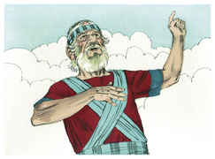
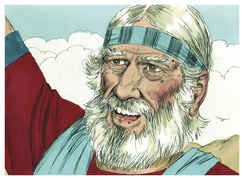
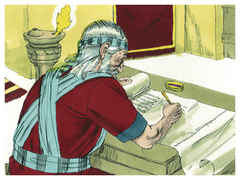
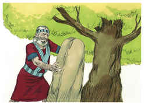
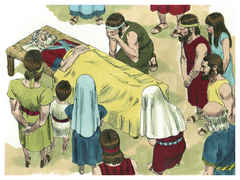
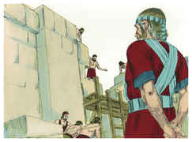
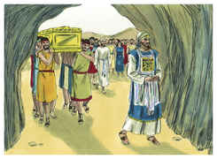
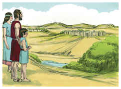

# Josué Capítulo 24

1	DEPOIS reuniu Josué todas as tribos de Israel em Siquém; e chamou os anciãos de Israel, e os seus cabeças, e os seus juízes, e os seus oficiais; e eles se apresentaram diante de Deus.

2	Então Josué disse a todo o povo: Assim diz o Senhor Deus de Israel: Além do rio habitaram antigamente vossos pais, Terá, pai de Abraão e pai de Naor; e serviram a outros deuses.

3	Eu, porém, tomei a vosso pai Abraão dalém do rio e o fiz andar por toda a terra de Canaã; também multipliquei a sua descendência e dei-lhe a Isaque.

4	E a Isaque dei Jacó e Esaú; e a Esaú dei a montanha de Seir, para a possuir; porém, Jacó e seus filhos desceram para o Egito.

5	Então enviei Moisés e Arão e feri ao Egito, como o fiz no meio deles; e depois vos tirei de lá.

6	E, tirando eu a vossos pais do Egito, viestes ao mar; e os egípcios perseguiram a vossos pais com carros e com cavaleiros, até ao Mar Vermelho.

7	E clamaram ao Senhor, que pôs uma escuridão entre vós e os egípcios, e trouxe o mar sobre eles, e os cobriu, e os vossos olhos viram o que eu fiz no Egito; depois habitastes no deserto muitos dias.

8	Então eu vos trouxe à terra dos amorreus, que habitavam além do Jordão, os quais pelejaram contra vós; porém os entreguei nas vossas mãos, e possuístes a sua terra, e os destruí de diante de vós.

9	Levantou-se também Balaque, filho de Zipor, rei dos moabitas e pelejou contra Israel; e mandou chamar a Balaão, filho de Beor, para que vos amaldiçoasse.

10	Porém eu não quis ouvir a Balaão; pelo que ele vos abençoou grandemente e eu vos livrei da sua mão.

11	E, passando vós o Jordão, e vindo a Jericó, os habitantes de Jericó pelejaram contra vós, os amorreus, e os perizeus, e os cananeus, e os heteus, e os girgaseus, e os heveus, e os jebuseus; porém os entreguei nas vossas mãos.

12	E enviei vespões adiante de vós, que os expulsaram de diante de vós, como a ambos os reis dos amorreus; não com a tua espada nem com o teu arco.

13	E eu vos dei a terra em que não trabalhastes, e cidades que não edificastes, e habitais nelas e comeis das vinhas e dos olivais que não plantastes.

14	Agora, pois, temei ao Senhor, e servi-o com sinceridade e com verdade; e deitai fora os deuses aos quais serviram vossos pais além do rio e no Egito, e servi ao Senhor.

15	Porém, se vos parece mal aos vossos olhos servir ao Senhor, escolhei hoje a quem sirvais; se aos deuses a quem serviram vossos pais, que estavam além do rio, ou aos deuses dos amorreus, em cuja terra habitais; porém eu e a minha casa serviremos ao Senhor.

16	Então respondeu o povo, e disse: Nunca nos aconteça que deixemos ao Senhor para servirmos a outros deuses;

17	Porque o Senhor é o nosso Deus; ele é o que nos fez subir, a nós e a nossos pais, da terra do Egito, da casa da servidão, e o que tem feito estes grandes sinais aos nossos olhos, e nos guardou por todo o caminho que andamos, e entre todos os povos pelo meio dos quais passamos.

18	E o Senhor expulsou de diante de nós a todos esses povos, até ao amorreu, morador da terra; também nós serviremos ao Senhor, porquanto é nosso Deus.

19	Então Josué disse ao povo: Não podereis servir ao Senhor, porquanto é Deus santo, é Deus zeloso, que não perdoará a vossa transgressão nem os vossos pecados.

20	Se deixardes ao Senhor, e servirdes a deuses estranhos, então ele se tornará, e vos fará mal, e vos consumirá, depois de vos ter feito o bem.

21	Então disse o povo a Josué: Não, antes ao Senhor serviremos.

22	E Josué disse ao povo: Sois testemunhas contra vós mesmos de que escolhestes ao Senhor, para o servir. E disseram: Somos testemunhas.

23	Deitai, pois, agora, fora aos deuses estranhos que há no meio de vós, e inclinai o vosso coração ao Senhor Deus de Israel.

24	E disse o povo a Josué: Serviremos ao Senhor nosso Deus, e obedeceremos à sua voz.

25	Assim, naquele dia fez Josué aliança com o povo e lhe pôs por estatuto e direito em Siquém.

26	E Josué escreveu estas palavras no livro da lei de Deus; e tomou uma grande pedra, e a erigiu ali debaixo do carvalho que estava junto ao santuário do Senhor.

27	E disse Josué a todo o povo: Eis que esta pedra nos será por testemunho, pois ela ouviu todas as palavras, que o Senhor nos tem falado; e também será testemunho contra vós, para que não mintais a vosso Deus.

28	Então Josué enviou o povo, cada um para a sua herança.

29	E depois destas coisas sucedeu que Josué, filho de Num, servo do Senhor, faleceu, com idade de cento e dez anos.

30	E sepultaram-no no termo da sua herança, em Timnate-Sera, que está no monte de Efraim, para o norte do monte de Gaás.

31	Serviu, pois, Israel ao Senhor todos os dias de Josué, e todos os dias dos anciãos que ainda sobreviveram muito tempo depois de Josué, e que sabiam todas as obras que o Senhor tinha feito a Israel.

32	Também os ossos de José, que os filhos de Israel trouxeram do Egito, foram enterrados em Siquém, naquela parte do campo que Jacó comprara aos filhos de Hemor, pai de Siquém, por cem peças de prata, e que se tornara herança dos filhos de José.

33	Faleceu também Eleazar, filho de Arão, e o sepultaram no outeiro de Finéias, seu filho, que lhe fora dado na montanha de Efraim.

