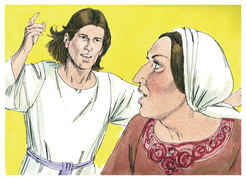
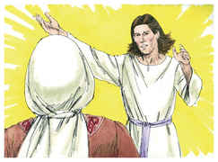
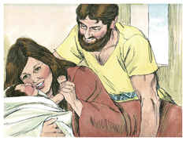

# Juízes Capítulo 13

1	E OS filhos de Israel tornaram a fazer o que era mau aos olhos do Senhor, e o Senhor os entregou na mão dos filisteus por quarenta anos.

2	E havia um homem de Zorá, da tribo de Dã, cujo nome era Manoá; e sua mulher, sendo estéril, não tinha filhos.

3	E o anjo do Senhor apareceu a esta mulher, e disse-lhe: Eis que agora és estéril, e nunca tens concebido; porém conceberás, e terás um filho.

4	Agora, pois, guarda-te de beber vinho, ou bebida forte, ou comer coisa imunda.

5	Porque eis que tu conceberás e terás um filho sobre cuja cabeça não passará navalha; porquanto o menino será nazireu de Deus desde o ventre; e ele começará a livrar a Israel da mão dos filisteus.

6	Então a mulher entrou, e falou a seu marido, dizendo: Um homem de Deus veio a mim, cuja aparência era semelhante a de um anjo de Deus, terribilíssima; e não lhe perguntei donde era, nem ele me disse o seu nome.

7	Porém disse-me: Eis que tu conceberás e terás um filho; agora pois, não bebas vinho, nem bebida forte, e não comas coisa imunda; porque o menino será nazireu de Deus, desde o ventre até ao dia da sua morte.

8	Então Manoá orou ao Senhor, e disse: Ah! Senhor meu, rogo-te que o homem de Deus, que enviaste, ainda venha para nós outra vez e nos ensine o que devemos fazer ao menino que há de nascer.

9	E Deus ouviu a voz de Manoá; e o anjo de Deus veio outra vez à mulher, e ela estava no campo, porém não estava com ela seu marido Manoá.

10	Apressou-se, pois, a mulher, e correu, e noticiou-o a seu marido, e disse-lhe: Eis que aquele homem que veio a mim o outro dia me apareceu.

11	Então Manoá levantou-se, e seguiu a sua mulher, e foi àquele homem, e disse-lhe: És tu aquele homem que falou a esta mulher? E disse: Eu sou.

12	Então disse Manoá: Cumpram-se as tuas palavras; mas qual será o modo de viver e o serviço do menino?

13	E disse o anjo do Senhor a Manoá: De tudo quanto eu disse à mulher se guardará ela.

14	De tudo quanto procede da videira não comerá, nem vinho nem bebida forte beberá, nem coisa imunda comerá; tudo quanto lhe tenho ordenado guardará.

15	Então Manoá disse ao anjo do Senhor: Ora deixa que te detenhamos, e te preparemos um cabrito.

16	Porém o anjo do Senhor disse a Manoá: Ainda que me detenhas, não comerei de teu pão; e se fizeres holocausto o oferecerás ao Senhor. Porque não sabia Manoá que era o anjo do Senhor.

17	E disse Manoá ao anjo do Senhor: Qual é o teu nome, para que, quando se cumprir a tua palavra, te honremos?

18	E o anjo do Senhor lhe disse: Por que perguntas assim pelo meu nome, visto que é maravilhoso?

19	Então Manoá tomou um cabrito e uma oferta de alimentos, e os ofereceu sobre uma penha ao Senhor: e houve-se o anjo maravilhosamente, observando-o Manoá e sua mulher.

20	E sucedeu que, subindo a chama do altar para o céu, o anjo do Senhor subiu na chama do altar; o que vendo Manoá e sua mulher, caíram em terra sobre seus rostos.

21	E nunca mais apareceu o anjo do Senhor a Manoá, nem a sua mulher; então compreendeu Manoá que era o anjo do Senhor.

22	E disse Manoá à sua mulher: Certamente morreremos, porquanto temos visto a Deus.

23	Porém sua mulher lhe disse: Se o Senhor nos quisesse matar, não aceitaria da nossa mão o holocausto e a oferta de alimentos, nem nos mostraria tudo isto, nem nos deixaria ouvir tais coisas neste tempo.

24	Depois teve esta mulher um filho, a quem pôs o nome de Sansão; e o menino cresceu, e o Senhor o abençoou.

25	E o Espírito do Senhor começou a incitá-lo de quando em quando para o campo de Maané-Dã, entre Zorá e Estaol.

