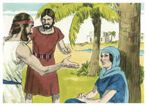
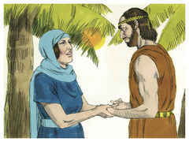
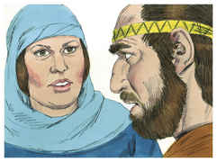
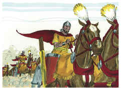
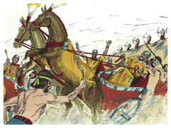
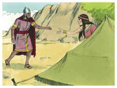
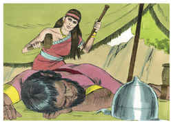
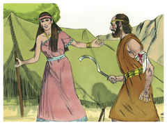
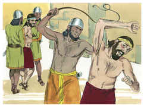

# Juízes Capítulo 4

1	PORÉM os filhos de Israel tornaram a fazer o que era mau aos olhos do Senhor, depois de falecer Eúde.

2	E vendeu-os o Senhor na mão de Jabim, rei de Canaã, que reinava em Hazor; e Sísera era o capitão do seu exército, o qual então habitava em Harosete dos gentios.

3	Então os filhos de Israel clamaram ao Senhor, porquanto ele tinha novecentos carros de ferro, e por vinte anos oprimia violentamente os filhos de Israel.

4	E Débora, mulher profetisa, mulher de Lapidote, julgava a Israel naquele tempo.

5	Ela assentava-se debaixo das palmeiras de Débora, entre Ramá e Betel, nas montanhas de Efraim; e os filhos de Israel subiam a ela a juízo.

6	E mandou chamar a Baraque, filho de Abinoão de Quedes de Naftali, e disse-lhe: Porventura o Senhor Deus de Israel não deu ordem, dizendo: Vai, e atrai gente ao monte Tabor, e toma contigo dez mil homens dos filhos de Naftali e dos filhos de Zebulom?

7	E atrairei a ti para o ribeiro de Quisom, a Sísera, capitão do exército de Jabim, com os seus carros, e com a sua multidão; e o darei na tua mão.

8	Então lhe disse Baraque: Se fores comigo, irei; porém, se não fores comigo, não irei.

9	E disse ela: Certamente irei contigo, porém não será tua a honra da jornada que empreenderes; pois à mão de uma mulher o Senhor venderá a Sísera. E Débora se levantou, e partiu com Baraque para Quedes.

10	Então Baraque convocou a Zebulom e a Naftali em Quedes, e subiu com dez mil homens após ele; e Débora subiu com ele.

11	E Héber, queneu, se tinha apartado dos queneus, dos filhos de Hobabe, sogro de Moisés; e tinha estendido as suas tendas até ao carvalho de Zaanaim, que está junto a Quedes,

12	E anunciaram a Sísera que Baraque, filho de Abinoão, tinha subido ao monte Tabor.

13	E Sísera convocou todos os seus carros, novecentos carros de ferro, e todo o povo que estava com ele, desde Harosete dos gentios até ao ribeiro de Quisom.

14	Então disse Débora a Baraque: Levanta-te, porque este é o dia em que o Senhor tem dado a Sísera na tua mão; porventura o Senhor não saiu adiante de ti? Baraque, pois, desceu do monte Tabor, e dez mil homens após ele.

15	E o Senhor derrotou a Sísera, e a todos os seus carros, e a todo o seu exército ao fio da espada, diante de Baraque; e Sísera desceu do carro, e fugiu a pé.

16	E Baraque perseguiu os carros, e o exército, até Harosete dos gentios; e todo o exército de Sísera caiu ao fio da espada, até não ficar um só.

17	Porém Sísera fugiu a pé à tenda de Jael, mulher de Héber, queneu; porquanto havia paz entre Jabim, rei de Hazor, e a casa de Héber, queneu.

18	E Jael saiu ao encontro de Sísera, e disse-lhe: Entra, senhor meu, entra aqui, não temas. Ele entrou na sua tenda, e ela o cobriu com uma coberta.

19	Então ele lhe disse: Dá-me, peço-te, de beber um pouco de água, porque tenho sede. Então ela abriu um odre de leite, e deu-lhe de beber, e o cobriu.

20	E ele lhe disse: Põe-te à porta da tenda; e há de ser que se alguém vier e te perguntar: Há aqui alguém? Responderás então: Não.

21	Então Jael, mulher de Héber, tomou uma estaca da tenda, e lançou mão de um martelo, e chegou-se mansamente a ele, e lhe cravou a estaca na fonte, de sorte que penetrou na terra, estando ele, porém, num profundo sono, e já muito cansado; e assim morreu.

22	E eis que, seguindo Baraque a Sísera, Jael lhe saiu ao encontro, e disse-lhe: Vem, e mostrar-te-ei o homem que buscas. E foi a ela, e eis que Sísera jazia morto, com a estaca na fonte.

23	Assim Deus naquele dia sujeitou a Jabim, rei de Canaã, diante dos filhos de Israel.

24	E continuou a mão dos filhos de Israel a pesar e a endurecer-se sobre Jabim, rei de Canaã; até que exterminaram a Jabim, rei de Canaã.

