# Lucas Capítulo 4

1	E JESUS, cheio do Espírito Santo, voltou do Jordão e foi levado pelo Espírito ao deserto;

2	E quarenta dias foi tentado pelo diabo, e naqueles dias não comeu coisa alguma; e, terminados eles, teve fome.

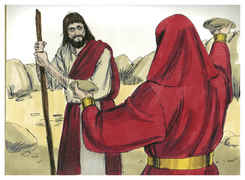

3	E disse-lhe o diabo: Se tu és o Filho de Deus, dize a esta pedra que se transforme em pão.

4	E Jesus lhe respondeu, dizendo: Está escrito que nem só de pão viverá o homem, mas de toda a palavra de Deus.

5	E o diabo, levando-o a um alto monte, mostrou-lhe num momento de tempo todos os reinos do mundo.

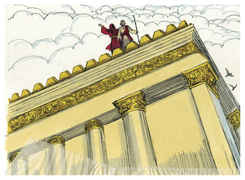

6	E disse-lhe o diabo: Dar-te-ei a ti todo este poder e a sua glória; porque a mim me foi entregue, e dou-o a quem quero.

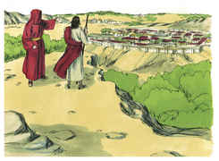

7	Portanto, se tu me adorares, tudo será teu.

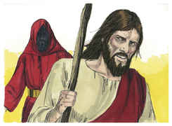

8	E Jesus, respondendo, disse-lhe: Vai-te para trás de mim, Satanás; porque está escrito: Adorarás o Senhor teu Deus, e só a ele servirás.

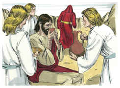

9	Levou-o também a Jerusalém, e pô-lo sobre o pináculo do templo, e disse-lhe: Se tu és o Filho de Deus, lança-te daqui abaixo;

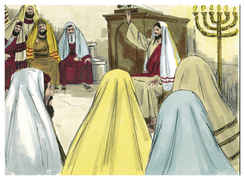

10	Porque está escrito: Mandará aos seus anjos, acerca de ti, que te guardem,

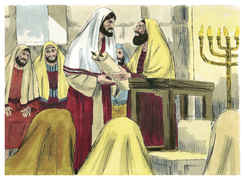

11	E que te sustenham nas mãos, Para que nunca tropeces com o teu pé em alguma pedra.

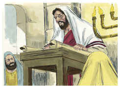

12	E Jesus, respondendo, disse-lhe: Dito está: Não tentarás ao Senhor teu Deus.

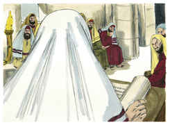

13	E, acabando o diabo toda a tentação, ausentou-se dele por algum tempo.

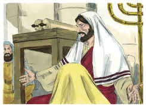

14	Então, pela virtude do Espírito, voltou Jesus para a Galiléia, e a sua fama correu por todas as terras em derredor.

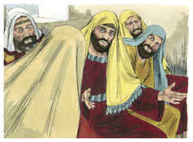

15	E ensinava nas suas sinagogas, e por todos era louvado.

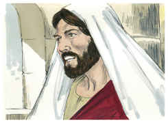

16	E, chegando a Nazaré, onde fora criado, entrou num dia de sábado, segundo o seu costume, na sinagoga, e levantou-se para ler.

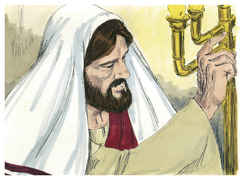

17	E foi-lhe dado o livro do profeta Isaías; e, quando abriu o livro, achou o lugar em que estava escrito:

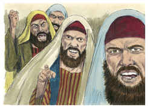

18	O Espírito do Senhor é sobre mim, Pois que me ungiu para evangelizar os pobres. Enviou-me a curar os quebrantados de coração,

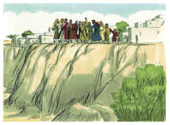

19	A pregar liberdade aos cativos, E restauração da vista aos cegos, A pôr em liberdade os oprimidos, A anunciar o ano aceitável do Senhor.

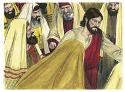

20	E, cerrando o livro, e tornando-o a dar ao ministro, assentou-se; e os olhos de todos na sinagoga estavam fitos nele.

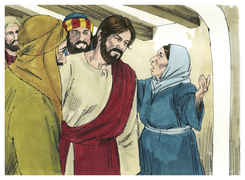

21	Então começou a dizer-lhes: Hoje se cumpriu esta Escritura em vossos ouvidos.

22	E todos lhe davam testemunho, e se maravilhavam das palavras de graça que saíam da sua boca; e diziam: Não é este o filho de José?

23	E ele lhes disse: Sem dúvida me direis este provérbio: Médico, cura-te a ti mesmo; faze também aqui na tua pátria tudo que ouvimos ter sido feito em Cafarnaum.

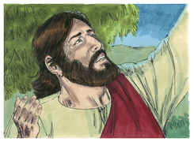

24	E disse: Em verdade vos digo que nenhum profeta é bem recebido na sua pátria.

25	Em verdade vos digo que muitas viúvas existiam em Israel nos dias de Elias, quando o céu se cerrou por três anos e seis meses, de sorte que em toda a terra houve grande fome;

26	E a nenhuma delas foi enviado Elias, senão a Sarepta de Sidom, a uma mulher viúva.

27	E muitos leprosos havia em Israel no tempo do profeta Eliseu, e nenhum deles foi purificado, senão Naamã, o sírio.

28	E todos, na sinagoga, ouvindo estas coisas, se encheram de ira.

29	E, levantando-se, o expulsaram da cidade, e o levaram até ao cume do monte em que a cidade deles estava edificada, para dali o precipitarem.

30	Ele, porém, passando pelo meio deles, retirou-se.

31	E desceu a Cafarnaum, cidade da Galiléia, e os ensinava nos sábados.

32	E admiravam a sua doutrina porque a sua palavra era com autoridade.

33	E estava na sinagoga um homem que tinha o espírito de um demônio imundo, e exclamou em alta voz,

34	Dizendo: Ah! que temos nós contigo, Jesus Nazareno? Vieste a destruir-nos? Bem sei quem és: O Santo de Deus.

35	E Jesus o repreendeu, dizendo: Cala-te, e sai dele. E o demônio, lançando-o por terra no meio do povo, saiu dele sem lhe fazer mal.

36	E veio espanto sobre todos, e falavam uns com os outros, dizendo: Que palavra é esta, que até aos espíritos imundos manda com autoridade e poder, e eles saem?

37	E a sua fama divulgava-se por todos os lugares, em redor daquela comarca.

38	Ora, levantando-se Jesus da sinagoga, entrou em casa de Simão; e a sogra de Simão estava enferma com muita febre, e rogaram-lhe por ela.

39	E, inclinando-se para ela, repreendeu a febre, e esta a deixou. E ela, levantando-se logo, servia-os.

40	E, ao pôr do sol, todos os que tinham enfermos de várias doenças lhos traziam; e, pondo as mãos sobre cada um deles, os curava.

41	E também de muitos saíam demônios, clamando e dizendo: Tu és o Cristo, o Filho de Deus. E ele, repreendendo-os, não os deixava falar, pois sabiam que ele era o Cristo.

42	E, sendo já dia, saiu, e foi para um lugar deserto; e a multidão o procurava, e chegou junto dele; e o detinham, para que não se ausentasse deles.

43	Ele, porém, lhes disse: Também é necessário que eu anuncie a outras cidades o evangelho do reino de Deus; porque para isso fui enviado.

44	E pregava nas sinagogas da Galiléia.

