# Lucas Capítulo 7

1	E, DEPOIS de concluir todos estes discursos perante o povo, entrou em Cafarnaum.

2	E o servo de um certo centurião, a quem muito estimava, estava doente, e moribundo.

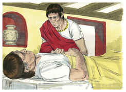

3	E, quando ouviu falar de Jesus, enviou-lhe uns anciãos dos judeus, rogando-lhe que viesse curar o seu servo.

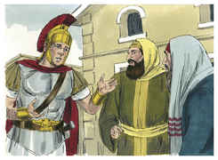

4	E, chegando eles junto de Jesus, rogaram-lhe muito, dizendo: É digno de que lhe concedas isto,

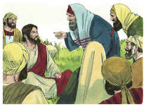

5	Porque ama a nossa nação, e ele mesmo nos edificou a sinagoga.

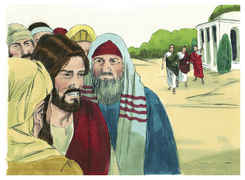

6	E foi Jesus com eles; mas, quando já estava perto da casa, enviou-lhe o centurião uns amigos, dizendo-lhe: Senhor, não te incomodes, porque não sou digno de que entres debaixo do meu telhado.

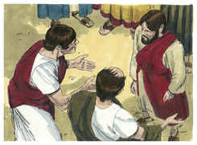

7	E por isso nem ainda me julguei digno de ir ter contigo; dize, porém, uma palavra, e o meu criado sarará.

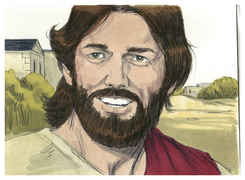

8	Porque também eu sou homem sujeito à autoridade, e tenho soldados sob o meu poder, e digo a este: Vai, e ele vai; e a outro: Vem, e ele vem; e ao meu servo: Faze isto, e ele o faz.

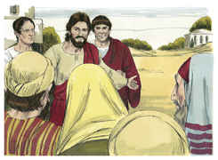

9	E, ouvindo isto Jesus, maravilhou-se dele, e voltando-se, disse à multidão que o seguia: Digo-vos que nem ainda em Israel tenho achado tanta fé.

10	E, voltando para casa os que foram enviados, acharam são o servo enfermo.

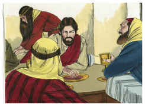

11	E aconteceu que, no dia seguinte, ele foi à cidade chamada Naim, e com ele iam muitos dos seus discípulos, e uma grande multidão;

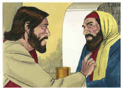

12	E, quando chegou perto da porta da cidade, eis que levavam um defunto, filho único de sua mãe, que era viúva; e com ela ia uma grande multidão da cidade.

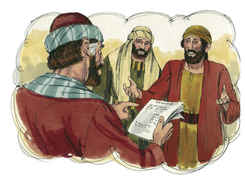

13	E, vendo-a, o Senhor moveu-se de íntima compaixão por ela, e disse-lhe: Não chores.

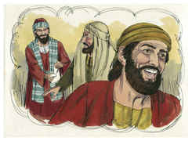

14	E, chegando-se, tocou o esquife (e os que o levavam pararam), e disse: Jovem, a ti te digo: Levanta-te. E o que fora defunto assentou-se, e começou a falar.

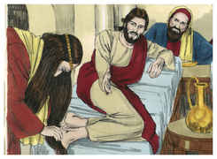

15	E entregou-o à sua mãe.

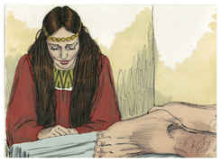

16	E de todos se apoderou o temor, e glorificavam a Deus, dizendo: Um grande profeta se levantou entre nós, e Deus visitou o seu povo.

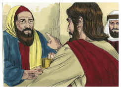

17	E correu dele esta fama por toda a Judéia e por toda a terra circunvizinha.

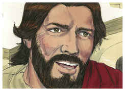

18	E os discípulos de João anunciaram-lhe todas estas coisas.

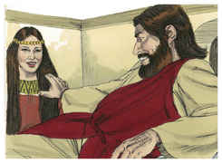

19	E João, chamando dois dos seus discípulos, enviou-os a Jesus, dizendo: És tu aquele que havia de vir, ou esperamos outro?

20	E, quando aqueles homens chegaram junto dele, disseram: João o Batista enviou-nos a perguntar-te: És tu aquele que havia de vir, ou esperamos outro?

21	E, na mesma hora, curou muitos de enfermidades, e males, e espíritos maus, e deu vista a muitos cegos.

22	Respondendo, então, Jesus, disse-lhes: Ide, e anunciai a João o que tendes visto e ouvido: que os cegos vêem, os coxos andam, os leprosos são purificados, os surdos ouvem, os mortos ressuscitam e aos pobres anuncia-se o evangelho.

23	E bem-aventurado é aquele que em mim se não escandalizar.

24	E, tendo-se retirado os mensageiros de João, começou a dizer à multidão acerca de João: Que saístes a ver no deserto? uma cana abalada pelo vento?

25	Mas que saístes a ver? um homem trajado de vestes delicadas? Eis que os que andam com preciosas vestiduras, e em delícias, estão nos paços reais.

26	Mas que saístes a ver? um profeta? Sim, vos digo, e muito mais do que profeta.

27	Este é aquele de quem está escrito: Eis que envio o meu anjo diante da tua face, o qual preparará diante de ti o teu caminho.

28	E eu vos digo que, entre os nascidos de mulheres, não há maior profeta do que João o Batista; mas o menor no reino de Deus é maior do que ele.

29	E todo o povo que o ouviu e os publicanos, tendo sido batizados com o batismo de João, justificaram a Deus.

30	Mas os fariseus e os doutores da lei rejeitaram o conselho de Deus contra si mesmos, não tendo sido batizados por ele.

31	E disse o Senhor: A quem, pois, compararei os homens desta geração, e a quem são semelhantes?

32	São semelhantes aos meninos que, assentados nas praças, clamam uns aos outros, e dizem: Tocamo-vos flauta, e não dançastes; cantamo-vos lamentações, e não chorastes.

33	Porque veio João o Batista, que não comia pão nem bebia vinho, e dizeis: Tem demônio;

34	Veio o Filho do homem, que come e bebe, e dizeis: Eis aí um homem comilão e bebedor de vinho, amigo dos publicanos e pecadores.

35	Mas a sabedoria é justificada por todos os seus filhos.

36	E rogou-lhe um dos fariseus que comesse com ele; e, entrando em casa do fariseu, assentou-se à mesa.

37	E eis que uma mulher da cidade, uma pecadora, sabendo que ele estava à mesa em casa do fariseu, levou um vaso de alabastro com ungüento;

38	E, estando por detrás, aos seus pés, chorando, começou a regar-lhe os pés com lágrimas, e enxugava-lhos com os cabelos da sua cabeça; e beijava-lhe os pés, e ungia-lhos com o ungüento.

39	Quando isto viu o fariseu que o tinha convidado, falava consigo, dizendo: Se este fora profeta, bem saberia quem e qual é a mulher que lhe tocou, pois é uma pecadora.

40	E respondendo, Jesus disse-lhe: Simão, uma coisa tenho a dizer-te. E ele disse: Dize-a, Mestre.

41	Um certo credor tinha dois devedores: um devia-lhe quinhentos dinheiros, e outro cinqüenta.

42	E, não tendo eles com que pagar, perdoou-lhes a ambos. Dize, pois, qual deles o amará mais?

43	E Simão, respondendo, disse: Tenho para mim que é aquele a quem mais perdoou. E ele lhe disse: Julgaste bem.

44	E, voltando-se para a mulher, disse a Simão: Vês tu esta mulher? Entrei em tua casa, e não me deste água para os pés; mas esta regou-me os pés com lágrimas, e os enxugou com os cabelos de sua cabeça.

45	Não me deste ósculo, mas esta, desde que entrou, não tem cessado de me beijar os pés.

46	Não me ungiste a cabeça com óleo, mas esta ungiu-me os pés com ungüento.

47	Por isso te digo que os seus muitos pecados lhe são perdoados, porque muito amou; mas aquele a quem pouco é perdoado pouco ama.

48	E disse-lhe a ela: Os teus pecados te são perdoados.

49	E os que estavam à mesa começaram a dizer entre si: Quem é este, que até perdoa pecados?

50	E disse à mulher: A tua fé te salvou; vai-te em paz.

