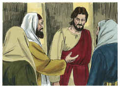
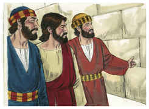
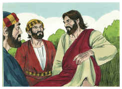
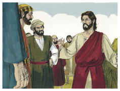
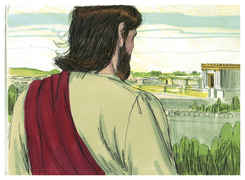

# Marcos Capítulo 13

1	E, SAINDO ele do templo, disse-lhe um dos seus discípulos: Mestre, olha que pedras, e que edifícios!

2	E, respondendo Jesus, disse-lhe: Vês estes grandes edifícios? Não ficará pedra sobre pedra que não seja derrubada.

3	E, assentando-se ele no Monte das Oliveiras, defronte do templo, Pedro, e Tiago, e João e André lhe perguntaram em particular:

4	Dize-nos, quando serão essas coisas, e que sinal haverá quando todas elas estiverem para se cumprir.

5	E Jesus, respondendo-lhes, começou a dizer: Olhai que ninguém vos engane;

6	Porque muitos virão em meu nome, dizendo: Eu sou o Cristo; e enganarão a muitos.

7	E, quando ouvirdes de guerras e de rumores de guerras, não vos perturbeis; porque assim deve acontecer; mas ainda não será o fim.

8	Porque se levantará nação contra nação, e reino contra reino, e haverá terremotos em diversos lugares, e haverá fomes e tribulações. Estas coisas são os princípios das dores.

9	Mas olhai por vós mesmos, porque vos entregarão aos concílios e às sinagogas; e sereis açoitados, e sereis apresentados perante presidentes e reis, por amor de mim, para lhes servir de testemunho.

10	Mas importa que o evangelho seja primeiramente pregado entre todas as nações.

11	Quando, pois, vos conduzirem e vos entregarem, não estejais solícitos de antemão pelo que haveis de dizer, nem premediteis; mas, o que vos for dado naquela hora, isso falai, porque não sois vós os que falais, mas o Espírito Santo.

12	E o irmão entregará à morte o irmão, e o pai ao filho; e levantar-se-ão os filhos contra os pais, e os farão morrer.

13	E sereis odiados por todos por amor do meu nome; mas quem perseverar até ao fim, esse será salvo.

14	Ora, quando vós virdes a abominação do assolamento, que foi predita por Daniel o profeta, estar onde não deve estar (quem lê, entenda), então os que estiverem na Judéia fujam para os montes.

15	E o que estiver sobre o telhado não desça para casa, nem entre a tomar coisa alguma de sua casa;

16	E o que estiver no campo não volte atrás, para tomar as suas vestes.

17	Mas ai das grávidas, e das que criarem naqueles dias!

18	Orai, pois, para que a vossa fuga não suceda no inverno.

19	Porque naqueles dias haverá uma aflição tal, qual nunca houve desde o princípio da criação, que Deus criou, até agora, nem jamais haverá.

20	E, se o Senhor não abreviasse aqueles dias, nenhuma carne se salvaria; mas, por causa dos eleitos que escolheu, abreviou aqueles dias.

21	E então, se alguém vos disser: Eis aqui o Cristo; ou: Ei-lo ali; não acrediteis.

22	Porque se levantarão falsos cristos, e falsos profetas, e farão sinais e prodígios, para enganarem, se for possível, até os escolhidos.

23	Mas vós vede; eis que de antemão vos tenho dito tudo.

24	Ora, naqueles dias, depois daquela aflição, o sol se escurecerá, e a lua não dará a sua luz.

25	E as estrelas cairão do céu, e as forças que estão nos céus serão abaladas.

26	E então verão vir o Filho do homem nas nuvens, com grande poder e glória.

27	E ele enviará os seus anjos, e ajuntará os seus escolhidos, desde os quatro ventos, da extremidade da terra até a extremidade do céu.

28	Aprendei, pois, a parábola da figueira: Quando já o seu ramo se torna tenro, e brota folhas, bem sabeis que já está próximo o verão.

29	Assim também vós, quando virdes sucederem estas coisas, sabei que já está perto, às portas.

30	Na verdade vos digo que não passará esta geração, sem que todas estas coisas aconteçam.

31	Passará o céu e a terra, mas as minhas palavras não passarão.

32	Mas daquele dia e hora ninguém sabe, nem os anjos que estão no céu, nem o Filho, senão o Pai.

33	Olhai, vigiai e orai; porque não sabeis quando chegará o tempo.

34	É como se um homem, partindo para fora da terra, deixasse a sua casa, e desse autoridade aos seus servos, e a cada um a sua obra, e mandasse ao porteiro que vigiasse.

35	Vigiai, pois, porque não sabeis quando virá o senhor da casa; se à tarde, se à meia-noite, se ao cantar do galo, se pela manhã,

36	Para que, vindo de improviso, não vos ache dormindo.

37	E as coisas que vos digo, digo-as a todos: Vigiai.

