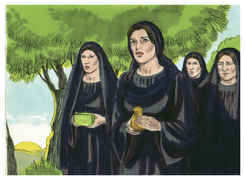
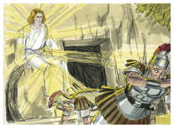
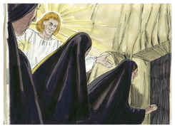
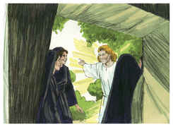
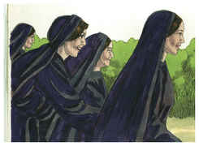
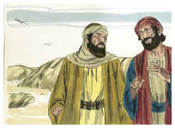

# Marcos Capítulo 16

1	E, PASSADO o sábado, Maria Madalena, e Maria, mãe de Tiago, e Salomé, compraram aromas para irem ungi-lo.

2	E, no primeiro dia da semana, foram ao sepulcro, de manhã cedo, ao nascer do sol.

3	E diziam umas às outras: Quem nos revolverá a pedra da porta do sepulcro?

4	E, olhando, viram que já a pedra estava revolvida; e era ela muito grande.

5	E, entrando no sepulcro, viram um jovem assentado à direita, vestido de uma roupa comprida, branca; e ficaram espantadas.

6	Ele, porém, disse-lhes: Não vos assusteis; buscais a Jesus Nazareno, que foi crucificado; já ressuscitou, não está aqui; eis aqui o lugar onde o puseram.

7	Mas ide, dizei a seus discípulos, e a Pedro, que ele vai adiante de vós para a Galiléia; ali o vereis, como ele vos disse.

8	E, saindo elas apressadamente, fugiram do sepulcro, porque estavam possuídas de temor e assombro; e nada diziam a ninguém porque temiam.

9	E Jesus, tendo ressuscitado na manhã do primeiro dia da semana, apareceu primeiramente a Maria Madalena, da qual tinha expulsado sete demônios.

10	E, partindo ela, anunciou-o àqueles que tinham estado com ele, os quais estavam tristes, e chorando.

11	E, ouvindo eles que vivia, e que tinha sido visto por ela, não o creram.

12	E depois manifestou-se de outra forma a dois deles, que iam de caminho para o campo.

13	E, indo estes, anunciaram-no aos outros, mas nem ainda estes creram.

14	Finalmente apareceu aos onze, estando eles assentados à mesa, e lançou-lhes em rosto a sua incredulidade e dureza de coração, por não haverem crido nos que o tinham visto já ressuscitado.

15	E disse-lhes: Ide por todo o mundo, pregai o evangelho a toda criatura.

16	Quem crer e for batizado será salvo; mas quem não crer será condenado.

17	E estes sinais seguirão aos que crerem: Em meu nome expulsarão os demônios; falarão novas línguas;

18	Pegarão nas serpentes; e, se beberem alguma coisa mortífera, não lhes fará dano algum; e porão as mãos sobre os enfermos, e os curarão.

19	Ora, o Senhor, depois de lhes ter falado, foi recebido no céu, e assentou-se à direita de Deus.

20	E eles, tendo partido, pregaram por todas as partes, cooperando com eles o Senhor, e confirmando a palavra com os sinais que se seguiram. Amém.

