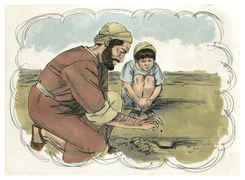
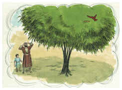
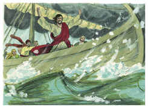
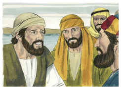

# Marcos Capítulo 4

1	E OUTRA vez começou a ensinar junto do mar, e ajuntou-se a ele grande multidão, de sorte que ele entrou e assentou-se num barco, sobre o mar; e toda a multidão estava em terra junto do mar.

2	E ensinava-lhes muitas coisas por parábolas, e lhes dizia na sua doutrina:

3	Ouvi: Eis que saiu o semeador a semear.

4	E aconteceu que semeando ele, uma parte da semente caiu junto do caminho, e vieram as aves do céu, e a comeram;

5	E outra caiu sobre pedregais, onde não havia muita terra, e nasceu logo, porque não tinha terra profunda;

6	Mas, saindo o sol, queimou-se; e, porque não tinha raiz, secou-se.

7	E outra caiu entre espinhos e, crescendo os espinhos, a sufocaram e não deu fruto.

8	E outra caiu em boa terra e deu fruto, que vingou e cresceu; e um produziu trinta, outro sessenta, e outro cem.

9	E disse-lhes: Quem tem ouvidos para ouvir, ouça.

10	E, quando se achou só, os que estavam junto dele com os doze interrogaram-no acerca da parábola.

11	E ele disse-lhes: A vós vos é dado saber os mistérios do reino de Deus, mas aos que estão de fora todas estas coisas se dizem por parábolas,

12	Para que, vendo, vejam, e não percebam; e, ouvindo, ouçam, e não entendam; para que não se convertam, e lhes sejam perdoados os pecados.

13	E disse-lhes: Não percebeis esta parábola? Como, pois, entendereis todas as parábolas?

14	O que semeia, semeia a palavra;

15	E, os que estão junto do caminho são aqueles em quem a palavra é semeada; mas, tendo-a eles ouvido, vem logo Satanás e tira a palavra que foi semeada nos seus corações.

16	E da mesma forma os que recebem a semente sobre pedregais; os quais, ouvindo a palavra, logo com prazer a recebem;

17	Mas não têm raiz em si mesmos, antes são temporãos; depois, sobrevindo tribulação ou perseguição, por causa da palavra, logo se escandalizam.

18	E outros são os que recebem a semente entre espinhos, os quais ouvem a palavra;

19	Mas os cuidados deste mundo, e os enganos das riquezas e as ambições de outras coisas, entrando, sufocam a palavra, e fica infrutífera.

20	E estes são os que foram semeados em boa terra, os que ouvem a palavra e a recebem, e dão fruto, um trinta, e outro sessenta, e outro cem.

21	E disse-lhes: Vem porventura a candeia para se meter debaixo do alqueire, ou debaixo da cama? não vem antes para se colocar no velador?

22	Porque nada há encoberto que não haja de ser manifesto; e nada se faz para ficar oculto, mas para ser descoberto.

23	Se alguém tem ouvidos para ouvir, ouça.

24	E disse-lhes: Atendei ao que ides ouvir. Com a medida com que medirdes vos medirão a vós, e ser-vos-á ainda acrescentada a vós que ouvis.

25	Porque ao que tem, ser-lhe-á dado; e, ao que não tem, até o que tem lhe será tirado.

26	E dizia: O reino de Deus é assim como se um homem lançasse semente à terra.

27	E dormisse, e se levantasse de noite ou de dia, e a semente brotasse e crescesse, não sabendo ele como.

28	Porque a terra por si mesma frutifica, primeiro a erva, depois a espiga, por último o grão cheio na espiga.

29	E, quando já o fruto se mostra, mete-se-lhe logo a foice, porque está chegada a ceifa.

30	E dizia: A que assemelharemos o reino de Deus? ou com que parábola o representaremos?

31	É como um grão de mostarda, que, quando se semeia na terra, é a menor de todas as sementes que há na terra;

32	Mas, tendo sido semeado, cresce; e faz-se a maior de todas as hortaliças, e cria grandes ramos, de tal maneira que as aves do céu podem aninhar-se debaixo da sua sombra.

33	E com muitas parábolas tais lhes dirigia a palavra, segundo o que podiam compreender.

34	E sem parábolas nunca lhes falava; porém, tudo declarava em particular aos seus discípulos.

35	E, naquele dia, sendo já tarde, disse-lhes: Passemos para o outro lado.

36	E eles, deixando a multidão, o levaram consigo, assim como estava, no barco; e havia também com ele outros barquinhos.

37	E levantou-se grande temporal de vento, e subiam as ondas por cima do barco, de maneira que já se enchia.

38	E ele estava na popa, dormindo sobre uma almofada, e despertaram-no, dizendo-lhe: Mestre, não se te dá que pereçamos?

39	E ele, despertando, repreendeu o vento, e disse ao mar: Cala-te, aquieta-te. E o vento se aquietou, e houve grande bonança.

40	E disse-lhes: Por que sois tão tímidos? Ainda não tendes fé?

41	E sentiram um grande temor, e diziam uns aos outros: Mas quem é este, que até o vento e o mar lhe obedecem?

