# Mateus Capítulo 13

1	TENDO Jesus saído de casa, naquele dia, estava assentado junto ao mar;

2	E ajuntou-se muita gente ao pé dele, de sorte que, entrando num barco, se assentou; e toda a multidão estava em pé na praia.

3	E falou-lhe de muitas coisas por parábolas, dizendo: Eis que o semeador saiu a semear.

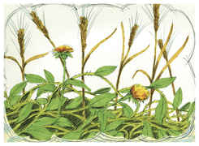

4	E, quando semeava, uma parte da semente caiu ao pé do caminho, e vieram as aves, e comeram-na;

5	E outra parte caiu em pedregais, onde não havia terra bastante, e logo nasceu, porque não tinha terra funda;

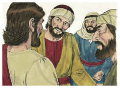

6	Mas, vindo o sol, queimou-se, e secou-se, porque não tinha raiz.

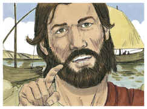

7	E outra caiu entre espinhos, e os espinhos cresceram e sufocaram-na.

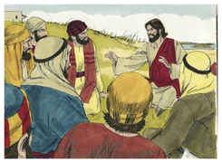

8	E outra caiu em boa terra, e deu fruto: um a cem, outro a sessenta e outro a trinta.

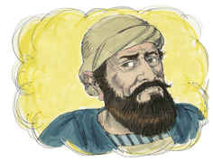

9	Quem tem ouvidos para ouvir, ouça.

10	E, acercando-se dele os discípulos, disseram-lhe: Por que lhes falas por parábolas?

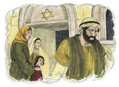

11	Ele, respondendo, disse-lhes: Porque a vós é dado conhecer os mistérios do reino dos céus, mas a eles não lhes é dado;

12	Porque àquele que tem, se dará, e terá em abundância; mas àquele que não tem, até aquilo que tem lhe será tirado.

13	Por isso lhes falo por parábolas; porque eles, vendo, não vêem; e, ouvindo, não ouvem nem compreendem.

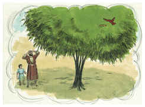

14	E neles se cumpre a profecia de Isaías, que diz: Ouvindo, ouvireis, mas não compreendereis, E, vendo, vereis, mas não percebereis.

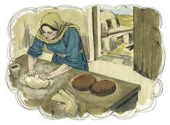

15	Porque o coração deste povo está endurecido, E ouviram de mau grado com seus ouvidos, E fecharam seus olhos; Para que não vejam com os olhos, E ouçam com os ouvidos, E compreendam com o coração, E se convertam, E eu os cure.

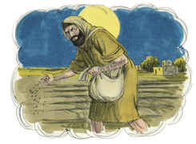

16	Mas, bem-aventurados os vossos olhos, porque vêem, e os vossos ouvidos, porque ouvem.

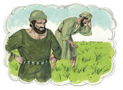

17	Porque em verdade vos digo que muitos profetas e justos desejaram ver o que vós vedes, e não o viram; e ouvir o que vós ouvis, e não o ouviram.

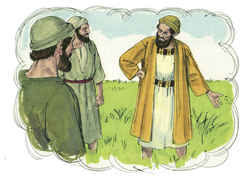

18	Escutai vós, pois, a parábola do semeador.

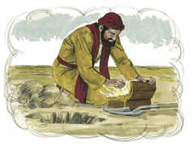

19	Ouvindo alguém a palavra do reino, e não a entendendo, vem o maligno, e arrebata o que foi semeado no seu coração; este é o que foi semeado ao pé do caminho.

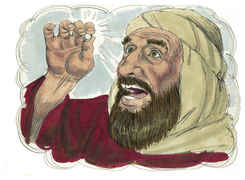

20	O que foi semeado em pedregais é o que ouve a palavra, e logo a recebe com alegria;

21	Mas não tem raiz em si mesmo, antes é de pouca duração; e, chegada a angústia e a perseguição, por causa da palavra, logo se ofende;

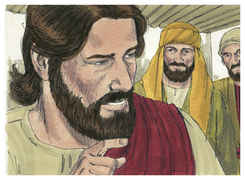

22	E o que foi semeado entre espinhos é o que ouve a palavra, mas os cuidados deste mundo, e a sedução das riquezas sufocam a palavra, e fica infrutífera;

23	Mas, o que foi semeado em boa terra é o que ouve e compreende a palavra; e dá fruto, e um produz cem, outro sessenta, e outro trinta.

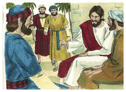

24	Propôs-lhes outra parábola, dizendo: O reino dos céus é semelhante ao homem que semeia a boa semente no seu campo;

25	Mas, dormindo os homens, veio o seu inimigo, e semeou joio no meio do trigo, e retirou-se.

26	E, quando a erva cresceu e frutificou, apareceu também o joio.

27	E os servos do pai de família, indo ter com ele, disseram-lhe: Senhor, não semeaste tu, no teu campo, boa semente? Por que tem, então, joio?

28	E ele lhes disse: Um inimigo é quem fez isso. E os servos lhe disseram: Queres pois que vamos arrancá-lo?

29	Ele, porém, lhes disse: Não; para que, ao colher o joio, não arranqueis também o trigo com ele.

30	Deixai crescer ambos juntos até à ceifa; e, por ocasião da ceifa, direi aos ceifeiros: Colhei primeiro o joio, e atai-o em molhos para o queimar; mas, o trigo, ajuntai-o no meu celeiro.

31	Outra parábola lhes propôs, dizendo: O reino dos céus é semelhante ao grão de mostarda que o homem, pegando nele, semeou no seu campo;

32	O qual é, realmente, a menor de todas as sementes; mas, crescendo, é a maior das plantas, e faz-se uma árvore, de sorte que vêm as aves do céu, e se aninham nos seus ramos.

33	Outra parábola lhes disse: O reino dos céus é semelhante ao fermento, que uma mulher toma e introduz em três medidas de farinha, até que tudo esteja levedado.

34	Tudo isto disse Jesus, por parábolas à multidão, e nada lhes falava sem parábolas;

35	Para que se cumprisse o que fora dito pelo profeta, que disse: Abrirei em parábolas a minha boca; Publicarei coisas ocultas desde a fundação do mundo.

36	Então, tendo despedido a multidão, foi Jesus para casa. E chegaram ao pé dele os seus discípulos, dizendo: Explica-nos a parábola do joio do campo.

37	E ele, respondendo, disse-lhes: O que semeia a boa semente, é o Filho do homem;

38	O campo é o mundo; e a boa semente são os filhos do reino; e o joio são os filhos do maligno;

39	O inimigo, que o semeou, é o diabo; e a ceifa é o fim do mundo; e os ceifeiros são os anjos.

40	Assim como o joio é colhido e queimado no fogo, assim será na consumação deste mundo.

41	Mandará o Filho do homem os seus anjos, e eles colherão do seu reino tudo o que causa escândalo, e os que cometem iniqüidade.

42	E lançá-los-ão na fornalha de fogo; ali haverá pranto e ranger de dentes.

43	Então os justos resplandecerão como o sol, no reino de seu Pai. Quem tem ouvidos para ouvir, ouça.

44	Também o reino dos céus é semelhante a um tesouro escondido num campo, que um homem achou e escondeu; e, pelo gozo dele, vai, vende tudo quanto tem, e compra aquele campo.

45	Outrossim, o reino dos céus é semelhante ao homem, negociante, que busca boas pérolas;

46	E, encontrando uma pérola de grande valor, foi, vendeu tudo quanto tinha, e comprou-a.

47	Igualmente o reino dos céus é semelhante a uma rede lançada ao mar, e que apanha toda a qualidade de peixes.

48	E, estando cheia, a puxam para a praia; e, assentando-se, apanham para os cestos os bons; os ruins, porém, lançam fora.

49	Assim será na consumação dos séculos: virão os anjos, e separarão os maus de entre os justos,

50	E lançá-los-ão na fornalha de fogo; ali haverá pranto e ranger de dentes.

51	E disse-lhes Jesus: Entendestes todas estas coisas? Disseram-lhe eles: Sim, Senhor.

52	E ele disse-lhes: Por isso, todo o escriba instruído acerca do reino dos céus é semelhante a um pai de família, que tira do seu tesouro coisas novas e velhas.

53	E aconteceu que Jesus, concluindo estas parábolas, se retirou dali.

54	E, chegando à sua pátria, ensinava-os na sinagoga deles, de sorte que se maravilhavam, e diziam: De onde veio a este a sabedoria, e estas maravilhas?

55	Não é este o filho do carpinteiro? e não se chama sua mãe Maria, e seus irmãos Tiago, e José, e Simão, e Judas?

56	E não estão entre nós todas as suas irmãs? De onde lhe veio, pois, tudo isto?

57	E escandalizavam-se nele. Jesus, porém, lhes disse: Não há profeta sem honra, a não ser na sua pátria e na sua casa.

58	E não fez ali muitas maravilhas, por causa da incredulidade deles.

