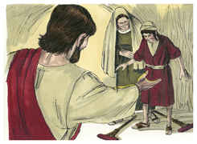

# Mateus Capítulo 15

1	ENTÃO chegaram ao pé de Jesus uns escribas e fariseus de Jerusalém, dizendo:

2	Por que transgridem os teus discípulos a tradição dos anciãos? pois não lavam as mãos quando comem pão.

3	Ele, porém, respondendo, disse-lhes: Por que transgredis vós, também, o mandamento de Deus pela vossa tradição?

4	Porque Deus ordenou, dizendo: Honra a teu pai e a tua mãe; e: Quem maldisser ao pai ou à mãe, certamente morrerá.

5	Mas vós dizeis: Qualquer que disser ao pai ou à mãe: É oferta ao Senhor o que poderias aproveitar de mim; esse não precisa honrar nem a seu pai nem a sua mãe,

6	E assim invalidastes, pela vossa tradição, o mandamento de Deus.

7	Hipócritas, bem profetizou Isaías a vosso respeito, dizendo:

8	Este povo se aproxima de mim com a sua boca e me honra com os seus lábios, mas o seu coração está longe de mim.

9	Mas, em vão me adoram, ensinando doutrinas que são preceitos dos homens.

10	E, chamando a si a multidão, disse-lhes: Ouvi, e entendei:

11	O que contamina o homem não é o que entra na boca, mas o que sai da boca, isso é o que contamina o homem.

12	Então, acercando-se dele os seus discípulos, disseram-lhe: Sabes que os fariseus, ouvindo essas palavras, se escandalizaram?

13	Ele, porém, respondendo, disse: Toda a planta, que meu Pai celestial não plantou, será arrancada.

14	Deixai-os; são cegos condutores de cegos. Ora, se um cego guiar outro cego, ambos cairão na cova.

15	E Pedro, tomando a palavra, disse-lhe: Explica-nos essa parábola.

16	Jesus, porém, disse: Até vós mesmos estais ainda sem entender?

17	Ainda não compreendeis que tudo o que entra pela boca desce para o ventre, e é lançado fora?

18	Mas, o que sai da boca, procede do coração, e isso contamina o homem.

19	Porque do coração procedem os maus pensamentos, mortes, adultérios, fornicação, furtos, falsos testemunhos e blasfêmias.

20	São estas coisas que contaminam o homem; mas comer sem lavar as mãos, isso não contamina o homem.

21	E, partindo Jesus dali, foi para as partes de Tiro e de Sidom.

22	E eis que uma mulher cananéia, que saíra daquelas cercanias, clamou, dizendo: Senhor, Filho de Davi, tem misericórdia de mim, que minha filha está miseravelmente endemoninhada.

23	Mas ele não lhe respondeu palavra. E os seus discípulos, chegando ao pé dele, rogaram-lhe, dizendo: Despede-a, que vem gritando atrás de nós.

24	E ele, respondendo, disse: Eu não fui enviado senão às ovelhas perdidas da casa de Israel.

25	Então chegou ela, e adorou-o, dizendo: Senhor, socorre-me!

26	Ele, porém, respondendo, disse: Não é bom pegar no pão dos filhos e deitá-lo aos cachorrinhos.

27	E ela disse: Sim, Senhor, mas também os cachorrinhos comem das migalhas que caem da mesa dos seus senhores.

28	Então respondeu Jesus, e disse-lhe: Ó mulher, grande é a tua fé! Seja isso feito para contigo como tu desejas. E desde aquela hora a sua filha ficou sã.

29	Partindo Jesus dali, chegou ao pé do mar da Galiléia, e, subindo a um monte, assentou-se lá.

30	E veio ter com ele grandes multidões, que traziam coxos, cegos, mudos, aleijados, e outros muitos, e os puseram aos pés de Jesus, e ele os sarou,

31	De tal sorte, que a multidão se maravilhou vendo os mudos a falar, os aleijados sãos, os coxos a andar, e os cegos a ver; e glorificava o Deus de Israel.

32	E Jesus, chamando os seus discípulos, disse: Tenho compaixão da multidão, porque já está comigo há três dias, e não tem o que comer; e não quero despedi-la em jejum, para que não desfaleça no caminho.

33	E os seus discípulos disseram-lhe: De onde nos viriam, num deserto, tantos pães, para saciar tal multidão?

34	E Jesus disse-lhes: Quantos pães tendes? E eles disseram: Sete, e uns poucos de peixinhos.

35	Então mandou à multidão que se assentasse no chão,

36	E, tomando os sete pães e os peixes, e dando graças, partiu-os, e deu-os aos seus discípulos, e os discípulos à multidão.

37	E todos comeram e se saciaram; e levantaram, do que sobejou, sete cestos cheios de pedaços.

38	Ora, os que tinham comido eram quatro mil homens, além de mulheres e crianças.

39	E, tendo despedido a multidão, entrou no barco, e dirigiu-se ao território de Magadã.

