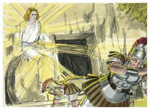
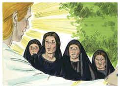
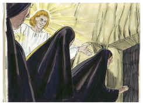
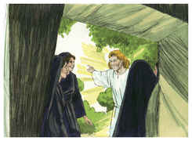
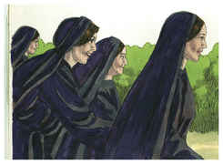
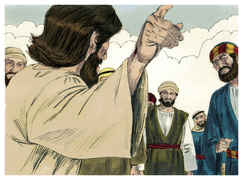

# Mateus Capítulo 28

1	E, NO fim do sábado, quando já despontava o primeiro dia da semana, Maria Madalena e a outra Maria foram ver o sepulcro.

2	E eis que houvera um grande terremoto, porque um anjo do Senhor, descendo do céu, chegou, removendo a pedra da porta, e sentou-se sobre ela.

3	E o seu aspecto era como um relâmpago, e as suas vestes brancas como neve.

4	E os guardas, com medo dele, ficaram muito assombrados, e como mortos.

5	Mas o anjo, respondendo, disse às mulheres: Não tenhais medo; pois eu sei que buscais a Jesus, que foi crucificado.

6	Ele não está aqui, porque já ressuscitou, como havia dito. Vinde, vede o lugar onde o Senhor jazia.

7	Ide pois, imediatamente, e dizei aos seus discípulos que já ressuscitou dentre os mortos. E eis que ele vai adiante de vós para a Galiléia; ali o vereis. Eis que eu vo-lo tenho dito.

8	E, saindo elas pressurosamente do sepulcro, com temor e grande alegria, correram a anunciá-lo aos seus discípulos.

9	E, indo elas a dar as novas aos seus discípulos, eis que Jesus lhes sai ao encontro, dizendo: Eu vos saúdo. E elas, chegando, abraçaram os seus pés, e o adoraram.

10	Então Jesus disse-lhes: Não temais; ide dizer a meus irmãos que vão à Galiléia, e lá me verão.

11	E, quando iam, eis que alguns da guarda, chegando à cidade, anunciaram aos príncipes dos sacerdotes todas as coisas que haviam acontecido.

12	E, congregados eles com os anciãos, e tomando conselho entre si, deram muito dinheiro aos soldados,

13	Dizendo: Dizei: Vieram de noite os seus discípulos e, dormindo nós, o furtaram.

14	E, se isto chegar a ser ouvido pelo presidente, nós o persuadiremos, e vos poremos em segurança.

15	E eles, recebendo o dinheiro, fizeram como estavam instruídos. E foi divulgado este dito entre os judeus, até ao dia de hoje.

16	E os onze discípulos partiram para a Galiléia, para o monte que Jesus lhes tinha designado.

17	E, quando o viram, o adoraram; mas alguns duvidaram.

18	E, chegando-se Jesus, falou-lhes, dizendo: É-me dado todo o poder no céu e na terra.

19	Portanto ide, fazei discípulos de todas as nações, batizando-os em nome do Pai, e do Filho, e do Espírito Santo;

20	Ensinando-os a guardar todas as coisas que eu vos tenho mandado; e eis que eu estou convosco todos os dias, até a consumação dos séculos. Amém.

