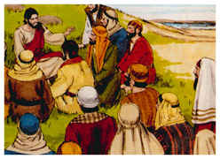
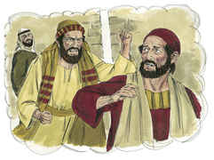
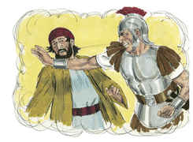
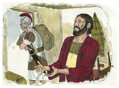
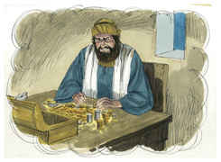
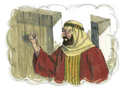

# Mateus Capítulo 5

1	E JESUS, vendo a multidão, subiu a um monte, e, assentando-se, aproximaram-se dele os seus discípulos;

2	E, abrindo a sua boca, os ensinava, dizendo:

3	Bem-aventurados os pobres de espírito, porque deles é o reino dos céus;

4	Bem-aventurados os que choram, porque eles serão consolados;

5	Bem-aventurados os mansos, porque eles herdarão a terra;

6	Bem-aventurados os que têm fome e sede de justiça, porque eles serão fartos;

7	Bem-aventurados os misericordiosos, porque eles alcançarão misericórdia;

8	Bem-aventurados os limpos de coração, porque eles verão a Deus;

9	Bem-aventurados os pacificadores, porque eles serão chamados filhos de Deus;

10	Bem-aventurados os que sofrem perseguição por causa da justiça, porque deles é o reino dos céus;

11	Bem-aventurados sois vós, quando vos injuriarem e perseguirem e, mentindo, disserem todo o mal contra vós por minha causa.

12	Exultai e alegrai-vos, porque é grande o vosso galardão nos céus; porque assim perseguiram os profetas que foram antes de vós.

13	Vós sois o sal da terra; e se o sal for insípido, com que se há de salgar? Para nada mais presta senão para se lançar fora, e ser pisado pelos homens.

14	Vós sois a luz do mundo; não se pode esconder uma cidade edificada sobre um monte;

15	Nem se acende a candeia e se coloca debaixo do alqueire, mas no velador, e dá luz a todos que estão na casa.

16	Assim resplandeça a vossa luz diante dos homens, para que vejam as vossas boas obras e glorifiquem a vosso Pai, que está nos céus.

17	Não cuideis que vim destruir a lei ou os profetas: não vim ab-rogar, mas cumprir.

18	Porque em verdade vos digo que, até que o céu e a terra passem, nem um jota ou um til jamais passará da lei, sem que tudo seja cumprido.

19	Qualquer, pois, que violar um destes mandamentos, por menor que seja, e assim ensinar aos homens, será chamado o menor no reino dos céus; aquele, porém, que os cumprir e ensinar será chamado grande no reino dos céus.

20	Porque vos digo que, se a vossa justiça não exceder a dos escribas e fariseus, de modo nenhum entrareis no reino dos céus.

21	Ouvistes que foi dito aos antigos: Não matarás; mas qualquer que matar será réu de juízo.

22	Eu, porém, vos digo que qualquer que, sem motivo, se encolerizar contra seu irmão, será réu de juízo; e qualquer que disser a seu irmão: Raca, será réu do sinédrio; e qualquer que lhe disser: Louco, será réu do fogo do inferno.

23	Portanto, se trouxeres a tua oferta ao altar, e aí te lembrares de que teu irmão tem alguma coisa contra ti,

24	Deixa ali diante do altar a tua oferta, e vai reconciliar-te primeiro com teu irmão e, depois, vem e apresenta a tua oferta.

25	Concilia-te depressa com o teu adversário, enquanto estás no caminho com ele, para que não aconteça que o adversário te entregue ao juiz, e o juiz te entregue ao oficial, e te encerrem na prisão.

26	Em verdade te digo que de maneira nenhuma sairás dali enquanto não pagares o último ceitil.

27	Ouvistes que foi dito aos antigos: Não cometerás adultério.

28	Eu, porém, vos digo, que qualquer que atentar numa mulher para a cobiçar, já em seu coração cometeu adultério com ela.

29	Portanto, se o teu olho direito te escandalizar, arranca-o e atira-o para longe de ti; pois te é melhor que se perca um dos teus membros do que seja todo o teu corpo lançado no inferno.

30	E, se a tua mão direita te escandalizar, corta-a e atira-a para longe de ti, porque te é melhor que um dos teus membros se perca do que seja todo o teu corpo lançado no inferno.

31	Também foi dito: Qualquer que deixar sua mulher, dê-lhe carta de divórcio.

32	Eu, porém, vos digo que qualquer que repudiar sua mulher, a não ser por causa de fornicação, faz que ela cometa adultério, e qualquer que casar com a repudiada comete adultério.

33	Outrossim, ouvistes que foi dito aos antigos: Não perjurarás, mas cumprirás os teus juramentos ao Senhor.

34	Eu, porém, vos digo que de maneira nenhuma jureis; nem pelo céu, porque é o trono de Deus;

35	Nem pela terra, porque é o escabelo de seus pés; nem por Jerusalém, porque é a cidade do grande Rei;

36	Nem jurarás pela tua cabeça, porque não podes tornar um cabelo branco ou preto.

37	Seja, porém, o vosso falar: Sim, sim; Não, não; porque o que passa disto é de procedência maligna.

38	Ouvistes que foi dito: Olho por olho, e dente por dente.

39	Eu, porém, vos digo que não resistais ao mau; mas, se qualquer te bater na face direita, oferece-lhe também a outra;

40	E, ao que quiser pleitear contigo, e tirar-te a túnica, larga-lhe também a capa;

41	E, se qualquer te obrigar a caminhar uma milha, vai com ele duas.

42	Dá a quem te pedir, e não te desvies daquele que quiser que lhe emprestes.

43	Ouvistes que foi dito: Amarás o teu próximo, e odiarás o teu inimigo.

44	Eu, porém, vos digo: Amai a vossos inimigos, bendizei os que vos maldizem, fazei bem aos que vos odeiam, e orai pelos que vos maltratam e vos perseguem; para que sejais filhos do vosso Pai que está nos céus;

45	Porque faz que o seu sol se levante sobre maus e bons, e a chuva desça sobre justos e injustos.

46	Pois, se amardes os que vos amam, que galardão tereis? Não fazem os publicanos também o mesmo?

47	E, se saudardes unicamente os vossos irmãos, que fazeis de mais? Não fazem os publicanos também assim?

48	Sede vós pois perfeitos, como é perfeito o vosso Pai que está nos céus.

