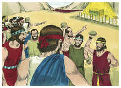
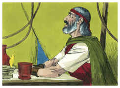
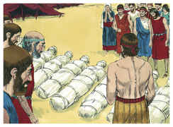
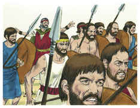
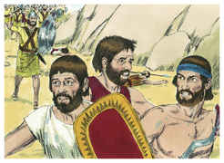

# Números Capítulo 14

1	ENTÃO toda a congregação levantou a sua voz; e o povo chorou naquela noite.

2	E todos os filhos de Israel murmuraram contra Moisés e contra Arão; e toda a congregação lhes disse: Quem dera tivéssemos morrido na terra do Egito! ou, mesmo neste deserto!

3	E por que o Senhor nos traz a esta terra, para cairmos à espada, e para que nossas mulheres e nossas crianças sejam por presa? Não nos seria melhor voltarmos ao Egito?

4	E diziam uns aos outros: Constituamos um líder, e voltemos ao Egito.

5	Então Moisés e Arão caíram sobre os seus rostos perante toda a congregação dos filhos de Israel.

6	E Josué, filho de Num, e Calebe filho de Jefoné, dos que espiaram a terra, rasgaram as suas vestes.

7	E falaram a toda a congregação dos filhos de Israel, dizendo: A terra pela qual passamos a espiar é terra muito boa.

8	Se o Senhor se agradar de nós, então nos porá nesta terra, e no-la dará; terra que mana leite e mel.

9	Tão-somente não sejais rebeldes contra o Senhor, e não temais o povo dessa terra, porquanto são eles nosso pão; retirou-se deles o seu amparo, e o Senhor é conosco; não os temais.

10	Mas toda a congregação disse que os apedrejassem; porém a glória do Senhor apareceu na tenda da congregação a todos os filhos de Israel.

11	E disse o Senhor a Moisés: Até quando me provocará este povo? e até quando não crerá em mim, apesar de todos os sinais que fiz no meio dele?

12	Com pestilência o ferirei, e o rejeitarei; e te farei a ti povo maior e mais forte do que este.

13	E disse Moisés ao Senhor: Assim os egípcios o ouvirão; porquanto com a tua força fizeste subir este povo do meio deles.

14	E dirão aos moradores desta terra, os quais ouviram que tu, ó Senhor, estás no meio deste povo, que face a face, ó Senhor, lhes apareces, que tua nuvem está sobre ele e que vais adiante dele numa coluna de nuvem de dia, e numa coluna de fogo de noite.

15	E se matares este povo como a um só homem, então as nações, que antes ouviram a tua fama, falarão, dizendo:

16	Porquanto o Senhor não podia pôr este povo na terra que lhe tinha jurado; por isso os matou no deserto.

17	Agora, pois, rogo-te que a força do meu Senhor se engrandeça; como tens falado, dizendo:

18	O Senhor é longânimo, e grande em misericórdia, que perdoa a iniqüidade e a transgressão, que o culpado não tem por inocente, e visita a iniqüidade dos pais sobre os filhos até a terceira e quarta geração.

19	Perdoa, pois, a iniqüidade deste povo, segundo a grandeza da tua misericórdia; e como também perdoaste a este povo desde a terra do Egito até aqui.

20	E disse o Senhor: Conforme à tua palavra lhe perdoei.

21	Porém, tão certamente como eu vivo, e como a glória do Senhor encherá toda a terra,

22	E que todos os homens que viram a minha glória e os meus sinais, que fiz no Egito e no deserto, e me tentaram estas dez vezes, e não obedeceram à minha voz,

23	Não verão a terra de que a seus pais jurei, e nenhum daqueles que me provocaram a verá.

24	Porém o meu servo Calebe, porquanto nele houve outro espírito, e perseverou em seguir-me, eu o levarei à terra em que entrou, e a sua descendência a possuirá em herança.

25	Ora, os amalequitas e os cananeus habitam no vale; tornai-vos amanhã e caminhai para o deserto pelo caminho do Mar Vermelho.

26	Depois falou o Senhor a Moisés e a Arão dizendo:

27	Até quando sofrerei esta má congregação, que murmura contra mim? Tenho ouvido as murmurações dos filhos de Israel, com que murmuram contra mim.

28	Dize-lhes: Vivo eu, diz o Senhor, que, como falastes aos meus ouvidos, assim farei a vós outros.

29	Neste deserto cairão os vossos cadáveres, como também todos os que de vós foram contados segundo toda a vossa conta, de vinte anos para cima, os que dentre vós contra mim murmurastes;

30	Não entrareis na terra, pela qual levantei a minha mão que vos faria habitar nela, salvo Calebe, filho de Jefoné, e Josué, filho de Num.

31	Mas os vossos filhos, de que dizeis: Por presa serão, porei nela; e eles conhecerão a terra que vós desprezastes.

32	Porém, quanto a vós, os vossos cadáveres cairão neste deserto.

33	E vossos filhos pastorearão neste deserto quarenta anos, e levarão sobre si as vossas infidelidades, até que os vossos cadáveres se consumam neste deserto.

34	Segundo o número dos dias em que espiastes esta terra, quarenta dias, cada dia representando um ano, levareis sobre vós as vossas iniqüidades quarenta anos, e conhecereis o meu afastamento.

35	Eu, o Senhor, falei; assim farei a toda esta má congregação, que se levantou contra mim; neste deserto se consumirão, e aí falecerão.

36	E os homens que Moisés mandara a espiar a terra, e que, voltando, fizeram murmurar toda a congregação contra ele, infamando a terra,

37	Aqueles mesmos homens que infamaram a terra, morreram de praga perante o Senhor.

38	Mas Josué, filho de Num, e Calebe, filho de Jefoné, que eram dos homens que foram espiar a terra, ficaram com vida.

39	E falou Moisés estas palavras a todos os filhos de Israel; então o povo se contristou muito.

40	E levantaram-se pela manhã de madrugada, e subiram ao cume do monte, dizendo: Eis-nos aqui, e subiremos ao lugar que o Senhor tem falado; porquanto havemos pecado.

41	Mas Moisés disse: Por que transgredis o mandado do Senhor? Pois isso não prosperará.

42	Não subais, pois o Senhor não estará no meio de vós, para que não sejais feridos diante dos vossos inimigos.

43	Porque os amalequitas e os cananeus estão ali diante da vossa face, e caireis à espada; pois, porquanto vos desviastes do Senhor, o Senhor não estará convosco.

44	Contudo, temerariamente, tentaram subir ao cume do monte; mas a arca da aliança do Senhor e Moisés não se apartaram do meio do arraial.

45	Então desceram os amalequitas e os cananeus, que habitavam na montanha, e os feriram, derrotando-os até Hormá.

