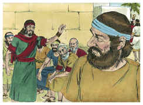
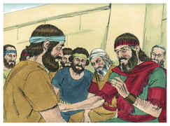
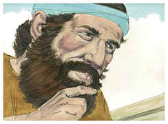
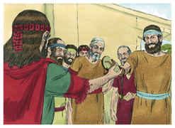
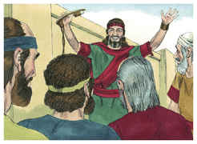
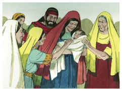

# Rute Capítulo 4

1	E BOAZ subiu à porta, e assentou-se ali; e eis que o remidor de que Boaz tinha falado ia passando, e disse-lhe: Ó fulano, vem cá, assenta-te aqui. E desviou-se para ali, e assentou-se.

2	Então tomou dez homens dos anciãos da cidade, e disse: Assentai-vos aqui. E assentaram-se.

3	Então disse ao remidor: Aquela parte da terra que foi de Elimeleque, nosso irmão, Noemi, que tornou da terra dos moabitas, está vendendo.

4	E eu resolvi informar-te disso e dizer-te: Compra-a diante dos habitantes, e diante dos anciãos do meu povo; se a hás de redimir, redime-a, e se não a houveres de redimir, declara-mo, para que o saiba, pois outro não há senão tu que a redima, e eu depois de ti. Então disse ele: Eu a redimirei.

5	Disse porém Boaz: No dia em que comprares a terra da mão de Noemi, também a comprarás da mão de Rute, a moabita, mulher do falecido, para suscitar o nome do falecido sobre a sua herança.

6	Então disse o remidor: Para mim não a poderei redimir, para que não prejudique a minha herança; toma para ti o meu direito de remissão, porque eu não a poderei redimir.

7	Havia, pois, já de muito tempo este costume em Israel, quanto a remissão e permuta, para confirmar todo o negócio; o homem descalçava o sapato e o dava ao seu próximo; e isto era por testemunho em Israel.

8	Disse, pois, o remidor a Boaz: Toma-a para ti. E descalçou o sapato.

9	Então Boaz disse aos anciãos e a todo o povo: Sois hoje testemunhas de que tomei tudo quanto foi de Elimeleque, e de Quiliom, e de Malom, da mão de Noemi,

10	E de que também tomo por mulher a Rute, a moabita, que foi mulher de Malom, para suscitar o nome do falecido sobre a sua herança, para que o nome do falecido não seja desarraigado dentre seus irmãos e da porta do seu lugar; disto sois hoje testemunhas.

11	E todo o povo que estava na porta, e os anciãos, disseram: Somos testemunhas; o Senhor faça a esta mulher, que entra na tua casa, como a Raquel e como a Lia, que ambas edificaram a casa de Israel; e porta-te valorosamente em Efrata, e faze-te nome afamado em Belém.

12	E seja a tua casa como a casa de Perez (que Tamar deu à luz a Judá), pela descendência que o Senhor te der desta moça.

13	Assim tomou Boaz a Rute, e ela lhe foi por mulher; e ele a possuiu, e o Senhor lhe fez conceber, e deu à luz um filho.

14	Então as mulheres disseram a Noemi: Bendito seja o Senhor, que não deixou hoje de te dar remidor, e seja o seu nome afamado em Israel.

15	Ele te será por restaurador da alma, e nutrirá a tua velhice, pois tua nora, que te ama, o deu à luz, e ela te é melhor do que sete filhos.

16	E Noemi tomou o filho, e o pôs no seu colo, e foi sua ama.

17	E as vizinhas lhe deram um nome, dizendo: A Noemi nasceu um filho. E deram-lhe o nome de Obede. Este é o pai de Jessé, pai de Davi.

18	Estas são, pois, as gerações de Perez: Perez gerou a Hezrom,

19	E Hezrom gerou a Rão, e Rão gerou a Aminadabe,

20	E Aminadabe gerou a Naassom, e Naassom gerou a Salmom,

21	E Salmom gerou a Boaz, e Boaz gerou a Obede,

22	E Obede gerou a Jessé, e Jessé gerou a Davi.

