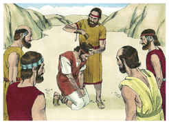

# 1 Crônicas Capítulo 11

1	ENTÃO todo o Israel se ajuntou a Davi em Hebrom, dizendo: Eis que somos teus ossos e tua carne.

2	E também outrora, sendo Saul ainda rei, eras tu o que fazias sair e entrar a Israel; também o Senhor teu Deus te disse: Tu apascentarás o meu povo Israel, e tu serás chefe sobre o meu povo Israel.

3	Também vieram todos os anciãos de Israel ao rei, a Hebrom, e Davi fez com eles aliança em Hebrom, perante o Senhor; e ungiram a Davi rei sobre Israel, conforme a palavra do Senhor pelo ministério de Samuel.

4	E partiu Davi e todo o Israel para Jerusalém, que é Jebus; porque ali estavam os jebuseus, habitantes da terra.

5	E disseram os habitantes de Jebus a Davi: Tu não entrarás aqui. Porém Davi ganhou a fortaleza de Sião, que é a cidade de Davi.

6	Porque disse Davi: Qualquer que primeiro ferir os jebuseus será chefe e capitão. Então Joabe, filho de Zeruia, subiu primeiro a ela; pelo que foi feito chefe.

7	E Davi habitou na fortaleza; por isso foi chamada a cidade de Davi.

8	E edificou a cidade ao redor, desde Milo até ao circuito; e Joabe renovou o restante da cidade.

9	E Davi tornava-se cada vez mais forte; porque o Senhor dos Exércitos era com ele.

10	E estes foram os chefes dos poderosos que Davi tinha, e que o apoiaram fortemente no seu reino, com todo o Israel, para o fazerem rei, conforme a palavra do Senhor, no tocante a Israel.

11	E este é o número dos poderosos que Davi tinha: Jasobeão, hacmonita, chefe dos capitães, o qual, brandindo a sua lança contra trezentos, de uma vez os matou.

12	E, depois dele Eleazar, filho de Dodó, o aoíta; ele estava entre os três poderosos.

13	Este esteve com Davi em Pas-Damim, quando os filisteus ali se ajuntaram à peleja, onde havia um pedaço de campo cheio de cevada; e o povo fugiu de diante dos filisteus.

14	E puseram-se no meio daquele campo, e o defenderam, e feriram os filisteus; e o Senhor efetuou um grande livramento.

15	E três dos trinta capitães desceram à penha, a ter com Davi, na caverna de Adulão; e o exército dos filisteus estava acampado no vale de Refaim.

16	E Davi estava então no lugar forte; e o alojamento dos filisteus estava então em Belém.

17	E desejou Davi, e disse: Quem me dera beber da água do poço de Belém, que está junto à porta!

18	Então aqueles três romperam pelo acampamento dos filisteus, e tiraram água do poço de Belém, que estava junto à porta, e tomaram dela e a trouxeram a Davi; porém Davi não a quis beber, mas a derramou ao Senhor,

19	E disse: Nunca meu Deus permita que faça tal! Beberia eu o sangue destes homens com as suas vidas? Pois com perigo das suas vidas a trouxeram. E ele não a quis beber. Isto fizeram aqueles três homens.

20	E também Abisai, irmão de Joabe, era chefe de três, o qual, brandindo a sua lança contra trezentos, os feriu; e teve nome entre os três.

21	Ele foi o mais ilustre dos três, pelo que foi capitão deles; porém não igualou aos primeiros três.

22	Também Benaia, filho de Joiada, filho de um homem poderoso de Cabzeel, grande em obras; ele feriu a dois heróis de Moabe; e também desceu, e feriu um leão dentro de uma cova, no tempo da neve.

23	Também feriu ele a um homem egípcio, homem de grande altura, de cinco côvados; e trazia o egípcio uma lança na mão, como o órgão do tecelão; mas Benaia desceu contra ele com uma vara, e arrancou a lança da mão do egípcio, e com ela o matou.

24	Estas coisas fez Benaia, filho de Joiada; pelo que teve nome entre aqueles três poderosos.

25	Eis que dos trinta foi ele o mais ilustre; contudo não chegou aos primeiros três; e Davi o pôs sobre os da sua guarda.

26	E foram os poderosos dos exércitos: Asael, irmão de Joabe, El-Hanã, filho de Dodó, de Belém;

27	Samote, o harorita; Helez, o pelonita;

28	Ira, filho de Iques, o tecoíta; Abiezer, o anatotita;

29	Sibecai, o husatita; Ilai, o aoíta;

30	Maarai, o netofatita; Helede, filho de Baaná, o netofatita;

31	Itai, filho de Ribai, de Gileade, dos filhos de Benjamim; Benaia, o piratonita;

32	Hurai, do ribeiro de Gaás; Abiel, o arbatita;

33	Azmavete, o baarumita; Eliabe, o saalbonita;

34	Dos filhos de Hasém, o gizonita: Jônatas, filho de Sage, o hararita;

35	Aião, filho de Sacar, o hararita; Elifal, filho de Ur;

36	Hefer, o mequeratita; Aías, o pelonita;

37	Hezro, o carmelita; Naarai, filho de Ezbai;

38	Joel, irmão de Natã; Mibar, filho de Hagri;

39	Zeleque, o amonita; Naarai, o beerotita, escudeiro de Joabe, filho de Zeruia;

40	Ira, o itrita; Garebe, o itrita;

41	Urias, o heteu; Zabade, filho de Alai;

42	Adina, filho de Siza, o rubenita, capitão dos rubenitas, e com ele trinta;

43	Hanã, filho de Maaca; e Josafá, o mitatita;

44	Uzias, o asteratita; Sama e Jeiel, filhos de Hotão, o aroerita;

45	Jediael, filho de Sinri; e Joa, seu irmão, o tizita;

46	Eliel, o maavita; e Jeribai e Josavias, filhos de Elnaão; e Itma, o moabita;

47	Eliel, Obede, e Jaasiel, o mesobaíta.

