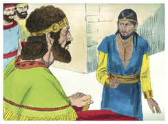
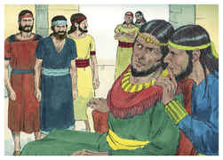
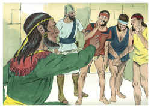
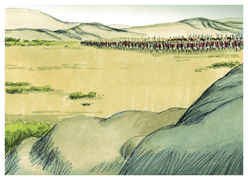
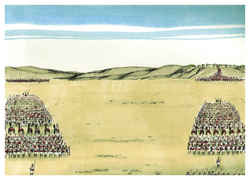
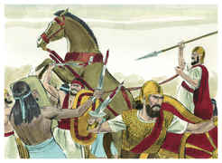
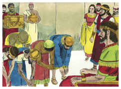

# 1 Crônicas Capítulo 19

1	E ACONTECEU, depois disto que Naás, rei dos filhos de Amom, morreu; e seu filho reinou em seu lugar.

2	Então disse Davi: Usarei de benevolência com Hanum, filho de Naás, porque seu pai usou de benevolência comigo. Por isso Davi enviou mensageiros para o consolarem acerca de seu pai. E, chegando os servos de Davi à terra dos filhos de Amom, a Hanum, para o consolarem,

3	Disseram os príncipes dos filhos de Amom a Hanum: Pensas porventura, que foi para honrar teu pai aos teus olhos, que Davi te mandou consoladores? Não vieram seus servos a ti, a esquadrinhar, e a transtornar, e a espiar a terra?

4	Por isso Hanum tomou os servos de Davi, e raspou-os, e cortou-lhes as vestes no meio até à coxa da perna, e os despediu.

5	E foram-se, e avisaram a Davi acerca daqueles homens; e enviou ele mensageiros a encontrá-los; porque aqueles homens estavam sobremaneira envergonhados. Disse, pois, o rei: Deixai-vos ficar em Jericó, até que vos torne a crescer a barba, e então voltai.

6	Vendo, pois, os filhos de Amom que se tinham feito odiosos para com Davi, enviou Hanum, e os filhos de Amom, mil talentos de prata para alugarem para si carros e cavaleiros da Mesopotâmia, e da Síria de Maaca, e de Zobá.

7	E alugaram para si trinta e dois mil carros, e o rei de Maaca e o seu povo, e eles vieram, e se acamparam diante de Medeba; também os filhos de Amom se ajuntaram das suas cidades, e vieram para a guerra.

8	O que ouvindo Davi, enviou Joabe e todo o exército dos homens valentes.

9	E, saindo os filhos de Amom, ordenaram a batalha à porta da cidade; porém os reis que vieram se puseram à parte no campo.

10	E, vendo Joabe que a batalha estava preparada contra ele, pela frente e pela retaguarda, separou dentre os mais escolhidos de Israel, e os ordenou contra os sírios.

11	E o resto do povo entregou na mão de Abisai, seu irmão; e puseram-se em ordem de batalha contra os filhos de Amom.

12	E disse: Se os sírios forem mais fortes do que eu, tu virás socorrer-me; e, se os filhos de Amom forem mais fortes do que tu, então eu te socorrerei.

13	Esforça-te, e esforcemo-nos pelo nosso povo, e pelas cidades do nosso Deus, e faça o Senhor o que parecer bem aos seus olhos.

14	Então se chegou Joabe, e o povo que tinha consigo, diante dos sírios, para a batalha; e fugiram de diante dele.

15	Vendo, pois, os filhos de Amom que os sírios fugiram, também eles fugiram de diante de Abisai, seu irmão, e entraram na cidade; e veio Joabe para Jerusalém.

16	E, vendo os sírios que foram derrotados diante de Israel, enviaram mensageiros, e fizeram sair os sírios que habitavam do outro lado do rio; e Sofaque, capitão do exército de Hadar-Ezer, marchava diante deles.

17	Do que avisado Davi, ajuntou a todo o Israel, e passou o Jordão, e foi ter com eles, e ordenou contra eles a batalha; e, tendo Davi ordenado a batalha contra os sírios, pelejaram contra ele.

18	Porém os sírios fugiram de diante de Israel, e feriu Davi, dos sírios, os homens de sete mil carros, e quarenta mil homens de pé; e a Sofaque, capitão do exército, matou.

19	Vendo, pois, os servos de Hadar-Ezer que tinham sido feridos diante de Israel, fizeram paz com Davi, e o serviram; e os sírios nunca mais quiseram socorrer os filhos de Amom.

