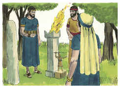
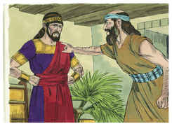
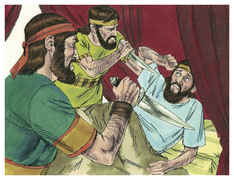

# 1 Crônicas Capítulo 24

1	E QUANTO aos filhos de Arão, estas foram as suas divisões: os filhos de Arão: Nadabe, Abiú, Eleazar e Itamar.

2	E morreram Nadabe e Abiú antes de seu pai, e não tiveram filhos; e Eleazar e Itamar administravam o sacerdócio.

3	E Davi, com Zadoque, dos filhos de Eleazar, e Aimeleque, dos filhos de Itamar, dividiu-os segundo o seu ofício no seu ministério.

4	E acharam-se muito mais chefes dos pais entre os filhos de Eleazar do que entre os filhos de Itamar, quando os repartiram; dos filhos de Eleazar dezesseis chefes das casas paternas, mas dos filhos de Itamar, segundo as casas paternas, oito.

5	E os repartiram por sortes, uns com os outros; porque houve governadores do santuário e governadores da casa de Deus, assim dentre os filhos de Eleazar, como dentre os filhos de Itamar.

6	E Semaías, filho de Natanael, o escrivão dentre os levitas, os registrou perante o rei, e os príncipes, e Zadoque, o sacerdote, e Aimeleque, filho de Abiatar, e os chefes dos pais entre os sacerdotes, e entre os levitas; dentre as casas dos pais tomou-se uma para Eleazar, e outra para Itamar.

7	E saiu a primeira sorte a Jeoiaribe, a segunda a Jedaías,

8	A terceira a Harim, a quarta a Seorim,

9	A quinta a Malquias, a sexta a Miamim,

10	A sétima a Hacoz, a oitava a Abias,

11	A nona a Jesua, a décima a Secanias,

12	A undécima a Eliasibe, a duodécima a Jaquim,

13	A décima terceira a Hupa, a décima quarta a Jesebeabe,

14	A décima quinta a Bilga, a décima sexta a Imer,

15	A décima sétima a Hezir, a décima oitava a Hapizes,

16	A décima nona a Petaías, a vigésima a Jeezquel,

17	A vigésima primeira a Jaquim, a vigésima segunda a Gamul,

18	A vigésima terceira a Delaías, a vigésima quarta a Maazias.

19	O ofício destes no seu ministério era entrar na casa do Senhor, segundo lhes fora ordenado por Arão seu pai, como o Senhor Deus de Israel lhe tinha mandado.

20	E do restante dos filhos de Levi: dos filhos de Anrão, Subael; dos filhos de Subael, Jedias.

21	Quanto a Reabias: dos filhos de Reabias, Issias era o primeiro;

22	Dos izaritas, Selomote; dos filhos de Selomote, Jaate;

23	E dos filhos de Hebrom, Jerias o primeiro, Amarias o segundo, Jaaziel o terceiro, Jecameão o quarto;

24	Dos filhos de Uziel, Mica; dos filhos de Mica, Samir;

25	O irmão de Mica, Issias; dos filhos de Issias, Zacarias;

26	Os filhos de Merari, Mali e Musi; dos filhos de Jaazias, Beno;

27	Os filhos de Merari: de Jaazias, Beno, e Soão, e Zacur, e Ibri;

28	De Mali, Eleazar; e este não teve filhos.

29	Quanto a Quis: dos filhos de Quis, Jerameel;

30	E os filhos de Musi: Mali, e Eder, e Jerimote; estes foram os filhos dos levitas, segundo as suas casas paternas.

31	Estes também lançaram sortes como seus irmãos, os filhos de Arão, perante o rei Davi, e Zadoque, e Aimeleque, e os chefes das famílias entre os sacerdotes e entre os levitas; assim fizeram, tanto os pais principais como os irmãos menores.

