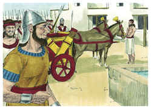
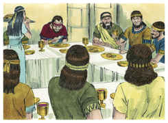
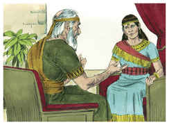
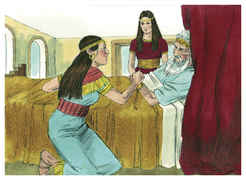
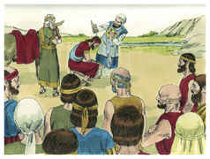
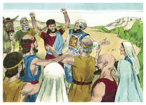
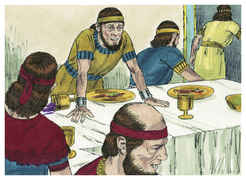
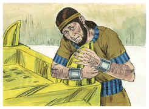
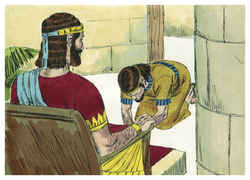

# 1 Reis Capítulo 1

## 1
SENDO, pois, o rei Davi já velho, e entrado em dias, cobriam-no de roupas, porém não se aquecia.

## 2
Então disseram-lhe os seus servos: Busquem para o rei meu senhor uma moça virgem, que esteja perante o rei, e tenha cuidado dele; e durma no seu seio, para que o rei meu senhor se aqueça.

## 3
E buscaram por todos os termos de Israel uma moça formosa, e acharam a Abisague, sunamita; e a trouxeram ao rei.

## 4
E era a moça sobremaneira formosa; e tinha cuidado do rei, e o servia; porém o rei não a conheceu.

## 5
Então Adonias, filho de Hagite, se levantou, dizendo: Eu reinarei. E preparou carros, e cavaleiros, e cinqüenta homens, que corressem adiante dele.

## 6
E nunca seu pai o tinha contrariado, dizendo: Por que fizeste assim? E era ele também muito formoso de parecer; e Hagite o tivera depois de Absalão.

## 7
E tinha entendimento com Joabe, filho de Zeruia, e com Abiatar o sacerdote; os quais o ajudavam, seguindo a Adonias.

## 8
Porém Zadoque, o sacerdote, e Benaia, filho de Joiada, e Natã, o profeta, e Simei, e Rei, e os poderosos que Davi tinha, não estavam com Adonias.

## 9
E matou Adonias ovelhas, e vacas, e animais cevados, junto à pedra de Zoelete, que está perto da fonte de Rogel; e convidou a todos os seus irmãos, os filhos do rei, e a todos os homens de Judá, servos do rei.

## 10
Porém a Natã, o profeta, e a Benaia, e aos poderosos, e a Salomão, seu irmão, não convidou.

## 11
Então falou Natã a Bate-Seba, mãe de Salomão, dizendo: Não ouviste que Adonias, filho de Hagite, reina? E que nosso senhor Davi não o sabe?

## 12
Vem, pois, agora, e deixa-me dar-te um conselho, para que salves a tua vida, e a de Salomão teu filho.

## 13
Vai, e chega ao rei Davi, e dize-lhe: Não juraste tu, rei senhor meu, à tua serva, dizendo: Certamente teu filho Salomão reinará depois de mim, e ele se assentará no meu trono? Por que, pois, reina Adonias?

## 14
Eis que, estando tu ainda aí falando com o rei, eu também entrarei depois de ti, e confirmarei as tuas palavras.

## 15
E foi Bate-Seba ao rei na sua câmara; e o rei era muito velho; e Abisague, a sunamita, servia ao rei.

## 16
E Bate-Seba inclinou a cabeça, e se prostrou perante o rei; e disse o rei: Que tens?

## 17
E ela lhe disse: Senhor meu, tu juraste à tua serva pelo Senhor teu Deus, dizendo: Salomão, teu filho, reinará depois de mim, e ele se assentará no meu trono.

## 18
E agora eis que Adonias reina; e tu, ó rei meu senhor, não o sabes.

## 19
E matou vacas, e animais cevados, e ovelhas em abundância, e convidou a todos os filhos do rei, e a Abiatar, o sacerdote, e a Joabe, capitão do exército, mas a teu servo Salomão não convidou.

## 20
Porém, ó rei meu senhor, os olhos de todo o Israel estão sobre ti, para que lhe declares quem se assentará sobre o trono do rei meu senhor, depois dele.

## 21
De outro modo sucederá que, quando o rei meu senhor dormir com seus pais, eu e Salomão meu filho seremos os culpados.

## 22
E, estando ela ainda falando com o rei, eis que entra o profeta Natã.

## 23
E o fizeram saber ao rei, dizendo: Eis aí está o profeta Natã. E entrou à presença do rei, e prostrou-se diante dele com o rosto em terra.

## 24
E disse Natã: Ó rei meu senhor, disseste tu: Adonias reinará depois de mim, e ele se assentará sobre o meu trono?

## 25
Porque hoje desceu, e matou vacas, e animais cevados, e ovelhas em abundância, e convidou a todos os filhos do rei e aos capitães do exército, e a Abiatar, o sacerdote, e eis que estão comendo e bebendo perante ele; e dizem: Viva o rei Adonias.

## 26
Porém a mim, sendo eu teu servo, e a Zadoque, o sacerdote, e a Benaia, filho de Joiada, e a Salomão, teu servo, não convidou.

## 27
Foi feito isto da parte do rei meu senhor? E não fizeste saber a teu servo quem se assentaria no trono do rei meu senhor depois dele?

## 28
E respondeu o rei Davi, e disse: Chamai-me a Bate-Seba. E ela entrou à presença do rei; e ficou em pé diante do rei.

## 29
Então jurou o rei e disse: Vive o Senhor, o qual remiu a minha alma de toda a angústia,

## 30
Que, como te jurei pelo Senhor Deus de Israel, dizendo: Certamente teu filho Salomão reinará depois de mim, e ele se assentará no meu trono, em meu lugar, assim o farei no dia de hoje.

## 31
Então Bate-Seba se inclinou com o rosto em terra e se prostrou diante do rei, e disse: Viva o rei Davi meu senhor para sempre.

## 32
E disse o rei Davi: Chamai-me a Zadoque, o sacerdote, e a Natã, o profeta, e a Benaia, filho de Joiada. E eles entraram à presença do rei.

## 33
E o rei lhes disse: Tomai convosco os servos de vosso senhor, e fazei subir a meu filho Salomão na mula que é minha; e levai-o a Giom.

## 34
E Zadoque, o sacerdote, com Natã, o profeta, ali o ungirão rei sobre Israel; então tocareis a trombeta, e direis: Viva o rei Salomão!

## 35
Então subireis após ele, e virá e se assentará no meu trono, e ele reinará em meu lugar; porque tenho ordenado que ele seja guia sobre Israel e sobre Judá.

## 36
Então Benaia, filho de Joiada, respondeu ao rei, e disse: Amém; assim o diga o Senhor Deus do rei meu senhor.

## 37
Como o Senhor foi com o rei meu senhor, assim o seja com Salomão, e faça que o seu trono seja maior do que o trono do rei Davi meu senhor.

## 38
Então desceu Zadoque, o sacerdote, e Natã, o profeta, e Benaia, filho de Joiada, e os quereteus, e os peleteus, e fizeram montar a Salomão na mula do rei Davi, e o levaram a Giom.

## 39
E Zadoque, o sacerdote, tomou o chifre de azeite do tabernáculo, e ungiu a Salomão; e tocaram a trombeta, e todo o povo disse: Viva o rei Salomão!

## 40
E todo o povo subiu após ele, e o povo tocava gaitas, e alegrava-se com grande alegria; de maneira que com o seu clamor a terra retiniu.

## 41
E o ouviu Adonias, e todos os convidados que estavam com ele, que tinham acabado de comer; também Joabe ouviu o sonido das trombetas, e disse: Por que há tal ruído de cidade alvoroçada?

## 42
Estando ele ainda falando, eis que vem Jônatas, filho de Abiatar, o sacerdote, e disse Adonias: Entra, porque és homem valente, e trarás boas novas.

## 43
E respondeu Jônatas, e disse a Adonias: Certamente nosso senhor, rei Davi, constituiu rei a Salomão;

## 44
E o rei enviou com ele a Zadoque, o sacerdote, e a Natã, o profeta, e a Benaia, filho de Joiada, e aos quereteus e aos peleteus; e o fizeram montar na mula do rei.

## 45
E Zadoque, o sacerdote, e Natã, o profeta, o ungiram rei em Giom, e dali subiram alegres, e a cidade está alvoroçada; este é o clamor que ouviste.

## 46
E também Salomão está assentado no trono do reino.

## 47
E também os servos do rei vieram abençoar a nosso senhor, o rei Davi, dizendo: Faça teu Deus que o nome de Salomão seja melhor do que o teu nome; e faça que o seu trono seja maior do que o teu trono. E o rei se inclinou no leito.

## 48
E também disse o rei assim: Bendito o Senhor Deus de Israel, que hoje tem dado quem se assente no meu trono, e que os meus olhos o vissem.

## 49
Então estremeceram e se levantaram todos os convidados que estavam com Adonias; e cada um se foi ao seu caminho.

## 50
Porém Adonias temeu a Salomão; e levantou-se, e foi, e apegou-se às pontas do altar.

## 51
E fez-se saber a Salomão, dizendo: Eis que Adonias teme ao rei Salomão; porque eis que apegou-se às pontas do altar, dizendo: Jure-me hoje o rei Salomão que não matará o seu servo à espada.

## 52
E disse Salomão: Se for homem de bem, nem um de seus cabelos cairá em terra; se, porém, se achar nele maldade, morrerá.

## 53
E mandou o rei Salomão, e o fizeram descer do altar; e veio, e prostrou-se perante o rei Salomão, e Salomão lhe disse: Vai para tua casa.

