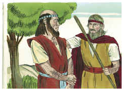

# 1 Reis Capítulo 19

1	E ACABE fez saber a Jezabel tudo quanto Elias havia feito, e como totalmente matara todos os profetas à espada.

2	Então Jezabel mandou um mensageiro a Elias, a dizer-lhe: Assim me façam os deuses, e outro tanto, se de certo amanhã a estas horas não puser a tua vida como a de um deles.

3	O que vendo ele, se levantou e, para escapar com vida, se foi, e chegando a Berseba, que é de Judá, deixou ali o seu servo.

4	Ele, porém, foi ao deserto, caminho de um dia, e foi sentar-se debaixo de um zimbro; e pediu para si a morte, e disse: Já basta, ó Senhor; toma agora a minha vida, pois não sou melhor do que meus pais.

5	E deitou-se, e dormiu debaixo do zimbro; e eis que então um anjo o tocou, e lhe disse: Levanta-te, come.

6	E olhou, e eis que à sua cabeceira estava um pão cozido sobre as brasas, e uma botija de água; e comeu, e bebeu, e tornou a deitar-se.

7	E o anjo do Senhor tornou segunda vez, e o tocou, e disse: Levanta-te e come, porque te será muito longo o caminho.

8	Levantou-se, pois, e comeu e bebeu; e com a força daquela comida caminhou quarenta dias e quarenta noites até Horebe, o monte de Deus.

9	E ali entrou numa caverna e passou ali a noite; e eis que a palavra do Senhor veio a ele, e lhe disse: Que fazes aqui Elias?

10	E ele disse: Tenho sido muito zeloso pelo Senhor Deus dos Exércitos, porque os filhos de Israel deixaram a tua aliança, derrubaram os teus altares, e mataram os teus profetas à espada, e só eu fiquei, e buscam a minha vida para ma tirarem.

11	E Deus lhe disse: Sai para fora, e põe-te neste monte perante o Senhor. E eis que passava o Senhor, como também um grande e forte vento que fendia os montes e quebrava as penhas diante do Senhor; porém o Senhor não estava no vento; e depois do vento um terremoto; também o Senhor não estava no terremoto;

12	E depois do terremoto um fogo; porém também o Senhor não estava no fogo; e depois do fogo uma voz mansa e delicada.

13	E sucedeu que, ouvindo-a Elias, envolveu o seu rosto na sua capa, e saiu para fora, e pôs-se à entrada da caverna; e eis que veio a ele uma voz, que dizia: Que fazes aqui, Elias?

14	E ele disse: Eu tenho sido em extremo zeloso pelo Senhor Deus dos Exércitos, porque os filhos de Israel deixaram a tua aliança, derrubaram os teus altares, e mataram os teus profetas à espada, e só eu fiquei; e buscam a minha vida para ma tirarem.

15	E o Senhor lhe disse: Vai, volta pelo teu caminho para o deserto de Damasco; e, chegando lá, unge a Hazael rei sobre a Síria.

16	Também a Jeú, filho de Ninsi, ungirás rei de Israel; e também a Eliseu, filho de Safate de Abel-Meolá, ungirás profeta em teu lugar.

17	E há de ser que o que escapar da espada de Hazael, matá-lo-á Jeú; e o que escapar da espada de Jeú, matá-lo-á Eliseu.

18	Também deixei ficar em Israel sete mil: todos os joelhos que não se dobraram a Baal, e toda a boca que não o beijou.

19	Partiu, pois, Elias dali, e achou a Eliseu, filho de Safate, que andava lavrando com doze juntas de bois adiante dele, e ele estava com a duodécima; e Elias passou por ele, e lançou a sua capa sobre ele.

20	Então deixou ele os bois, e correu após Elias; e disse: Deixa-me beijar a meu pai e a minha mãe, e então te seguirei. E ele lhe disse: Vai, e volta; pois, que te fiz eu?

21	Voltou, pois, de o seguir, e tomou a junta de bois, e os matou, e com os aparelhos dos bois cozeu as carnes, e as deu ao povo, e comeram; então se levantou e seguiu a Elias, e o servia.

