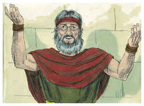
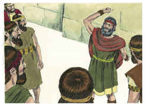
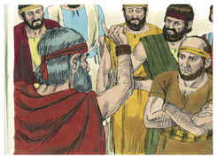
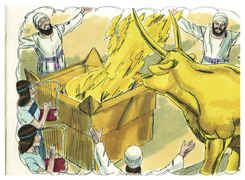
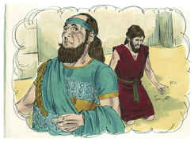
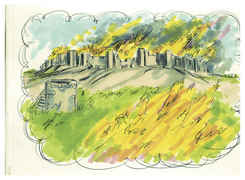
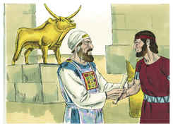
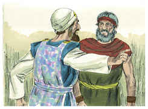
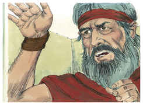
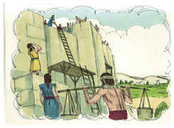

# 1 Reis Capítulo 20

1	E BEN-HADADE, rei da Síria, ajuntou todo o seu exército; e havia com ele trinta e dois reis, e cavalos e carros; e subiu, e cercou a Samaria, e pelejou contra ela.

2	E enviou à cidade mensageiros, a Acabe, rei de Israel,

3	Que lhe disseram: Assim diz Ben-Hadade: A tua prata e o teu ouro são meus; e tuas mulheres e os melhores de teus filhos são meus.

4	E respondeu o rei de Israel, e disse: Conforme a tua palavra, ó rei meu senhor, eu sou teu, e tudo quanto tenho.

5	E tornaram a vir os mensageiros, e disseram: Assim diz Ben-Hadade: Enviei-te, na verdade, mensageiros que dissessem: Tu me hás de dar a tua prata, e o teu ouro, e as tuas mulheres e os teus filhos;

6	Todavia amanhã a estas horas enviarei os meus servos a ti, e esquadrinharão a tua casa, e as casas dos teus servos; e há de ser que tudo o que de precioso tiveres, eles tomarão consigo, e o levarão.

7	Então o rei de Israel chamou a todos os anciãos da terra, e disse: Notai agora, e vede como este homem procura o mal; pois mandou pedir-me as mulheres, os meus filhos, a minha prata e o meu ouro, e não lhos neguei.

8	E todos os anciãos e todo o povo lhe disseram: Não lhe dês ouvidos, nem consintas.

9	Por isso disse aos mensageiros de Ben-Hadade: Dizei ao rei, meu senhor: Tudo o que primeiro mandaste pedir a teu servo, farei, porém isto não posso fazer. E voltaram os mensageiros, e lhe levaram a resposta.

10	E Ben-Hadade enviou a ele mensageiros dizendo: Assim me façam os deuses, e outro tanto, que o pó de Samaria não bastará para encher as mãos de todo o povo que me segue.

11	Porém o rei de Israel respondeu: Dizei-lhe: Não se gabe quem se cinge das armas, como aquele que as descinge.

12	E sucedeu que, ouvindo ele esta palavra, estando a beber com os reis nas tendas, disse aos seus servos: Ponde-vos em ordem contra a cidade.

13	E eis que um profeta se chegou a Acabe rei de Israel, e lhe disse: Assim diz o Senhor: Viste toda esta grande multidão? Eis que hoje ta entregarei nas tuas mãos, para que saibas que eu sou o Senhor.

14	E disse Acabe: Por quem? E ele disse: Assim diz o Senhor: Pelos moços dos príncipes das províncias. E disse: Quem começará a peleja? E disse: Tu.

15	Então contou os moços dos príncipes das províncias, e foram duzentos e trinta e dois; e depois deles contou a todo o povo, todos os filhos de Israel, sete mil.

16	E saíram ao meio-dia; e Ben-Hadade estava bebendo e embriagando-se nas tendas, ele e os reis, os trinta e dois reis, que o ajudavam.

17	E os moços dos príncipes das províncias saíram primeiro; e Ben-Hadade enviou espias, que lhe deram avisos, dizendo: Saíram de Samaria uns homens.

18	E ele disse: Ainda que para paz saíssem, tomai-os vivos; e ainda que à peleja saíssem, tomai-os vivos.

19	Saíram, pois, da cidade os moços dos príncipes das províncias, e o exército que os seguia.

20	E eles feriram cada um o seu adversário, e os sírios fugiram, e Israel os perseguiu; porém Ben-Hadade, rei da Síria, escapou a cavalo, com alguns cavaleiros.

21	E saiu o rei de Israel, e feriu os cavalos e os carros; e feriu os sírios com grande estrago.

22	Então o profeta chegou-se ao rei de Israel e lhe disse: Vai, esforça-te, e atenta, e olha o que hás de fazer; porque no decurso de um ano o rei da Síria subirá contra ti.

23	Porque os servos do rei da Síria lhe disseram: Seus deuses são deuses dos montes, por isso foram mais fortes do que nós; mas pelejemos com eles em campo raso, e por certo veremos, se não somos mais fortes do que eles!

24	Faze, pois, isto: tira os reis, cada um do seu lugar, e substitui-os por capitães;

25	E forma outro exército, igual ao exército que perdeste, cavalo por cavalo, e carro por carro, e pelejemos com eles em campo raso, e veremos se não somos mais fortes do que eles! E deu ouvidos à sua voz, e assim fez.

26	E sucedeu que, passado um ano, Ben-Hadade passou revista aos sírios, e subiu a Afeque, para pelejar contra Israel.

27	Também aos filhos de Israel se passou revista, e providos de víveres marcharam contra eles; e os filhos de Israel acamparam-se defronte deles, como dois pequenos rebanhos de cabras; mas os sírios enchiam a terra.

28	E chegou o homem de Deus, e falou ao rei de Israel, e disse: Assim diz o Senhor: Porquanto os sírios disseram: O Senhor é Deus dos montes, e não Deus dos vales; toda esta grande multidão entregarei nas tuas mãos; para que saibas que eu sou o Senhor.

29	E sete dias estiveram acampados uns defronte dos outros; e sucedeu ao sétimo dia que a peleja começou, e os filhos de Israel feriram dos sírios cem mil homens de pé, num dia.

30	E os restantes fugiram a Afeque, à cidade; e caiu o muro sobre vinte e sete mil homens, que restaram; Ben-Hadade, porém, fugiu, e veio à cidade, escondendo-se de câmara em câmara.

31	Então lhe disseram os seus servos: Eis que já temos ouvido que os reis da casa de Israel são reis clementes; ponhamos, pois, sacos aos lombos, e cordas às cabeças, e saiamos ao rei de Israel; pode ser que ele te poupe a vida.

32	Então cingiram sacos aos lombos e cordas às cabeças, e foram ao rei de Israel, e disseram: Diz o teu servo Ben-Hadade: Deixa-me viver. E disse Acabe: Pois ainda vive? É meu irmão.

33	E aqueles homens tomaram isto por bom presságio, e apressaram-se em apanhar a sua palavra, e disseram: Teu irmão Ben-Hadade vive. E ele disse: Vinde, trazei-mo. Então Ben-Hadade foi a ele, e ele o fez subir ao carro.

34	E disse ele: As cidades que meu pai tomou de teu pai tas restituirei, e faze para ti ruas em Damasco, como meu pai as fez em Samaria. E eu, respondeu Acabe, te deixarei ir com esta aliança. E fez com ele aliança e o deixou ir.

35	Então um dos homens dos filhos dos profetas disse ao seu companheiro, pela palavra do Senhor: Ora fere-me. E o homem recusou feri-lo.

36	E ele lhe disse: Porque não obedeceste à voz do Senhor, eis que, em te apartando de mim, um leão te ferirá. E como dele se apartou, um leão o encontrou e o feriu.

37	Depois encontrou outro homem, e disse-lhe: Ora fere-me. E aquele homem deu-lhe um golpe, ferindo-o.

38	Então foi o profeta, e pôs-se perante o rei no caminho; e disfarçou-se com cinza sobre os seus olhos.

39	E sucedeu que, passando o rei, clamou ele ao rei, dizendo: Teu servo estava no meio da peleja, e eis que, desviando-se um homem, trouxe-me outro homem, e disse: Guarda-me este homem; se vier a faltar, será a tua vida em lugar da vida dele, ou pagarás um talento de prata.

40	Sucedeu, pois, que, estando o teu servo ocupado de uma e de outra parte, eis que o homem desapareceu. Então o rei de Israel lhe disse: Esta é a tua sentença; tu mesmo a pronunciaste.

41	Então ele se apressou, e tirou a cinza de sobre os seus olhos; e o rei de Israel o reconheceu, que era um dos profetas.

42	E disse-lhe: Assim diz o Senhor: Porquanto soltaste da mão o homem que eu havia posto para destruição, a tua vida será em lugar da sua vida, e o teu povo em lugar do seu povo.

43	E foi o rei de Israel para a sua casa, desgostoso e indignado; e chegou a Samaria.

