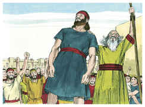

# 1Samuel Capítulo 11

## 1
ENTÃO subiu Naás, amonita, e sitiou a Jabes-Gileade; e disseram todos os homens de Jabes a Naás: Faze aliança conosco, e te serviremos.

## 2
Porém Naás, amonita, lhes disse: Com esta condição farei aliança convosco: que a todos vos arranque o olho direito, e assim ponha esta afronta sobre todo o Israel.

## 3
Então os anciãos de Jabes lhe disseram: Deixa-nos por sete dias, para que enviemos mensageiros por todos os termos de Israel, e, não havendo ninguém que nos livre, então viremos a ti.

## 4
E, vindo os mensageiros a Gibeá de Saul, falaram estas palavras aos ouvidos do povo. Então todo o povo levantou a sua voz, e chorou.

## 5
E eis que Saul vinha do campo, atrás dos bois; e disse Saul: Que tem o povo, que chora? E contaram-lhe as palavras dos homens de Jabes.

## 6
Então o Espírito de Deus se apoderou de Saul, ouvindo estas palavras; e acendeu-se em grande maneira a sua ira.

## 7
E tomou uma junta de bois, e cortou-os em pedaços, e os enviou a todos os termos de Israel pelas mãos dos mensageiros, dizendo: Qualquer que não seguir a Saul e a Samuel, assim se fará aos seus bois. Então caiu o temor do Senhor sobre o povo, e saíram como um só homem.

## 8
E contou-os em Bezeque; e houve dos filhos de Israel trezentos mil, e dos homens de Judá trinta mil.

## 9
Então disseram aos mensageiros que vieram: Assim direis aos homens de Jabes-Gileade: Amanhã, em aquecendo o sol, vos virá livramento. Vindo, pois, os mensageiros, e anunciando-o aos homens de Jabes, se alegraram.

## 10
E os homens de Jabes disseram aos amonitas: Amanhã sairemos a vós; então nos fareis conforme a tudo o que parecer bem aos vossos olhos.

## 11
E sucedeu que ao outro dia Saul pôs o povo em três companhias, e vieram ao meio do arraial pela vigília da manhã, e feriram aos amonitas até que o dia aqueceu; e sucedeu que os restantes se espalharam, de modo que não ficaram dois deles juntos.

## 12
Então disse o povo a Samuel: Quem é aquele que dizia que Saul não reinaria sobre nós? Dai-nos aqueles homens, e os mataremos.

## 13
Porém Saul disse: Hoje não morrerá nenhum, pois hoje tem feito o Senhor um livramento em Israel.

## 14
E disse Samuel ao povo: Vinde, vamos nós a Gilgal, e renovemos ali o reino.

## 15
E todo o povo partiu para Gilgal, onde proclamaram a Saul por rei perante o Senhor, e ofereceram ali ofertas pacíficas perante o Senhor; e Saul se alegrou muito ali com todos os homens de Israel.

