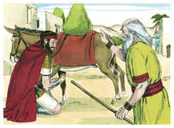
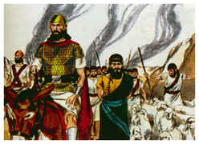
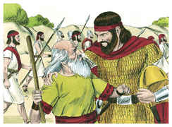
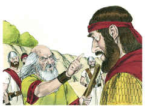
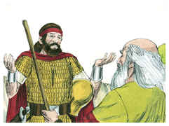
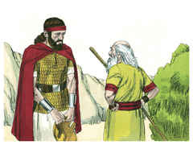
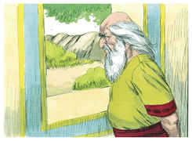

# 1Samuel Capítulo 15

1	ENTÃO disse Samuel a Saul: Enviou-me o Senhor a ungir-te rei sobre o seu povo, sobre Israel; ouve, pois, agora a voz das palavras do Senhor.

2	Assim diz o Senhor dos Exércitos: Eu me recordei do que fez Amaleque a Israel; como se lhe opôs no caminho, quando subia do Egito.

3	Vai, pois, agora e fere a Amaleque; e destrói totalmente a tudo o que tiver, e não lhe perdoes; porém matarás desde o homem até à mulher, desde os meninos até aos de peito, desde os bois até às ovelhas, e desde os camelos até aos jumentos.

4	O que Saul convocou ao povo, e os contou em Telaim, duzentos mil homens de pé, e dez mil homens de Judá.

5	Chegando, pois, Saul à cidade de Amaleque, pôs emboscada no vale.

6	E disse Saul aos queneus: Ide-vos, retirai-vos e saí do meio dos amalequitas, para que não vos destrua juntamente com eles, porque vós usastes de misericórdia com todos os filhos de Israel, quando subiram do Egito. Assim os queneus se retiraram do meio dos amalequitas.

7	Então feriu Saul aos amalequitas desde Havilá até chegar a Sur, que está defronte do Egito.

8	E tomou vivo a Agague, rei dos amalequitas; porém a todo o povo destruiu ao fio da espada.

9	E Saul e o povo pouparam a Agague, e ao melhor das ovelhas e das vacas, e as da segunda ordem, e aos cordeiros e ao melhor que havia, e não os quiseram destruir totalmente; porém a toda a coisa vil e desprezível destruíram totalmente.

10	Então veio a palavra do Senhor a Samuel, dizendo:

11	Arrependo-me de haver posto a Saul como rei; porquanto deixou de me seguir, e não cumpriu as minhas palavras. Então Samuel se contristou, e toda a noite clamou ao Senhor.

12	E madrugou Samuel para encontrar a Saul pela manhã: e anunciou-se a Samuel, dizendo: Já chegou Saul ao Carmelo, e eis que levantou para si uma coluna. Então voltando, passou e desceu a Gilgal.

13	Veio, pois, Samuel a Saul; e Saul lhe disse: Bendito sejas tu do Senhor; cumpri a palavra do Senhor.

14	Então disse Samuel: Que balido, pois, de ovelhas é este aos meus ouvidos, e o mugido de vacas que ouço?

15	E disse Saul: De Amaleque as trouxeram; porque o povo poupou ao melhor das ovelhas, e das vacas, para as oferecer ao Senhor teu Deus; o resto, porém, temos destruído totalmente.

16	Então disse Samuel a Saul: Espera, e te declararei o que o Senhor me disse esta noite. E ele disse-lhe: Fala.

17	E disse Samuel: Porventura, sendo tu pequeno aos teus olhos, não foste por cabeça das tribos de Israel? E o Senhor te ungiu rei sobre Israel.

18	E enviou-te o Senhor a este caminho, e disse: Vai, e destrói totalmente a estes pecadores, os amalequitas, e peleja contra eles, até que os aniquiles.

19	Por que, pois, não deste ouvidos à voz do Senhor, antes te lançaste ao despojo, e fizeste o que parecia mau aos olhos do Senhor?

20	Então disse Saul a Samuel: Antes dei ouvidos à voz do Senhor, e caminhei no caminho pelo qual o Senhor me enviou; e trouxe a Agague, rei de Amaleque, e os amalequitas destruí totalmente;

21	Mas o povo tomou do despojo ovelhas e vacas, o melhor do interdito, para oferecer ao Senhor teu Deus em Gilgal.

22	Porém Samuel disse: Tem porventura o Senhor tanto prazer em holocaustos e sacrifícios, como em que se obedeça à palavra do Senhor? Eis que o obedecer é melhor do que o sacrificar; e o atender melhor é do que a gordura de carneiros.

23	Porque a rebelião é como o pecado de feitiçaria, e o porfiar é como iniqüidade e idolatria. Porquanto tu rejeitaste a palavra do Senhor, ele também te rejeitou a ti, para que não sejas rei.

24	Então disse Saul a Samuel: Pequei, porquanto tenho transgredido a ordem do Senhor e as tuas palavras; porque temi ao povo, e dei ouvidos à sua voz.

25	Agora, pois, rogo-te perdoa o meu pecado; e volta comigo, para que adore ao Senhor.

26	Porém Samuel disse a Saul: Não voltarei contigo; porquanto rejeitaste a palavra do Senhor, já te rejeitou o Senhor, para que não sejas rei sobre Israel.

27	E virando-se Samuel para se ir, ele lhe pegou pela orla da capa, e a rasgou.

28	Então Samuel lhe disse: O Senhor tem rasgado de ti hoje o reino de Israel, e o tem dado ao teu próximo, melhor do que tu.

29	E também aquele que é a Força de Israel não mente nem se arrepende; porquanto não é um homem para que se arrependa.

30	Disse ele então: Pequei; honra-me, porém, agora diante dos anciãos do meu povo, e diante de Israel; e volta comigo, para que adore ao Senhor teu Deus.

31	Então, voltando Samuel, seguiu a Saul; e Saul adorou ao Senhor.

32	Então disse Samuel: Trazei-me aqui a Agague, rei dos amalequitas. E Agague veio a ele animosamente; e disse Agague: Na verdade já passou a amargura da morte.

33	Disse, porém, Samuel: Assim como a tua espada desfilhou as mulheres, assim ficará desfilhada a tua mãe entre as mulheres. Então Samuel despedaçou a Agague perante o Senhor em Gilgal.

34	Então Samuel se foi a Ramá; e Saul subiu à sua casa, a Gibeá de Saul.

35	E nunca mais viu Samuel a Saul até ao dia da sua morte; porque Samuel teve dó de Saul. E o Senhor se arrependeu de haver posto a Saul rei sobre Israel.

