# 1Samuel Capítulo 20

## 1
ENTÃO fugiu Davi de Naiote, em Ramá; e veio, e disse a Jônatas: Que fiz eu? Qual é o meu crime? E qual é o meu pecado diante de teu pai, que procura tirar-me a vida?

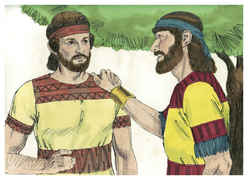

## 2
E ele lhe disse: Tal não suceda; não morrerás; eis que meu pai não faz coisa nenhuma grande, nem pequena, sem primeiro me informar; por que, pois, meu pai me encobriria este negócio? Não será assim.

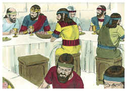

## 3
Então Davi tornou a jurar, e disse: Teu pai sabe muito bem que achei graça em teus olhos; por isso disse: Não saiba isto Jônatas, para que não se magoe. Mas, na verdade, como vive o Senhor, e como vive a tua alma, há apenas um passo entre mim e a morte.

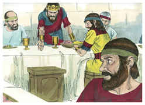

## 4
E disse Jônatas a Davi: O que disser a tua alma, eu te farei.

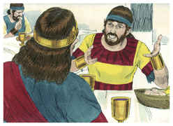

## 5
Disse Davi a Jônatas: Eis que amanhã é a lua nova, em que costumo assentar-me com o rei para comer; porém deixa-me ir, e esconder-me-ei no campo, até à tarde do terceiro dia.

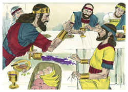

## 6
Se teu pai notar a minha ausência, dirás: Davi me pediu muito que o deixasse ir correndo a Belém, sua cidade; porquanto se faz lá o sacrifício anual para toda a linhagem.

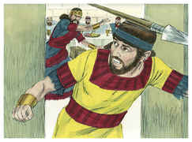

## 7
Se disser assim: Está bem; então teu servo tem paz; porém se muito se indignar, sabe que já está inteiramente determinado no mal.

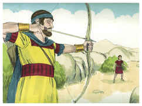

## 8
Usa, pois, de misericórdia com o teu servo, porque o fizeste entrar contigo em aliança do Senhor; se, porém, há em mim crime, mata-me tu mesmo; por que me levarias a teu pai?

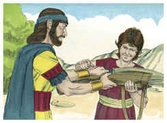

## 9
Então disse Jônatas: Longe de ti tal coisa; porém se de alguma forma soubesse que já este mal está inteiramente determinado por meu pai, para que viesse sobre ti, não to revelaria eu?

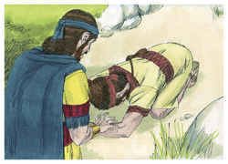

## 10
E disse Davi a Jônatas: Quem me fará saber, se por acaso teu pai te responder asperamente?

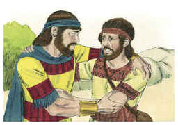

## 11
Então disse Jônatas a Davi: Vem e saiamos ao campo. E saíram ambos ao campo.

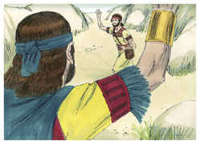

## 12
E disse Jônatas a Davi: O Senhor Deus de Israel seja testemunha! Sondando eu a meu pai amanhã a estas horas, ou depois de amanhã, e eis que se houver coisa favorável para Davi, e eu então não enviar a ti, e não to fizer saber;

## 13
O Senhor faça assim com Jônatas outro tanto; que se aprouver a meu pai fazer-te mal, também to farei saber, e te deixarei partir, e irás em paz; e o Senhor seja contigo, assim como foi com meu pai.

## 14
E, se eu então ainda viver, porventura não usarás comigo da beneficência do Senhor, para que não morra?

## 15
Nem tampouco cortarás da minha casa a tua beneficência eternamente; nem ainda quando o Senhor desarraigar da terra a cada um dos inimigos de Davi.

## 16
Assim fez Jônatas aliança com a casa de Davi, dizendo: O Senhor o requeira da mão dos inimigos de Davi.

## 17
E Jônatas fez jurar a Davi de novo, porquanto o amava; porque o amava com todo o amor da sua alma.

## 18
E disse-lhe Jônatas: Amanhã é a lua nova, e não te acharão no teu lugar, pois o teu assento se achará vazio.

## 19
E, ausentando-te tu três dias, desce apressadamente, e vai àquele lugar onde te escondeste no dia do negócio; e fica-te junto à pedra de Ezel.

## 20
E eu atirarei três flechas para aquele lado, como se atirasse ao alvo.

## 21
E eis que mandarei o moço dizendo: Anda, busca as flechas. Se eu expressamente disser ao moço: Olha que as flechas estão para cá de ti; toma-o contigo, e vem, porque há paz para ti, e não há nada, vive o Senhor.

## 22
Porém se disser ao moço assim: Olha que as flechas estão para lá de ti; vai-te embora, porque o Senhor te deixa ir.

## 23
E quanto ao negócio de que eu e tu falamos, eis que o Senhor está entre mim e ti eternamente.

## 24
Escondeu-se, pois, Davi no campo; e, sendo a lua nova, assentou-se o rei para comer pão.

## 25
E, assentando-se o rei, como das outras vezes, no seu assento, no lugar junto à parede, Jônatas se levantou, e assentou-se Abner ao lado de Saul; e o lugar de Davi apareceu vazio.

## 26
Porém naquele dia não disse Saul nada, porque dizia: Aconteceu-lhe alguma coisa, pela qual não está limpo; certamente não está limpo.

## 27
Sucedeu também no outro dia, o segundo da lua nova, que o lugar de Davi apareceu vazio; disse, pois, Saul a Jônatas, seu filho: Por que não veio o filho de Jessé nem ontem nem hoje a comer pão?

## 28
E respondeu Jônatas a Saul: Davi me pediu encarecidamente que o deixasse ir a Belém.

## 29
Dizendo: Peço-te que me deixes ir, porquanto a nossa linhagem tem um sacrifício na cidade, e meu irmão mesmo me mandou ir; se, pois, agora tenho achado graça em teus olhos, peço-te que me deixes partir, para que veja a meus irmãos; por isso não veio à mesa do rei.

## 30
Então se acendeu a ira de Saul contra Jônatas, e disse-lhe: Filho da mulher perversa e rebelde; não sei eu que tens escolhido o filho de Jessé, para vergonha tua e para vergonha da nudez de tua mãe?

## 31
Porque todos os dias que o filho de Jessé viver sobre a terra nem tu estarás seguro, nem o teu reino; pelo que envia, e traze-mo nesta hora; porque é digno de morte.

## 32
Então respondeu Jônatas a Saul, seu pai, e lhe disse: Por que há de morrer? Que tem feito?

## 33
Então Saul atirou-lhe com a lança, para o ferir; assim entendeu Jônatas que já seu pai tinha determinado matar a Davi.

## 34
Por isso Jônatas, todo encolerizado, se levantou da mesa; e no segundo dia da lua nova não comeu pão; porque se magoava por causa de Davi, porque seu pai o tinha humilhado.

## 35
E aconteceu, pela manhã, que Jônatas saiu ao campo, ao tempo que tinha ajustado com Davi, e um moço pequeno com ele.

## 36
Então disse ao seu moço: Corre a buscar as flechas que eu atirar. Correu, pois, o moço, e ele atirou uma flecha, que fez passar além dele.

## 37
E, chegando o moço ao lugar da flecha que Jônatas tinha atirado, gritou Jônatas atrás do moço, e disse: Não está porventura a flecha mais para lá de ti?

## 38
E tornou Jônatas a gritar atrás do moço: Apressa-te, corre, não te demores. E o moço de Jônatas apanhou as flechas, e veio a seu senhor.

## 39
E o moço não entendeu coisa alguma; só Jônatas e Davi sabiam deste negócio.

## 40
Então Jônatas deu as suas armas ao moço que trazia, e disse-lhe: Anda, e leva-as à cidade.

## 41
E, indo-se o moço, levantou-se Davi do lado do sul, e lançou-se sobre o seu rosto em terra, e inclinou-se três vezes; e beijaram-se um ao outro, e choraram juntos, mas Davi chorou muito mais.

## 42
E disse Jônatas a Davi: Vai-te em paz; o que nós temos jurado ambos em nome do Senhor, dizendo: O Senhor seja entre mim e ti, e entre a minha descendência e a tua descendência, seja perpetuamente. (20:43)Então se levantou Davi, e partiu; e Jônatas entrou na cidade.

