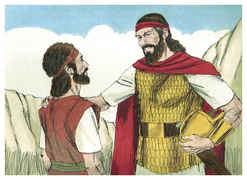

# 1Samuel Capítulo 26

1	E VIERAM os zifeus a Saul, a Gibeá, dizendo: Não está Davi escondido no outeiro de Haquilá, defronte de Jesimom?

2	Então Saul se levantou e desceu ao deserto de Zife, e com ele três mil homens escolhidos de Israel, a buscar a Davi no deserto de Zife.

3	E acampou-se Saul no outeiro de Haquilá, que está defronte de Jesimom, junto ao caminho; porém Davi ficou no deserto, e viu que Saul vinha seguindo-o no deserto.

4	Pois Davi enviou espias, e soube que Saul tinha vindo.

5	E Davi se levantou, e foi ao lugar onde Saul se tinha acampado; viu Davi o lugar onde se tinha deitado Saul, e Abner, filho de Ner, capitão do seu exército; e Saul estava deitado dentro do lugar dos carros, e o povo estava acampado ao redor dele.

6	E dirigindo-se Davi a Aimeleque, o heteu, e a Abisai, filho de Zeruia, irmão de Joabe, disse: Quem descerá comigo a Saul ao arraial? E respondeu Abisai: Eu descerei contigo.

7	Foram, pois, Davi e Abisai de noite ao povo, e eis que Saul estava deitado dormindo dentro do lugar dos carros, e a sua lança estava fincada na terra à sua cabeceira; e Abner e o povo deitavam-se ao redor dele.

8	Então disse Abisai a Davi: Deus te entregou hoje nas mãos o teu inimigo; deixa-me, pois, agora encravá-lo com a lança de uma vez na terra, e não o ferirei segunda vez.

9	E disse Davi a Abisai: Nenhum dano lhe faças; porque quem estendeu a sua mão contra o ungido do Senhor, e ficou inocente?

10	Disse mais Davi: Vive o Senhor que o Senhor o ferirá, ou o seu dia chegará em que morra, ou descerá para a batalha e perecerá.

11	O Senhor me guarde, de que eu estenda a mão contra o ungido do Senhor; agora, porém, toma a lança que está à sua cabeceira e a bilha de água, e vamo-nos.

12	Tomou, pois, Davi a lança e a bilha de água, da cabeceira de Saul, e foram-se; e ninguém houve que o visse, nem que o advertisse, nem que acordasse; porque todos estavam dormindo, porque da parte do Senhor havia caído sobre eles um profundo sono.

13	E Davi, passando ao outro lado, pôs-se no cume do monte ao longe, de maneira que entre eles havia grande distância.

14	E Davi bradou ao povo, e a Abner, filho de Ner, dizendo: Não responderás, Abner? Então Abner respondeu e disse: Quem és tu, que bradas ao rei?

15	Então disse Davi a Abner: Porventura não és homem? E quem há em Israel como tu? Por que, pois, não guardaste o rei, teu senhor? Porque um do povo veio para destruir o rei, teu senhor.

16	Não é bom isso, que fizeste; vive o Senhor, que sois dignos de morte, vós que não guardastes a vosso senhor, o ungido do Senhor; vede, pois, agora onde está a lança do rei, e a bilha de água, que tinha à sua cabeceira.

17	Então conheceu Saul a voz de Davi, e disse: Não é esta a tua voz, meu filho Davi? E disse Davi: É minha voz, ó rei meu senhor.

18	Disse mais: Por que persegue o meu senhor tanto o seu servo? Que fiz eu? E que maldade se acha nas minhas mãos?

19	Ouve, pois, agora, te rogo, rei meu senhor, as palavras de teu servo: Se o Senhor te incita contra mim, receba ele a oferta de alimentos; se, porém, são os filhos dos homens, malditos sejam perante o Senhor; pois eles me têm expulsado hoje para que eu não tenha parte na herança do Senhor, dizendo: Vai, serve a outros deuses.

20	Agora, pois, não se derrame o meu sangue na terra diante do Senhor; pois saiu o rei de Israel em busca de uma pulga, como quem persegue uma perdiz nos montes.

21	Então disse Saul: Pequei; volta, meu filho Davi, porque não tornarei a fazer-te mal; porque foi hoje preciosa a minha vida aos teus olhos; eis que procedi loucamente, e errei grandissimamente.

22	Davi então respondeu, e disse: Eis aqui a lança do rei; venha cá um dos moços, e leve-a.

23	O Senhor, porém, pague a cada um a sua justiça e a sua lealdade; pois o Senhor te entregou hoje na minha mão, porém não quis estender a minha mão contra o ungido do Senhor.

24	E eis que, assim como foi a tua vida hoje de tanta estima aos meus olhos, assim seja a minha vida de muita estima aos olhos do Senhor, e ele me livre de toda a tribulação.

25	Então Saul disse a Davi: Bendito sejas tu, meu filho Davi; pois grandes coisas farás e também prevalecerás. Então Davi se foi pelo seu caminho e Saul voltou para o seu lugar.

