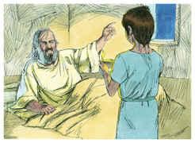
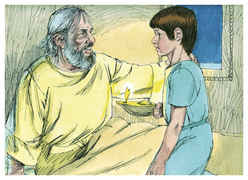
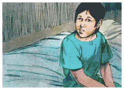
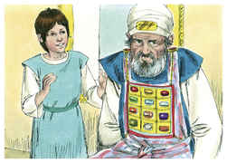
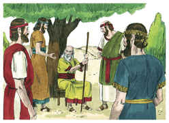

# 1Samuel Capítulo 3

## 1
E O JOVEM Samuel servia ao Senhor perante Eli; e a palavra do Senhor era de muita valia naqueles dias; não havia visão manifesta.

## 2
E sucedeu, naquele dia, que, estando Eli deitado no seu lugar (e os seus olhos começavam a escurecer, pois não podia ver),

## 3
E estando também Samuel já deitado, antes que a lâmpada de Deus se apagasse no templo do Senhor, onde estava a arca de Deus,

## 4
O Senhor chamou a Samuel, e disse ele: Eis-me aqui.

## 5
E correu a Eli, e disse: Eis-me aqui, porque tu me chamaste. Mas ele disse: Não te chamei eu, torna a deitar-te. E foi e se deitou.

## 6
E o Senhor tornou a chamar outra vez a Samuel, e Samuel se levantou, e foi a Eli, e disse: Eis-me aqui, porque tu me chamaste. Mas ele disse: Não te chamei eu, filho meu, torna a deitar-te.

## 7
Porém Samuel ainda não conhecia ao Senhor, e ainda não lhe tinha sido manifestada a palavra do Senhor.

## 8
O Senhor, pois, tornou a chamar a Samuel terceira vez, e ele se levantou, e foi a Eli, e disse: Eis-me aqui, porque tu me chamaste. Então entendeu Eli que o Senhor chamava o jovem.

## 9
Por isso Eli disse a Samuel: Vai deitar-te e há de ser que, se te chamar, dirás: Fala, Senhor, porque o teu servo ouve. Então Samuel foi e se deitou no seu lugar.

## 10
Então veio o Senhor, e pôs-se ali, e chamou como das outras vezes: Samuel, Samuel. E disse Samuel: Fala, porque o teu servo ouve.

## 11
E disse o Senhor a Samuel: Eis que vou fazer uma coisa em Israel, a qual todo o que ouvir lhe tinirão ambos os ouvidos.

## 12
Naquele mesmo dia suscitarei contra Eli tudo quanto tenho falado contra a sua casa, começarei e acabarei.

## 13
Porque eu já lhe fiz saber que julgarei a sua casa para sempre, pela iniqüidade que ele bem conhecia, porque, fazendo-se os seus filhos execráveis, não os repreendeu.

## 14
Portanto, jurei à casa de Eli que nunca jamais será expiada a sua iniqüidade, nem com sacrifício, nem com oferta de alimentos.

## 15
E Samuel ficou deitado até pela manhã, e então abriu as portas da casa do Senhor; porém temia Samuel relatar esta visão a Eli.

## 16
Então chamou Eli a Samuel, e disse: Samuel, meu filho. E disse ele: Eis-me aqui.

## 17
E ele disse: Qual é a palavra que te falou? Peço-te que não ma encubras; assim Deus te faça, e outro tanto, se me encobrires alguma palavra de todas as que te falou.

## 18
Então Samuel lhe contou todas aquelas palavras, e nada lhe encobriu. E disse ele: Ele é o Senhor; faça o que bem parecer aos seus olhos.

## 19
E crescia Samuel, e o Senhor era com ele, e nenhuma de todas as suas palavras deixou cair em terra.

## 20
E todo o Israel, desde Dã até Berseba, conheceu que Samuel estava confirmado por profeta do Senhor.

## 21
E continuou o Senhor a aparecer em Siló; porquanto o Senhor se manifestava a Samuel em Siló pela palavra do Senhor.

