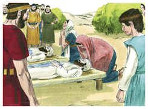

# 1Samuel Capítulo 4

1	E VEIO a palavra de Samuel a todo o Israel; e Israel saiu à peleja contra os filisteus e acampou-se junto a Ebenézer; e os filisteus se acamparam junto a Afeque.

2	E os filisteus se dispuseram em ordem de batalha, para sair contra Israel; e, estendendo-se a peleja, Israel foi ferido diante dos filisteus, porque feriram na batalha, no campo, uns quatro mil homens.

3	E voltando o povo ao arraial, disseram os anciãos de Israel: Por que nos feriu o Senhor hoje diante dos filisteus? Tragamos de Siló a arca da aliança do Senhor, e venha no meio de nós, para que nos livre da mão de nossos inimigos.

4	Enviou, pois, o povo a Siló, e trouxeram de lá a arca da aliança do Senhor dos Exércitos, que habita entre os querubins; e os dois filhos de Eli, Hofni e Finéias, estavam ali com a arca da aliança de Deus.

5	E sucedeu que, vindo a arca da aliança do Senhor ao arraial, todo o Israel gritou com grande júbilo, até que a terra estremeceu.

6	E os filisteus, ouvindo a voz de júbilo, disseram: Que voz de grande júbilo é esta no arraial dos hebreus? Então souberam que a arca do Senhor era vinda ao arraial.

7	Por isso os filisteus se atemorizaram, porque diziam: Deus veio ao arraial. E diziam mais: Ai de nós! Tal nunca jamais sucedeu antes.

8	Ai de nós! Quem nos livrará da mão desses grandiosos deuses? Estes são os deuses que feriram aos egípcios com todas as pragas junto ao deserto.

9	Esforçai-vos, e sede homens, ó filisteus, para que porventura não venhais a servir aos hebreus, como eles serviram a vós; sede, pois, homens, e pelejai.

10	Então pelejaram os filisteus, e Israel foi ferido, fugindo cada um para a sua tenda; e foi tão grande o estrago, que caíram de Israel trinta mil homens de pé.

11	E foi tomada a arca de Deus: e os dois filhos de Eli, Hofni e Finéias, morreram.

12	Então correu, da batalha, um homem de Benjamim, e chegou no mesmo dia a Siló; e trazia as vestes rotas, e terra sobre a cabeça.

13	E, chegando ele, eis que Eli estava assentado numa cadeira, olhando para o caminho; porquanto o seu coração estava tremendo pela arca de Deus. Entrando, pois, aquele homem a anunciar isto na cidade, toda a cidade gritou.

14	E Eli, ouvindo os gritos, disse: Que alvoroço é esse? Então chegou aquele homem apressadamente, e veio, e o anunciou a Eli.

15	E era Eli da idade de noventa e oito anos; e estavam os seus olhos tão escurecidos, que já não podia ver.

16	E disse aquele homem a Eli: Eu sou o que venho da batalha; porque eu fugi hoje da batalha. E disse ele: Que coisa sucedeu, filho meu?

17	Então respondeu o que trazia as notícias, e disse: Israel fugiu de diante dos filisteus, e houve também grande matança entre o povo; e, além disso, também teus dois filhos, Hofni e Finéias, morreram, e a arca de Deus foi tomada.

18	E sucedeu que, fazendo ele menção da arca de Deus, Eli caiu da cadeira para trás, ao lado da porta, e quebrou-se-lhe o pescoço e morreu; porquanto o homem era velho e pesado; e tinha ele julgado Israel quarenta anos.

19	E, estando sua nora, a mulher de Finéias, grávida, e próxima ao parto, e ouvindo estas notícias, de que a arca de Deus era tomada, e de que seu sogro e seu marido morreram, encurvou-se e deu à luz; porquanto as dores lhe sobrevieram.

20	E, ao tempo em que ia morrendo, disseram as mulheres que estavam com ela: Não temas, pois deste à luz um filho. Ela porém não respondeu, nem fez caso disso.

21	E chamou ao menino Icabode, dizendo: De Israel se foi a glória! Porque a arca de Deus foi tomada, e por causa de seu sogro e de seu marido.

22	E disse: De Israel a glória é levada presa; pois é tomada a arca de Deus.

