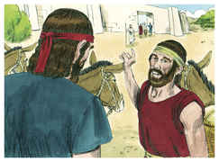
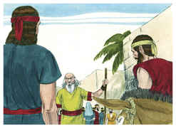
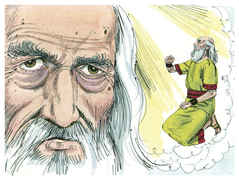
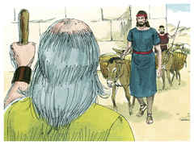
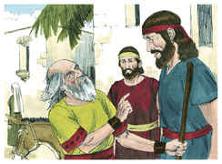

# 1Samuel Capítulo 9

## 1
E HAVIA um homem de Benjamim, cujo nome era Quis, filho de Abiel, filho de Zeror, filho de Becorate, filho de Afia, filho de um homem de Benjamim; homem poderoso.

## 2
Este tinha um filho, cujo nome era Saul, moço, e tão belo que entre os filhos de Israel não havia outro homem mais belo do que ele; desde os ombros para cima sobressaía a todo o povo.

## 3
E perderam-se as jumentas de Quis, pai de Saul; por isso disse Quis a Saul, seu filho: Toma agora contigo um dos moços, e levanta-te e vai procurar as jumentas.

## 4
Passaram, pois, pela montanha de Efraim, e dali passaram à terra de Salisa, porém não as acharam; depois passaram à terra de Saalim, porém tampouco estavam ali; também passaram à terra de Benjamim, porém tampouco as acharam.

## 5
Vindo eles então à terra de Zufe, Saul disse para o seu moço, com quem ele ia: Vem, e voltemos; para que porventura meu pai não deixe de inquietar-se pelas jumentas e se aflija por causa de nós.

## 6
Porém ele lhe disse: Eis que há nesta cidade um homem de Deus, e homem honrado é; tudo quanto diz, sucede assim infalivelmente; vamo-nos agora lá; porventura nos mostrará o caminho que devemos seguir.

## 7
Então Saul disse ao seu moço: Eis, porém, se lá formos, que levaremos então àquele homem? Porque o pão de nossos alforjes se acabou, e presente nenhum temos para levar ao homem de Deus; que temos?

## 8
E o moço tornou a responder a Saul, e disse: Eis que ainda se acha na minha mão um quarto de um siclo de prata, o qual darei ao homem de Deus, para que nos mostre o caminho

## 9
(Antigamente em Israel, indo alguém consultar a Deus, dizia assim: Vinde, e vamos ao vidente; porque ao profeta de hoje, antigamente se chamava vidente).

## 10
Então disse Saul ao moço: Bem dizes; vem, pois, vamos. E foram-se à cidade onde estava o homem de Deus.

## 11
E, subindo eles à cidade, acharam umas moças que saíam a tirar água; e disseram-lhes: Está aqui o vidente?

## 12
E elas lhes responderam, e disseram: Sim, eis aí o tens diante de ti; apressa-te, pois, porque hoje veio à cidade; porquanto o povo tem hoje sacrifício no alto.

## 13
Entrando vós na cidade, logo o achareis, antes que suba ao alto para comer; porque o povo não comerá, até que ele venha; porque ele é o que abençoa o sacrifício, e depois comem os convidados; subi, pois, agora, que hoje o achareis.

## 14
Subiram, pois, à cidade; e, vindo eles no meio da cidade, eis que Samuel lhes saiu ao encontro, para subir ao alto.

## 15
Porque o Senhor revelara isto aos ouvidos de Samuel, um dia antes que Saul viesse, dizendo:

## 16
Amanhã a estas horas te enviarei um homem da terra de Benjamim, o qual ungirás por capitão sobre o meu povo de Israel, e ele livrará o meu povo da mão dos filisteus; porque tenho olhado para o meu povo; porque o seu clamor chegou a mim.

## 17
E quando Samuel viu a Saul, o Senhor lhe respondeu: Eis aqui o homem de quem eu te falei. Este dominará sobre o meu povo.

## 18
E Saul se chegou a Samuel no meio da porta, e disse: Mostra-me, peço-te, onde está a casa do vidente.

## 19
E Samuel respondeu a Saul, e disse: Eu sou o vidente; sobe diante de mim ao alto, e comei hoje comigo; e pela manhã te despedirei, e tudo quanto está no teu coração, to declararei.

## 20
E quanto às jumentas que há três dias se te perderam, não ocupes o teu coração com elas, porque já se acharam. E para quem é todo o desejo de Israel? Porventura não é para ti, e para toda a casa de teu pai?

## 21
Então respondeu Saul, e disse: Porventura não sou eu filho de Benjamim, da menor das tribos de Israel? E a minha família a menor de todas as famílias da tribo de Benjamim? Por que, pois, me falas com semelhantes palavras?

## 22
Porém Samuel tomou a Saul e ao seu moço, e os levou à câmara; e deu-lhes lugar acima de todos os convidados, que eram uns trinta homens.

## 23
Então disse Samuel ao cozinheiro: Dá aqui a porção que te dei, de que te disse: Põe-na à parte contigo.

## 24
Levantou, pois, o cozinheiro a espádua, com o que havia nela, e pô-la diante de Saul; e disse Samuel: Eis que o que foi reservado está diante de ti. Come; porque se guardou para ti para esta ocasião, dizendo eu: Tenho convidado o povo. Assim comeu Saul aquele dia com Samuel.

## 25
Então desceram do alto para a cidade; e falou com Saul sobre o eirado.

## 26
E se levantaram de madrugada; e sucedeu que, quase ao subir da alva, chamou Samuel a Saul ao eirado, dizendo: Levanta-te, e despedir-te-ei. Levantou-se Saul, e saíram ambos para fora, ele e Samuel.

## 27
E, descendo eles para a extremidade da cidade, Samuel disse a Saul: Dize ao moço que passe adiante de nós (e passou); porém tu espera agora, e te farei ouvir a palavra de Deus.

