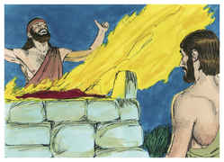
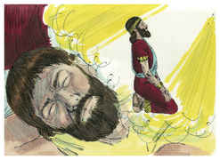
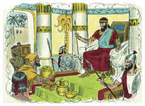

# 2 Crônicas Capítulo 1

1	SALOMÃO, filho de Davi, fortaleceu-se no seu reino; e o Senhor seu Deus era com ele, e o engrandeceu sobremaneira.

2	E falou Salomão a todo o Israel, aos capitães de mil e de cem, aos juízes e a todos os governadores em todo o Israel, chefes das famílias.

3	E foi Salomão, e toda a congregação com ele, ao alto que estava em Gibeom, porque ali estava a tenda da congregação de Deus, que Moisés, servo do Senhor, tinha feito no deserto.

4	Mas Davi tinha feito subir a arca de Deus de Quiriate-Jearim ao lugar que lhe preparara; porque lhe tinha armado uma tenda em Jerusalém.

5	Também o altar de cobre que tinha feito Bezaleel, filho de Uri, filho de Hur, estava ali diante do tabernáculo do Senhor; e Salomão e a congregação o buscavam.

6	E Salomão ofereceu ali sacrifícios perante o Senhor, sobre o altar de cobre que estava na tenda da congregação; e ofereceu sobre ele mil holocaustos.

7	Naquela mesma noite Deus apareceu a Salomão, e disse-lhe: Pede o que queres que eu te dê.

8	E Salomão disse a Deus: Tu usaste de grande benignidade com meu pai Davi, e a mim me fizeste rei em seu lugar.

9	Agora, pois, ó Senhor Deus, confirme-se a tua palavra, dada a meu pai Davi; porque tu me fizeste reinar sobre um povo numeroso como o pó da terra.

10	Dá-me, pois, agora, sabedoria e conhecimento, para que possa sair e entrar perante este povo; pois quem poderia julgar a este tão grande povo?

11	Então Deus disse a Salomão: Porquanto houve isto no teu coração, e não pediste riquezas, bens, ou honra, nem a morte dos que te odeiam, nem tampouco pediste muitos dias de vida, mas pediste para ti sabedoria e conhecimento, para poderes julgar a meu povo, sobre o qual te constituí rei,

12	Sabedoria e conhecimento te são dados; e te darei riquezas, bens e honra, quais não teve nenhum rei antes de ti, e nem depois de ti haverá.

13	Assim Salomão veio a Jerusalém, do alto que estava em Gibeom, de diante da tenda da congregação; e reinou sobre Israel.

14	E Salomão ajuntou carros e cavaleiros, e teve mil e quatrocentos carros, e doze mil cavaleiros; os quais pôs nas cidades dos carros, e junto ao rei em Jerusalém.

15	E fez o rei que houvesse ouro e prata em Jerusalém como pedras; e cedros em tanta abundância como sicômoros que há pelas campinas.

16	E os cavalos, que tinha Salomão, eram trazidos do Egito; e os mercadores do rei os recebiam em tropas, cada uma pelo seu preço.

17	E faziam subir e sair do Egito cada carro por seiscentos siclos de prata, e cada cavalo por cento e cinqüenta; e assim, por meio deles eram para todos os reis dos heteus, e para os reis da Síria.

