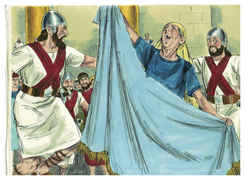
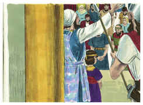

# 2 Crônicas Capítulo 23

1	PORÉM no sétimo ano Joiada se animou, e tomou consigo em aliança os chefes de cem, a Azarias, filho de Jeroão, a Ismael, filho de Joanã, a Azarias, filho de Obede, a Maaséias, filho de Adaías, e a Elisafate, filho de Zicri.

2	Estes percorreram a Judá e ajuntaram os levitas de todas as cidades de Judá e os chefes dos pais de Israel, e vieram para Jerusalém.

3	E toda aquela congregação fez aliança com o rei na casa de Deus; e Joiada lhes disse: Eis que o filho do rei reinará, como o Senhor falou a respeito dos filhos de Davi.

4	Isto é o que haveis de fazer; uma terça parte de vós, ou seja, dos sacerdotes e dos levitas que entram no sábado, serão guardas das portas;

5	E uma terça parte estará na casa do rei; e a outra terça parte à porta do fundamento; e todo o povo estará nos pátios da casa do Senhor.

6	Porém ninguém entre na casa do Senhor, senão os sacerdotes e os levitas que ministram; estes entrarão, porque são santos; mas todo o povo fará a guarda diante do Senhor.

7	E os levitas cercarão o rei de todos os lados, cada um com as suas armas na mão; e qualquer que entrar na casa será morto; porém vós estareis com o rei, quando entrar e quando sair.

8	E fizeram os levitas e todo o Judá conforme a tudo o que ordenara o sacerdote Joiada; e tomou cada um os seus homens, tanto os que entravam no sábado como os que saíam no sábado; porque o sacerdote Joiada não tinha despedido as turmas.

9	Também o sacerdote Joiada deu aos capitães de cem as lanças, os escudos e as rodelas que foram do rei Davi, os quais estavam na casa de Deus.

10	E dispôs todo o povo, a cada um com as suas armas na mão, desde o lado direito da casa até o lado esquerdo da casa, do lado do altar e da casa, em redor do rei.

11	Então tiraram para fora ao filho do rei, e lhe puseram a coroa; deram-lhe o testemunho, e o fizeram rei; e Joiada e seus filhos o ungiram, e disseram: Viva o rei!

12	Ouvindo, pois, Atalia a voz do povo que concorria e louvava o rei, veio ao povo, à casa do Senhor.

13	E olhou, e eis que o rei estava junto à coluna, à entrada, e os príncipes e as trombetas junto ao rei; e todo o povo da terra estava alegre e tocava as trombetas; e também os cantores tocavam instrumentos musicais, e dirigiam o cantar de louvores; então Atalia rasgou os seus vestidos, e clamou: Traição, traição!

14	Porém o sacerdote Joiada trouxe para fora os centuriões que estavam postos sobre o exército e disse-lhes: Tirai-a para fora das fileiras, e o que a seguir, morrerá à espada; porque dissera o sacerdote: Não a mateis na casa do Senhor.

15	E lançaram mão dela; e ela foi pelo caminho da entrada da porta dos cavalos, à casa do rei, e ali a mataram.

16	E Joiada fez aliança entre si e o povo e o rei, para que fossem o povo do Senhor.

17	Depois todo o povo entrou na casa de Baal, e a derrubaram, e quebraram os seus altares, e as suas imagens, e a Matã, sacerdote de Baal, mataram diante dos altares.

18	E Joiada ordenou os ofícios na casa do Senhor, sob a direção dos sacerdotes levitas a quem Davi designara na casa do Senhor, para oferecerem os holocaustos do Senhor, como está escrito na lei de Moisés, com alegria e com canto, conforme a instituição de Davi.

19	E pôs porteiros às portas da casa do Senhor, para que nela não entrasse ninguém imundo em coisa alguma.

20	E tomou os centuriões, os poderosos, os que tinham domínio entre o povo e todo o povo da terra, e conduziram o rei da casa do Senhor, e entraram na casa do rei passando pela porta maior, e assentaram-no no trono real.

21	E todo o povo da terra se alegrou, e a cidade ficou em paz, depois que mataram a Atalia à espada.

