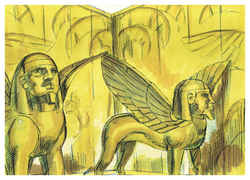

# 2 Crônicas Capítulo 3

## 1
E COMEÇOU Salomão a edificar a casa do Senhor em Jerusalém, no monte Moriá, onde o Senhor aparecera a Davi seu pai, no lugar que Davi tinha preparado na eira de Ornã, o jebuseu.

## 2
E começou a edificar no segundo mês, no segundo dia, no ano quarto do seu reinado.

## 3
E estes foram os fundamentos que Salomão pôs para edificar a casa de Deus: o comprimento em côvados, segundo a primeira medida, era de sessenta côvados, e a largura de vinte côvados.

## 4
E o pátio, que estava na frente, tinha vinte côvados de comprimento, segundo a largura da casa, e a altura era de cento e vinte; e por dentro o revestiu com ouro puro.

## 5
E a casa grande forrou com madeira de faia; e então a revestiu com ouro fino; e fez sobre ela palmas e cadeias.

## 6
Também a casa adornou de pedras preciosas, para ornamento; e o ouro era ouro de Parvaim.

## 7
Também na casa revestiu, com ouro, as traves, os umbrais, as suas paredes e as suas portas; e lavrou querubins nas paredes.

## 8
Fez mais a casa do lugar santíssimo, cujo comprimento, segundo a largura da casa, era de vinte côvados, e também a largura de vinte côvados; e revestiu-a de ouro fino, do peso de seiscentos talentos.

## 9
O peso dos pregos era de cinqüenta siclos de ouro; e as câmaras cobriu de ouro.

## 10
Também fez na casa do lugar santíssimo dois querubins de obra móvel, e cobriu-os de ouro.

## 11
E, quanto às asas dos querubins, o seu comprimento era de vinte côvados; a asa de um deles, de cinco côvados, e tocava na parede da casa; e a outra asa de cinco côvados, e tocava na asa do outro querubim.

## 12
Também a asa do outro querubim era de cinco côvados, e tocava na parede da casa; era também a outra asa de cinco côvados, que tocava na asa do outro querubim.

## 13
E as asas destes querubins se estendiam vinte côvados; e estavam postos em pé, e os seus rostos virados para a casa.

## 14
Também fez o véu de azul, púrpura, carmesim e linho fino; e pôs sobre ele querubins;

## 15
Fez também, diante da casa, duas colunas de trinta e cinco côvados de altura; e o capitel, que estava sobre cada uma, era de cinco côvados.

## 16
Também fez cadeias no oráculo, e as pôs sobre as cabeças das colunas; fez também cem romãs, as quais pôs entre as cadeias.

## 17
E levantou as colunas diante do templo, uma à direita, e outra à esquerda; e chamou o nome da que estava à direita Jaquim, e o nome da que estava à esquerda Boaz.

