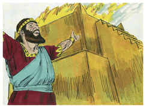

# 2 Crônicas Capítulo 6

## 1
ENTÃO falou Salomão: O Senhor disse que habitaria nas trevas.

## 2
E eu te tenho edificado uma casa para morada, e um lugar para a tua eterna habitação.

## 3
Então o rei virou o seu rosto, e abençoou a toda a congregação de Israel, e toda a congregação de Israel estava em pé.

## 4
E ele disse: Bendito seja o Senhor Deus de Israel, que falou pela sua boca a Davi meu pai; e pelas suas mãos o cumpriu, dizendo:

## 5
Desde o dia em que tirei a meu povo da terra do Egito, não escolhi cidade alguma de todas as tribos de Israel, para edificar nela uma casa em que estivesse o meu nome; nem escolhi homem algum para ser líder do meu povo, Israel.

## 6
Porém escolhi a Jerusalém para que ali estivesse o meu nome; e escolhi a Davi, para que estivesse sobre o meu povo Israel.

## 7
Também Davi meu pai teve no seu coração o edificar uma casa ao nome do Senhor Deus de Israel.

## 8
Porém o Senhor disse a Davi, meu pai: Porquanto tiveste no teu coração o edificar uma casa ao meu nome, bem fizeste de ter isto no teu coração.

## 9
Contudo tu não edificarás a casa, mas teu filho, que há de proceder de teus lombos, esse edificará a casa ao meu nome.

## 10
Assim confirmou o Senhor a sua palavra, que falou; porque eu me levantei em lugar de Davi meu pai, e me assentei sobre o trono de Israel, como o Senhor disse, e edifiquei a casa ao nome do Senhor Deus de Israel.

## 11
E pus nela a arca, em que está a aliança que o Senhor fez com os filhos de Israel.

## 12
E pôs-se em pé, perante o altar do Senhor, na presença de toda a congregação de Israel, e estendeu as suas mãos.

## 13
Porque Salomão tinha feito uma plataforma de metal, de cinco côvados de comprimento, de cinco côvados de largura e de três côvados de altura, e a tinha posto no meio do pátio, e pôs-se em pé sobre ela, e ajoelhou-se em presença de toda a congregação de Israel, e estendeu as suas mãos para o céu.

## 14
E disse: Ó Senhor Deus de Israel, não há Deus semelhante a ti, nem nos céus nem na terra; que guardas a aliança e a beneficência aos teus servos que caminham perante ti de todo o seu coração.

## 15
Que guardaste ao teu servo Davi, meu pai, o que lhe falaste; porque tu pela tua boca o disseste, e pela tua mão o cumpriste, como se vê neste dia.

## 16
Agora, pois, Senhor Deus de Israel, guarda ao teu servo Davi, meu pai, o que falaste, dizendo: Nunca homem algum será cortado de diante de mim, que se assente sobre o trono de Israel; tão-somente que teus filhos guardem seu caminho, andando na minha lei, como tu andaste diante de mim.

## 17
E agora, Senhor Deus de Israel, cumpra-se a tua palavra, que disseste ao teu servo Davi.

## 18
Mas, na verdade, habitará Deus com os homens na terra? Eis que os céus, e o céu dos céus, não te podem conter, quanto menos esta casa que tenho edificado?

## 19
Atende, pois, à oração do teu servo, e à sua súplica, ó Senhor meu Deus; para ouvires o clamor, e a oração, que o teu servo faz perante ti.

## 20
Que os teus olhos estejam dia e noite abertos sobre este lugar, de que disseste que ali porias o teu nome; para ouvires a oração que o teu servo orar neste lugar.

## 21
Ouve, pois, as súplicas do teu servo, e do teu povo Israel, que fizerem neste lugar; e ouve tu do lugar da tua habitação, desde os céus; ouve pois, e perdoa.

## 22
Quando alguém pecar contra o seu próximo, e lhe impuser juramento de maldição, fazendo-o jurar, e o juramento de maldição vier perante o teu altar, nesta casa,

## 23
Ouve tu, então, desde os céus, e age e julga a teus servos, condenando ao ímpio, retribuindo o seu proceder sobre a sua cabeça; e justificando ao justo, dando-lhe segundo a sua justiça.

## 24
Quando também o teu povo Israel for ferido diante do inimigo, por ter pecado contra ti, e eles se converterem, e confessarem o teu nome, e orarem e suplicarem perante ti nesta casa,

## 25
Então, ouve tu desde os céus, e perdoa os pecados do teu povo Israel; e torna a levá-los à terra que lhes tens dado e a seus pais.

## 26
Quando os céus se fecharem, e não houver chuva, por terem pecado contra ti, e orarem neste lugar, e confessarem teu nome, e se converterem dos seus pecados, quando tu os afligires,

## 27
Então, ouve tu desde os céus, e perdoa o pecado de teus servos, e do teu povo Israel, ensinando-lhes o bom caminho, em que andem; e dá chuva sobre a tua terra, que deste ao teu povo em herança.

## 28
Quando houver fome na terra, quando houver peste, quando houver queima de seara, ou ferrugem, gafanhotos, ou lagarta, cercando-a algum dos seus inimigos nas terras das suas portas, ou quando houver qualquer praga, ou qualquer enfermidade,

## 29
Toda a oração, e toda a súplica, que qualquer homem fizer, ou todo o teu povo Israel, conhecendo cada um a sua praga, e a sua dor, e estendendo as suas mãos para esta casa,

## 30
Então, ouve tu desde os céus, do assento da tua habitação, e perdoa, e dá a cada um conforme a todos os seus caminhos, segundo conheces o seu coração (pois só tu conheces o coração dos filhos dos homens),

## 31
A fim de que te temam, para andarem nos teus caminhos, todos os dias que viverem na terra que deste a nossos pais.

## 32
Assim também ao estrangeiro, que não for do teu povo Israel, quando vier de terras remotas por amor do teu grande nome, e da tua poderosa mão, e do teu braço estendido, vindo eles e orando nesta casa;

## 33
Então, ouve tu desde os céus, do assento da tua habitação, e faze conforme a tudo o que o estrangeiro te suplicar; a fim de que todos os povos da terra conheçam o teu nome, e te temam, como o teu povo Israel; e a fim de saberem que pelo teu nome é chamada esta casa que edifiquei.

## 34
Quando o teu povo sair à guerra contra os seus inimigos, pelo caminho que os enviares, e orarem a ti para o lado desta cidade que escolheste, e desta casa, que edifiquei ao teu nome,

## 35
Ouve, então, desde os céus a sua oração, e a sua súplica, e faze-lhes justiça.

## 36
Quando pecarem contra ti (pois não há homem que não peque), e tu te indignares contra eles, e os entregares diante do inimigo, para que os que os cativarem os levem em cativeiro para alguma terra, remota ou vizinha,

## 37
E na terra, para onde forem levados em cativeiro, caírem em si, e se converterem, e na terra do seu cativeiro, a ti suplicarem, dizendo: Pecamos, perversamente procedemos e impiamente agimos;

## 38
E se converterem a ti com todo o seu coração e com toda a sua alma, na terra do seu cativeiro, a que os levaram presos, e orarem para o lado da sua terra, que deste a seus pais, e para esta cidade que escolheste, e para esta casa que edifiquei ao teu nome,

## 39
Ouve, então, desde os céus, do assento da tua habitação, a sua oração e as suas súplicas, e executa o seu direito; e perdoa ao teu povo que houver pecado contra ti.

## 40
Agora, pois, ó meu Deus, estejam os teus olhos abertos, e os teus ouvidos atentos à oração deste lugar.

## 41
Levanta-te, pois, agora, Senhor Deus, para o teu repouso, tu e a arca da tua fortaleza; os teus sacerdotes, ó Senhor Deus, sejam vestidos de salvação, e os teus santos se alegrem do bem.

## 42
Ó Senhor Deus, não faças virar o rosto do teu ungido; lembra-te das misericórdias de Davi teu servo.

