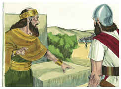
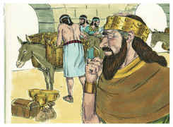
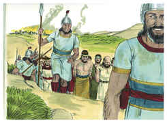
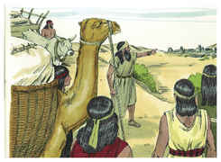
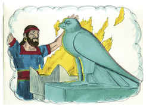

# 2 Reis Capítulo 17

1	NO ano duodécimo de Acaz, rei de Judá, começou a reinar Oséias, filho de Elá, e reinou sobre Israel, em Samaria, nove anos.

2	E fez o que era mau aos olhos do Senhor, contudo não como os reis de Israel que foram antes dele.

3	Contra ele subiu Salmaneser, rei da Assíria; e Oséias ficou sendo servo dele, e pagava-lhe tributos.

4	Porém o rei da Assíria achou em Oséias conspiração; porque enviara mensageiros a Sô, rei do Egito, e não pagava tributos ao rei da Assíria cada ano, como dantes; então o rei da Assíria o encerrou e aprisionou na casa do cárcere.

5	Porque o rei da Assíria subiu por toda a terra, e veio até Samaria, e a cercou três anos.

6	No ano nono de Oséias, o rei da Assíria tomou a Samaria, e levou Israel cativo para a Assíria; e fê-los habitar em Hala e em Habor junto ao rio de Gozã, e nas cidades dos medos,

7	Porque sucedeu que os filhos de Israel pecaram contra o Senhor seu Deus, que os fizera subir da terra do Egito, de debaixo da mão de Faraó, rei do Egito; e temeram a outros deuses.

8	E andaram nos estatutos das nações que o Senhor lançara fora de diante dos filhos de Israel, e nos dos reis de Israel, que eles fizeram.

9	E os filhos de Israel fizeram secretamente coisas que não eram retas, contra o Senhor seu Deus; e edificaram altos em todas as suas cidades, desde a torre dos atalaias até à cidade fortificada.

10	E levantaram, para si, estátuas e imagens do bosque, em todos os altos outeiros, e debaixo de todas as árvores verdes.

11	E queimaram ali incenso em todos os altos, como as nações, que o Senhor expulsara de diante deles; e fizeram coisas ruins, para provocarem à ira o Senhor.

12	E serviram os ídolos, dos quais o Senhor lhes dissera: Não fareis estas coisas.

13	E o Senhor advertiu a Israel e a Judá, pelo ministério de todos os profetas e de todos os videntes, dizendo: Convertei-vos de vossos maus caminhos, e guardai os meus mandamentos e os meus estatutos, conforme toda a lei que ordenei a vossos pais e que eu vos enviei pelo ministério de meus servos, os profetas.

14	Porém não deram ouvidos; antes endureceram a sua cerviz, como a cerviz de seus pais, que não creram no Senhor seu Deus.

15	E rejeitaram os seus estatutos, e a sua aliança que fizera com seus pais, como também as suas advertências, com que protestara contra eles; e seguiram a vaidade, e tornaram-se vãos; como também seguiram as nações, que estavam ao redor deles, das quais o Senhor lhes tinha ordenado que não as imitassem.

16	E deixaram todos os mandamentos do Senhor seu Deus, e fizeram imagens de fundição, dois bezerros; e fizeram um ídolo do bosque, e adoraram perante todo o exército do céu, e serviram a Baal.

17	Também fizeram passar pelo fogo a seus filhos e suas filhas, e deram-se a adivinhações, e criam em agouros; e venderam-se para fazer o que era mau aos olhos do Senhor, para o provocarem à ira.

18	Portanto o Senhor muito se indignou contra Israel, e os tirou de diante da sua face; nada mais ficou, senão somente a tribo de Judá.

19	Até Judá não guardou os mandamentos do Senhor seu Deus; antes andaram nos estatutos de Israel, que eles fizeram.

20	Por isso o Senhor rejeitou a toda a descendência de Israel, e os oprimiu, e os deu nas mãos dos despojadores, até que os expulsou da sua presença.

21	Porque rasgou a Israel da casa de Davi; e eles fizeram rei a Jeroboão, filho de Nebate. E Jeroboão apartou a Israel de seguir ao Senhor, e os fez cometer um grande pecado.

22	Assim andaram os filhos de Israel em todos os pecados que Jeroboão tinha feito; nunca se apartaram deles;

23	Até que o Senhor tirou a Israel de diante da sua presença, como falara pelo ministério de todos os seus servos, os profetas; assim foi Israel expulso da sua terra à Assíria até ao dia de hoje.

24	E o rei da Assíria trouxe gente de Babilônia, de Cuta, de Ava, de Hamate e Sefarvaim, e a fez habitar nas cidades de Samaria, em lugar dos filhos de Israel; e eles tomaram a Samaria em herança, e habitaram nas suas cidades.

25	E sucedeu que, no princípio da sua habitação ali, não temeram ao Senhor; e o Senhor mandou entre eles, leões, que mataram a alguns deles.

26	Por isso falaram ao rei da Assíria, dizendo: A gente que transportaste e fizeste habitar nas cidades de Samaria, não sabe o costume do Deus da terra; assim mandou leões entre ela, e eis que a matam, porquanto não sabe o culto do Deus da terra.

27	Então o rei da Assíria mandou dizer: Levai ali um dos sacerdotes que transportastes de lá; e vá e habite lá, e ele lhes ensine o costume do Deus da terra.

28	Veio, pois, um dos sacerdotes que transportaram de Samaria, e habitou em Betel, e lhes ensinou como deviam temer ao Senhor.

29	Porém cada nação fez os seus deuses, e os puseram nas casas dos altos que os samaritanos fizeram, cada nação nas cidades, em que habitava.

30	E os de Babilônia fizeram Sucote-Benote; e os de Cuta fizeram Nergal; e os de Hamate fizeram Asima.

31	E os aveus fizeram Nibaz e Tartaque; e os sefarvitas queimavam seus filhos no fogo a Adrameleque, e a Anameleque, deuses de Sefarvaim.

32	Também temiam ao Senhor; e dos mais baixos do povo fizeram sacerdotes dos lugares altos, os quais lhes faziam o ministério nas casas dos lugares altos.

33	Assim temiam ao Senhor, mas também serviam a seus deuses, segundo o costume das nações dentre as quais tinham sido transportados.

34	Até ao dia de hoje fazem segundo os primeiros costumes; não temem ao Senhor, nem fazem segundo os seus estatutos, segundo as suas ordenanças, segundo a lei e segundo o mandamento que o Senhor ordenou aos filhos de Jacó, a quem deu o nome de Israel.

35	Contudo o Senhor tinha feito uma aliança com eles, e lhes ordenara, dizendo: Não temereis a outros deuses, nem vos inclinareis diante deles, nem os servireis, nem lhes sacrificareis.

36	Mas o Senhor, que vos fez subir da terra do Egito com grande força e com braço estendido, a este temereis, e a ele vos inclinareis e a ele sacrificareis.

37	E os estatutos, as ordenanças, a lei e o mandamento, que vos escreveu, tereis cuidado de fazer todos os dias; e não temereis a outros deuses.

38	E da aliança que fiz convosco não vos esquecereis; e não temereis a outros deuses.

39	Mas ao Senhor vosso Deus temereis, e ele vos livrará das mãos de todos os vossos inimigos.

40	Porém eles não ouviram; antes fizeram segundo o seu primeiro costume.

41	Assim estas nações temiam ao Senhor e serviam as suas imagens de escultura; também seus filhos, e os filhos de seus filhos, como fizeram seus pais, assim fazem eles até ao dia de hoje.

