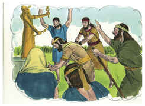
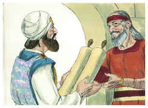
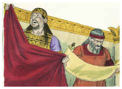
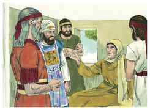

# 2 Reis Capítulo 22

1	TINHA Josias oito anos de idade quando começou a reinar, e reinou trinta e um anos em Jerusalém; e era o nome de sua mãe, Jedida, filha de Adaías, de Bozcate.

2	E fez o que era reto aos olhos do Senhor; e andou em todo o caminho de Davi, seu pai, e não se apartou dele nem para a direita nem para a esquerda.

3	Sucedeu que, no ano décimo oitavo do rei Josias, o rei mandou ao escrivão Safã, filho de Azalias, filho de Mesulão, à casa do Senhor, dizendo:

4	Sobe a Hilquias, o sumo sacerdote, para que tome o dinheiro que se trouxe à casa do Senhor, o qual os guardas do umbral da porta ajuntaram do povo,

5	E que o dêem na mão dos que têm cargo da obra, e estão encarregados da casa do Senhor; para que o dêem àqueles que fazem a obra que há na casa do Senhor, para repararem as fendas da casa;

6	Aos carpinteiros, aos edificadores e aos pedreiros; e para comprar madeira e pedras lavradas, para repararem a casa.

7	Porém não se pediu conta do dinheiro que se lhes entregara nas suas mãos, porquanto procediam com fidelidade.

8	Então disse o sumo sacerdote Hilquias ao escrivão Safã: Achei o livro da lei na casa do Senhor. E Hilquias deu o livro a Safã, e ele o leu.

9	Então o escrivão Safã veio ter com o rei e, dando-lhe conta, disse: Teus servos ajuntaram o dinheiro que se achou na casa, e o entregaram na mão dos que têm cargo da obra, que estão encarregados da casa do Senhor.

10	Também Safã, o escrivão, fez saber ao rei, dizendo: O sacerdote Hilquias me deu um livro. E Safã o leu diante do rei.

11	Sucedeu, pois, que, ouvindo o rei as palavras do livro da lei, rasgou as suas vestes.

12	E o rei mandou a Hilquias, o sacerdote, a Aicão, filho de Safã, a Acbor, filho de Micaías, a Safã o escrivão e a Asaías, o servo do rei, dizendo:

13	Ide, e consultai o Senhor por mim, pelo povo e por todo o Judá, acerca das palavras deste livro que se achou; porque grande é o furor do Senhor, que se acendeu contra nós; porquanto nossos pais não deram ouvidos às palavras deste livro, para fazerem conforme tudo quanto acerca de nós está escrito.

14	Então foi o sacerdote Hilquias, e Aicão, Acbor, Safã e Asaías à profetisa Hulda, mulher de Salum, filho de Ticvá, o filho de Harás, o guarda das vestiduras (e ela habitava em Jerusalém, na segunda parte), e lhe falaram.

15	E ela lhes disse: Assim diz o Senhor Deus de Israel: Dizei ao homem que vos enviou a mim:

16	Assim diz o Senhor: Eis que trarei mal sobre este lugar, e sobre os seus moradores, a saber: todas as palavras do livro que leu o rei de Judá.

17	Porquanto me deixaram, e queimaram incenso a outros deuses, para me provocarem à ira por todas as obras das suas mãos, o meu furor se acendeu contra este lugar, e não se apagará.

18	Porém ao rei de Judá, que vos enviou a consultar o Senhor, assim lhe direis: Assim diz o Senhor Deus de Israel, acerca das palavras, que ouviste:

19	Porquanto o teu coração se enterneceu, e te humilhaste perante o Senhor, quando ouviste o que falei contra este lugar, e contra os seus moradores, que seria para assolação e para maldição, e que rasgaste as tuas vestes, e choraste perante mim, também eu te ouvi, diz o Senhor.

20	Por isso eis que eu te recolherei a teus pais, e tu serás recolhido em paz à tua sepultura, e os teus olhos não verão todo o mal que hei de trazer sobre este lugar. Então tornaram a trazer ao rei a resposta.

