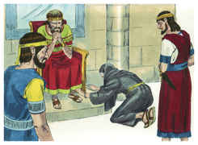
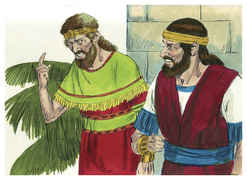
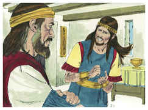
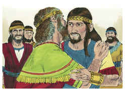

# 2 Samuel Capítulo 14

## 1
CONHECENDO, pois, Joabe, filho de Zeruia, que o coração do rei estava inclinado para Absalão,

## 2
Enviou Joabe a Tecoa, e tomou de lá uma mulher e disse-lhe: Ora, finge que estás de luto; veste roupas de luto, e não te unjas com óleo, e sê como uma mulher que há já muitos dias está de luto por algum morto.

## 3
E vai ao rei, e fala-lhe conforme a esta palavra. E Joabe lhe pôs as palavras na boca.

## 4
E a mulher tecoíta falou ao rei, e, deitando-se com o rosto em terra, se prostrou e disse: Salva-me, ó rei.

## 5
E disse-lhe o rei: Que tens? E disse ela: Na verdade sou mulher viúva; morreu meu marido.

## 6
Tinha, pois, a tua serva dois filhos, e estes brigaram entre si no campo, e não houve quem os apartasse; assim um feriu ao outro, e o matou.

## 7
E eis que toda a linhagem se levantou contra a tua serva, e disseram: Dá-nos aquele que feriu a seu irmão, para que o matemos, por causa da vida de seu irmão, a quem matou, e para que destruamos também ao herdeiro. Assim apagarão a brasa que me ficou, de sorte que não deixam a meu marido nome, nem remanescente sobre a terra.

## 8
E disse o rei à mulher: Vai para tua casa; e eu mandarei ordem acerca de ti.

## 9
E disse a mulher tecoíta ao rei: A injustiça, rei meu senhor, venha sobre mim e sobre a casa de meu pai; e o rei e o seu trono fique inculpável.

## 10
E disse o rei: Quem falar contra ti, traze-mo a mim; e nunca mais te tocará.

## 11
E disse ela: Ora, lembre-se o rei do Senhor seu Deus, para que os vingadores do sangue não prossigam na destruição, e não exterminem a meu filho. Então disse ele: Vive o Senhor, que não há de cair no chão nem um dos cabelos de teu filho.

## 12
Então disse a mulher: Peço-te que a tua serva fale uma palavra ao rei meu senhor. E disse ele: Fala.

## 13
E disse a mulher: Por que, pois, pensaste tu uma tal coisa contra o povo de Deus? Porque, falando o rei tal palavra, fica como culpado; visto que o rei não torna a trazer o seu desterrado.

## 14
Porque certamente morreremos, e seremos como águas derramadas na terra que não se ajuntam mais; Deus, pois, lhe não tirará a vida, mas cogita meios, para que não fique banido dele o seu desterrado.

## 15
E se eu agora vim falar esta palavra ao rei, meu senhor, é porque o povo me atemorizou; dizia, pois, a tua serva: Falarei, pois, ao rei; porventura fará o rei segundo a palavra da sua serva.

## 16
Porque o rei ouvirá, para livrar a sua serva da mão do homem que intenta destruir juntamente a mim e a meu filho da herança de Deus.

## 17
Dizia mais a tua serva: Seja agora a palavra do rei meu senhor para descanso; porque como um anjo de Deus, assim é o rei, meu senhor, para ouvir o bem e o mal; e o Senhor teu Deus será contigo.

## 18
Então respondeu o rei, e disse à mulher: Peço-te que não me encubras o que eu te perguntar. E disse a mulher: Ora fale o rei, meu senhor.

## 19
E disse o rei: Não é verdade que a mão de Joabe anda contigo em tudo isto? E respondeu a mulher, e disse: Vive a tua alma, ó rei meu senhor, que ninguém se poderá desviar, nem para a direita nem para a esquerda, de tudo quanto o rei, meu senhor, tem falado: Porque Joabe, teu servo, é quem me deu ordem, e foi ele que pôs na boca da tua serva todas estas palavras:

## 20
Para mudar o aspecto deste caso foi que o teu servo Joabe fez isto; porém sábio é meu senhor, conforme à sabedoria de um anjo de Deus, para entender tudo o que há na terra.

## 21
Então o rei disse a Joabe: Eis que fiz isto; vai, pois, e torna a trazer o jovem Absalão.

## 22
Então Joabe se prostrou sobre o seu rosto em terra, e se inclinou, e agradeceu ao rei; e disse Joabe: Hoje conhece o teu servo que achei graça aos teus olhos, ó rei meu senhor, porque o rei fez segundo a palavra do teu servo.

## 23
Levantou-se, pois, Joabe, e foi a Gesur, e trouxe Absalão a Jerusalém.

## 24
E disse o rei: Torne para a sua casa, e não veja a minha face. Tornou, pois, Absalão para sua casa, e não viu a face do rei.

## 25
Não havia, porém, em todo o Israel homem tão belo e tão aprazível como Absalão; desde a planta do pé até à cabeça não havia nele defeito algum.

## 26
E, quando tosquiava a sua cabeça (e sucedia que no fim de cada ano a tosquiava, porquanto muito lhe pesava, e por isso a tosquiava), pesava o cabelo da sua cabeça duzentos siclos, segundo o peso real.

## 27
Também nasceram a Absalão três filhos e uma filha, cujo nome era Tamar; e esta era mulher formosa à vista.

## 28
Assim ficou Absalão dois anos inteiros em Jerusalém, e não viu a face do rei.

## 29
Mandou, pois, Absalão chamar a Joabe, para o enviar ao rei; porém não quis vir a ele; e enviou ainda segunda vez e, contudo, não quis vir.

## 30
Então disse aos seus servos: Vedes ali o pedaço de campo de Joabe pegado ao meu, e tem cevada nele; ide, e ponde-lhe fogo. E os servos de Absalão puseram fogo ao pedaço de campo.

## 31
Então Joabe se levantou, e veio a Absalão, em casa, e disse-lhe: Por que puseram os teus servos fogo ao pedaço de campo que é meu?

## 32
E disse Absalão a Joabe: Eis que enviei a ti, dizendo: Vem cá, para que te envie ao rei, a dizer-lhe: Para que vim de Gesur? Melhor me fora estar ainda lá. Agora, pois, veja eu a face do rei; e, se há ainda em mim alguma culpa, que me mate.

## 33
Então foi Joabe ao rei, e assim lho disse. Então chamou a Absalão, e ele se apresentou ao rei, e se inclinou sobre o seu rosto em terra diante do rei; e o rei beijou a Absalão.

