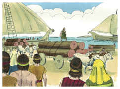

# 2 Samuel Capítulo 5

## 1
ENTÃO todas as tribos de Israel vieram a Davi, em Hebrom, e falaram, dizendo: Eis-nos aqui, somos teus ossos e tua carne.

## 2
E também outrora, sendo Saul ainda rei sobre nós, eras tu o que saías e entravas com Israel; e também o Senhor te disse: Tu apascentarás o meu povo de Israel, e tu serás príncipe sobre Israel.

## 3
Assim, pois, todos os anciãos de Israel vieram ao rei, em Hebrom; e o rei Davi fez com eles acordo em Hebrom, perante o Senhor; e ungiram a Davi rei sobre Israel.

## 4
Da idade de trinta anos era Davi quando começou a reinar; quarenta anos reinou.

## 5
Em Hebrom reinou sobre Judá sete anos e seis meses, e em Jerusalém reinou trinta e três anos sobre todo o Israel e Judá.

## 6
E partiu o rei com os seus homens a Jerusalém, contra os jebuseus que habitavam naquela terra; e falaram a Davi, dizendo: Não entrarás aqui, pois os cegos e os coxos te repelirão, querendo dizer: Não entrará Davi aqui.

## 7
Porém Davi tomou a fortaleza de Sião; esta é a cidade de Davi.

## 8
Porque Davi disse naquele dia: Qualquer que ferir aos jebuseus, suba ao canal e fira aos coxos e aos cegos, a quem a alma de Davi odeia. Por isso se diz: Nem cego nem coxo entrará nesta casa.

## 9
Assim habitou Davi na fortaleza, e a chamou a cidade de Davi; e Davi foi edificando em redor, desde Milo para dentro.

## 10
E Davi ia, cada vez mais, aumentando e crescendo, porque o Senhor Deus dos Exércitos era com ele.

## 11
E Hirão, rei de Tiro, enviou mensageiros a Davi, e madeira de cedro, e carpinteiros, e pedreiros que edificaram a Davi uma casa.

## 12
E entendeu Davi que o Senhor o confirmara rei sobre Israel, e que exaltara o seu reino por amor do seu povo.

## 13
E tomou Davi mais concubinas e mulheres de Jerusalém, depois que viera de Hebrom; e nasceram a Davi mais filhos e filhas.

## 14
E estes são os nomes dos que lhe nasceram em Jerusalém: Samua, e Sobabe, e Natã, e Salomão,

## 15
E Ibar, e Elisua, e Nefegue, e Jafia,

## 16
E Elisama, e Eliada, e Elifelete.

## 17
Ouvindo, pois, os filisteus que haviam ungido a Davi rei sobre Israel, todos os filisteus subiram em busca de Davi; o que ouvindo Davi, desceu à fortaleza.

## 18
E os filisteus vieram, e se estenderam pelo vale de Refaim.

## 19
E Davi consultou ao Senhor, dizendo: Subirei contra os filisteus? Entregar-mos-ás nas minhas mãos? E disse o Senhor a Davi: Sobe, porque certamente entregarei os filisteus nas tuas mãos.

## 20
Então foi Davi a Baal-Perazim; e feriu-os ali Davi, e disse: Rompeu o Senhor a meus inimigos diante de mim, como quem rompe águas. Por isso chamou o nome daquele lugar Baal-Perazim.

## 21
E deixaram ali os seus ídolos; e Davi e os seus homens os tomaram.

## 22
E os filisteus tornaram a subir, e se estenderam pelo vale de Refaim.

## 23
E Davi consultou ao Senhor, o qual disse: Não subirás; mas rodeia por detrás deles, e virás a eles por defronte das amoreiras.

## 24
E há de ser que, ouvindo tu um estrondo de marcha pelas copas das amoreiras, então te apressarás; porque o Senhor saiu então diante de ti, a ferir o arraial dos filisteus.

## 25
E fez Davi assim como o Senhor lhe tinha ordenado; e feriu os filisteus desde Geba, até chegar a Gezer.

