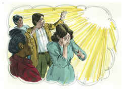
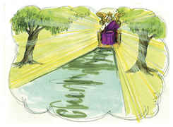
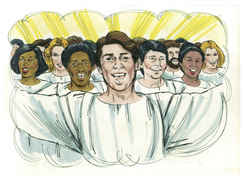
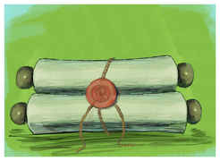

# Apocalipse Capítulo 21

1	E VI um novo céu, e uma nova terra. Porque já o primeiro céu e a primeira terra passaram, e o mar já não existe.

2	E eu, João, vi a santa cidade, a nova Jerusalém, que de Deus descia do céu, adereçada como uma esposa ataviada para o seu marido.

3	E ouvi uma grande voz do céu, que dizia: Eis aqui o tabernáculo de Deus com os homens, pois com eles habitará, e eles serão o seu povo, e o mesmo Deus estará com eles, e será o seu Deus.

4	E Deus limpará de seus olhos toda a lágrima; e não haverá mais morte, nem pranto, nem clamor, nem dor; porque já as primeiras coisas são passadas.

5	E o que estava assentado sobre o trono disse: Eis que faço novas todas as coisas. E disse-me: Escreve; porque estas palavras são verdadeiras e fiéis.

6	E disse-me mais: Está cumprido. Eu sou o Alfa e o Ômega, o princípio e o fim. A quem quer que tiver sede, de graça lhe darei da fonte da água da vida.

7	Quem vencer, herdará todas as coisas; e eu serei seu Deus, e ele será meu filho.

8	Mas, quanto aos tímidos, e aos incrédulos, e aos abomináveis, e aos homicidas, e aos que se prostituem, e aos feiticeiros, e aos idólatras e a todos os mentirosos, a sua parte será no lago que arde com fogo e enxofre; o que é a segunda morte.

9	E veio a mim um dos sete anjos que tinham as sete taças cheias das últimas sete pragas, e falou comigo, dizendo: Vem, mostrar-te-ei a esposa, a mulher do Cordeiro.

10	E levou-me em espírito a um grande e alto monte, e mostrou-me a grande cidade, a santa Jerusalém, que de Deus descia do céu.

11	E tinha a glória de Deus; e a sua luz era semelhante a uma pedra preciosíssima, como a pedra de jaspe, como o cristal resplandecente.

12	E tinha um grande e alto muro com doze portas, e nas portas doze anjos, e nomes escritos sobre elas, que são os nomes das doze tribos dos filhos de Israel.

13	Do lado do levante tinha três portas, do lado do norte, três portas, do lado do sul, três portas, do lado do poente, três portas.

14	E o muro da cidade tinha doze fundamentos, e neles os nomes dos doze apóstolos do Cordeiro.

15	E aquele que falava comigo tinha uma cana de ouro, para medir a cidade, e as suas portas, e o seu muro.

16	E a cidade estava situada em quadrado; e o seu comprimento era tanto como a sua largura. E mediu a cidade com a cana até doze mil estádios; e o seu comprimento, largura e altura eram iguais.

17	E mediu o seu muro, de cento e quarenta e quatro côvados, conforme a medida de homem, que é a de um anjo.

18	E a construção do seu muro era de jaspe, e a cidade de ouro puro, semelhante a vidro puro.

19	E os fundamentos do muro da cidade estavam adornados de toda a pedra preciosa. O primeiro fundamento era jaspe; o segundo, safira; o terceiro, calcedônia; o quarto, esmeralda;

20	O quinto, sardônica; o sexto, sárdio; o sétimo, crisólito; o oitavo, berilo; o nono, topázio; o décimo, crisópraso; o undécimo, jacinto; o duodécimo, ametista.

21	E as doze portas eram doze pérolas; cada uma das portas era uma pérola; e a praça da cidade de ouro puro, como vidro transparente.

22	E nela não vi templo, porque o seu templo é o Senhor Deus Todo-Poderoso, e o Cordeiro.

23	E a cidade não necessita de sol nem de lua, para que nela resplandeçam, porque a glória de Deus a tem iluminado, e o Cordeiro é a sua lâmpada.

24	E as nações dos salvos andarão à sua luz; e os reis da terra trarão para ela a sua glória e honra.

25	E as suas portas não se fecharão de dia, porque ali não haverá noite.

26	E a ela trarão a glória e honra das nações.

27	E não entrará nela coisa alguma que contamine, e cometa abominação e mentira; mas só os que estão inscritos no livro da vida do Cordeiro.

