# Atos dos Apóstolos Capítulo 1

## 1
FIZ o primeiro tratado, ó Teófilo, acerca de tudo que Jesus começou, não só a fazer, mas a ensinar,

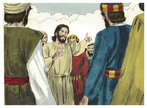

## 2
Até ao dia em que foi recebido em cima, depois de ter dado mandamentos, pelo Espírito Santo, aos apóstolos que escolhera;

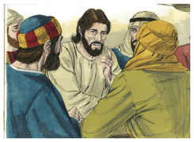

## 3
Aos quais também, depois de ter padecido, se apresentou vivo, com muitas e infalíveis provas, sendo visto por eles por espaço de quarenta dias, e falando das coisas concernentes ao reino de Deus.

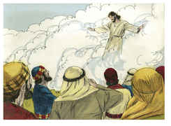

## 4
E, estando com eles, determinou-lhes que não se ausentassem de Jerusalém, mas que esperassem a promessa do Pai, que, disse ele, de mim ouvistes.

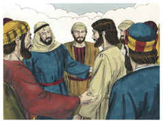

## 5
Porque, na verdade, João batizou com água, mas vós sereis batizados com o Espírito Santo, não muito depois destes dias.

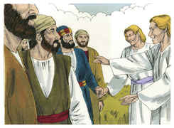

## 6
Aqueles, pois, que se haviam reunido perguntaram-lhe, dizendo: Senhor, restaurarás tu neste tempo o reino a Israel?

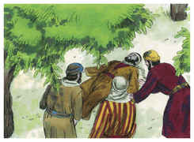

## 7
E disse-lhes: Não vos pertence saber os tempos ou as estações que o Pai estabeleceu pelo seu próprio poder.

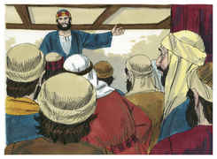

## 8
Mas recebereis a virtude do Espírito Santo, que há de vir sobre vós; e ser-me-eis testemunhas, tanto em Jerusalém como em toda a Judéia e Samaria, e até aos confins da terra.

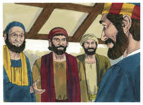

## 9
E, quando dizia isto, vendo-o eles, foi elevado às alturas, e uma nuvem o recebeu, ocultando-o a seus olhos.

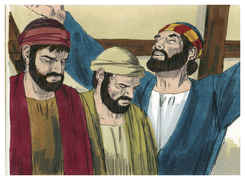

## 10
E, estando com os olhos fitos no céu, enquanto ele subia, eis que junto deles se puseram dois homens vestidos de branco.

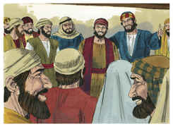

## 11
Os quais lhes disseram: Homens galileus, por que estais olhando para o céu? Esse Jesus, que dentre vós foi recebido em cima no céu, há de vir assim como para o céu o vistes ir.

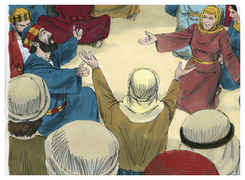

## 12
Então voltaram para Jerusalém, do monte chamado das Oliveiras, o qual está perto de Jerusalém, à distância do caminho de um sábado.

## 13
E, entrando, subiram ao cenáculo, onde habitavam Pedro e Tiago, João e André, Filipe e Tomé, Bartolomeu e Mateus, Tiago, filho de Alfeu, Simão, o Zelote, e Judas, irmão de Tiago.

## 14
Todos estes perseveravam unanimemente em oração e súplicas, com as mulheres, e Maria mãe de Jesus, e com seus irmãos.

## 15
E naqueles dias, levantando-se Pedro no meio dos discípulos (ora a multidão junta era de quase cento e vinte pessoas) disse:

## 16
Homens irmãos, convinha que se cumprisse a Escritura que o Espírito Santo predisse pela boca de Davi, acerca de Judas, que foi o guia daqueles que prenderam a Jesus;

## 17
Porque foi contado conosco e alcançou sorte neste ministério.

## 18
Ora, este adquiriu um campo com o galardão da iniqüidade; e, precipitando-se, rebentou pelo meio, e todas as suas entranhas se derramaram.

## 19
E foi notório a todos os que habitam em Jerusalém; de maneira que na sua própria língua esse campo se chama Aceldama, isto é, Campo de Sangue.

## 20
Porque no livro dos Salmos está escrito: Fique deserta a sua habitação, E não haja quem nela habite, e: Tome outro o seu bispado.

## 21
É necessário, pois, que, dos homens que conviveram conosco todo o tempo em que o Senhor Jesus entrou e saiu dentre nós,

## 22
Começando desde o batismo de João até ao dia em que de entre nós foi recebido em cima, um deles se faça conosco testemunha da sua ressurreição.

## 23
E apresentaram dois: José, chamado Barsabás, que tinha por sobrenome o Justo, e Matias.

## 24
E, orando, disseram: Tu, Senhor, conhecedor dos corações de todos, mostra qual destes dois tens escolhido,

## 25
Para que tome parte neste ministério e apostolado, de que Judas se desviou, para ir para o seu próprio lugar.

## 26
E, lançando-lhes sortes, caiu a sorte sobre Matias. E por voto comum foi contado com os onze apóstolos.

