# Atos dos Apóstolos Capítulo 16

## 1
E CHEGOU a Derbe e Listra. E eis que estava ali um certo discípulo por nome Timóteo, filho de uma judia que era crente, mas de pai grego;

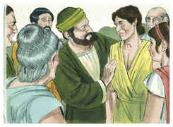

## 2
Do qual davam bom testemunho os irmãos que estavam em Listra e em Icônio.

## 3
Paulo quis que este fosse com ele; e tomando-o, o circuncidou, por causa dos judeus que estavam naqueles lugares; porque todos sabiam que seu pai era grego.

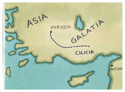

## 4
E, quando iam passando pelas cidades, lhes entregavam, para serem observados, os decretos que haviam sido estabelecidos pelos apóstolos e anciãos em Jerusalém.

## 5
De sorte que as igrejas eram confirmadas na fé, e cada dia cresciam em número.

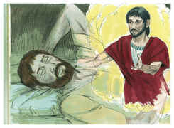

## 6
E, passando pela Frígia e pela província da Galácia, foram impedidos pelo Espírito Santo de anunciar a palavra na Ásia.

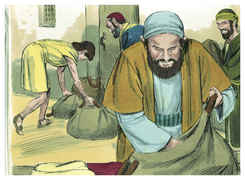

## 7
E, quando chegaram a Mísia, intentavam ir para Bitínia, mas o Espírito não lho permitiu.

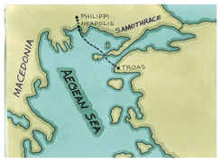

## 8
E, tendo passado por Mísia, desceram a Trôade.

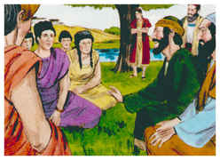

## 9
E Paulo teve de noite uma visão, em que se apresentou um homem da Macedônia, e lhe rogou, dizendo: Passa à Macedônia, e ajuda-nos.

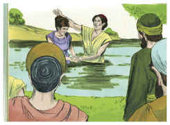

## 10
E, logo depois desta visão, procuramos partir para a Macedônia, concluindo que o Senhor nos chamava para lhes anunciarmos o evangelho.

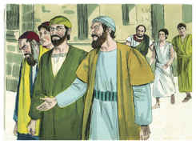

## 11
E, navegando de Trôade, fomos correndo em caminho direito para a Samotrácia e, no dia seguinte, para Neápolis;

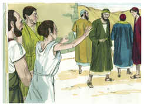

## 12
E dali para Filipos, que é a primeira cidade desta parte da Macedônia, e é uma colônia; e estivemos alguns dias nesta cidade.

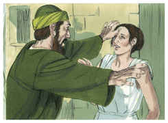

## 13
E no dia de sábado saímos fora das portas, para a beira do rio, onde se costumava fazer oração; e, assentando-nos, falamos às mulheres que ali se ajuntaram.

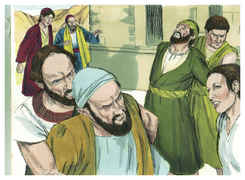

## 14
E uma certa mulher, chamada Lídia, vendedora de púrpura, da cidade de Tiatira, e que servia a Deus, nos ouvia, e o Senhor lhe abriu o coração para que estivesse atenta ao que Paulo dizia.

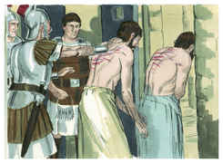

## 15
E, depois que foi batizada, ela e a sua casa, nos rogou, dizendo: Se haveis julgado que eu seja fiel ao Senhor, entrai em minha casa, e ficai ali. E nos constrangeu a isso.

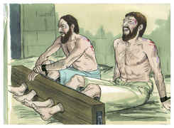

## 16
E aconteceu que, indo nós à oração, nos saiu ao encontro uma jovem, que tinha espírito de adivinhação, a qual, adivinhando, dava grande lucro aos seus senhores.

## 17
Esta, seguindo a Paulo e a nós, clamava, dizendo: Estes homens, que nos anunciam o caminho da salvação, são servos do Deus Altíssimo.

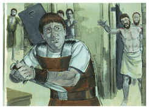

## 18
E isto fez ela por muitos dias. Mas Paulo, perturbado, voltou-se e disse ao espírito: Em nome de Jesus Cristo, te mando que saias dela. E na mesma hora saiu.

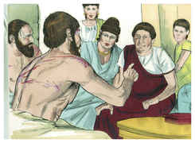

## 19
E, vendo seus senhores que a esperança do seu lucro estava perdida, prenderam Paulo e Silas, e os levaram à praça, à presença dos magistrados.

## 20
E, apresentando-os aos magistrados, disseram: Estes homens, sendo judeus, perturbaram a nossa cidade,

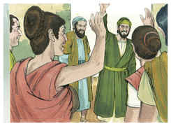

## 21
E nos expõem costumes que não nos é lícito receber nem praticar, visto que somos romanos.

## 22
E a multidão se levantou unida contra eles, e os magistrados, rasgando-lhes as vestes, mandaram açoitá-los com varas.

## 23
E, havendo-lhes dado muitos açoites, os lançaram na prisão, mandando ao carcereiro que os guardasse com segurança.

## 24
O qual, tendo recebido tal ordem, os lançou no cárcere interior, e lhes segurou os pés no tronco.

## 25
E, perto da meia-noite, Paulo e Silas oravam e cantavam hinos a Deus, e os outros presos os escutavam.

## 26
E de repente sobreveio um tão grande terremoto, que os alicerces do cárcere se moveram, e logo se abriram todas as portas, e foram soltas as prisões de todos.

## 27
E, acordando o carcereiro, e vendo abertas as portas da prisão, tirou a espada, e quis matar-se, cuidando que os presos já tinham fugido.

## 28
Mas Paulo clamou com grande voz, dizendo: Não te faças nenhum mal, que todos aqui estamos.

## 29
E, pedindo luz, saltou dentro e, todo trêmulo, se prostrou ante Paulo e Silas.

## 30
E, tirando-os para fora, disse: Senhores, que é necessário que eu faça para me salvar?

## 31
E eles disseram: Crê no Senhor Jesus Cristo e serás salvo, tu e a tua casa.

## 32
E lhe pregavam a palavra do Senhor, e a todos os que estavam em sua casa.

## 33
E, tomando-os ele consigo naquela mesma hora da noite, lavou-lhes os vergões; e logo foi batizado, ele e todos os seus.

## 34
E, levando-os à sua casa, lhes pôs a mesa; e, na sua crença em Deus, alegrou-se com toda a sua casa.

## 35
E, sendo já dia, os magistrados mandaram quadrilheiros, dizendo: Soltai aqueles homens.

## 36
E o carcereiro anunciou a Paulo estas palavras, dizendo: Os magistrados mandaram que vos soltasse; agora, pois, saí e ide em paz.

## 37
Mas Paulo replicou: Açoitaram-nos publicamente e, sem sermos condenados, sendo homens romanos, nos lançaram na prisão, e agora encobertamente nos lançam fora? Não será assim; mas venham eles mesmos e tirem-nos para fora.

## 38
E os quadrilheiros foram dizer aos magistrados estas palavras; e eles temeram, ouvindo que eram romanos.

## 39
E, vindo, lhes dirigiram súplicas; e, tirando-os para fora, lhes pediram que saíssem da cidade.

## 40
E, saindo da prisão, entraram em casa de Lídia e, vendo os irmãos, os confortaram, e depois partiram.

