# Atos dos Apóstolos Capítulo 17

1	E PASSANDO por Anfípolis e Apolônia, chegaram a Tessalônica, onde havia uma sinagoga de judeus.

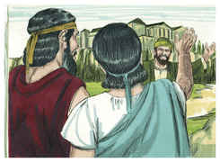

2	E Paulo, como tinha por costume, foi ter com eles; e por três sábados disputou com eles sobre as Escrituras,

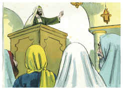

3	Expondo e demonstrando que convinha que Cristo padecesse e ressuscitasse dentre os mortos. E este Jesus, que vos anuncio, dizia ele, é o Cristo.

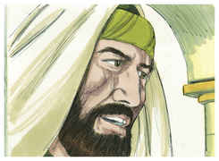

4	E alguns deles creram, e ajuntaram-se com Paulo e Silas; e também uma grande multidão de gregos religiosos, e não poucas mulheres principais.

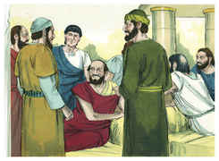

5	Mas os judeus desobedientes, movidos de inveja, tomaram consigo alguns homens perversos, dentre os vadios e, ajuntando o povo, alvoroçaram a cidade, e assaltando a casa de Jasom, procuravam trazê-los para junto do povo.

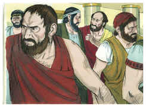

6	E, não os achando, trouxeram Jasom e alguns irmãos à presença dos magistrados da cidade, clamando: Estes que têm alvoroçado o mundo, chegaram também aqui;

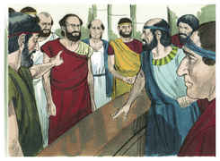

7	Os quais Jasom recolheu; e todos estes procedem contra os decretos de César, dizendo que há outro rei, Jesus.

8	E alvoroçaram a multidão e os principais da cidade, que ouviram estas coisas.

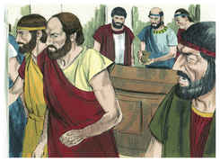

9	Tendo, porém, recebido satisfação de Jasom e dos demais, os soltaram.

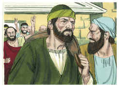

10	E logo os irmãos enviaram de noite Paulo e Silas a Beréia; e eles, chegando lá, foram à sinagoga dos judeus.

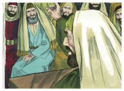

11	Ora, estes foram mais nobres do que os que estavam em Tessalônica, porque de bom grado receberam a palavra, examinando cada dia nas Escrituras se estas coisas eram assim.

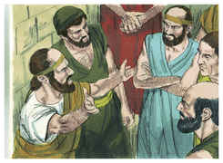

12	De sorte que creram muitos deles, e também mulheres gregas da classe nobre, e não poucos homens.

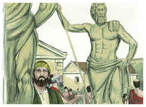

13	Mas, logo que os judeus de Tessalônica souberam que a palavra de Deus também era anunciada por Paulo em Beréia, foram lá, e excitaram as multidões.

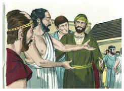

14	No mesmo instante os irmãos mandaram a Paulo que fosse até ao mar, mas Silas e Timóteo ficaram ali.

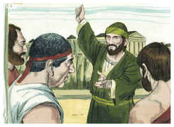

15	E os que acompanhavam Paulo o levaram até Atenas, e, recebendo ordem para que Silas e Timóteo fossem ter com ele o mais depressa possível, partiram.

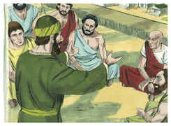

16	E, enquanto Paulo os esperava em Atenas, o seu espírito se comovia em si mesmo, vendo a cidade tão entregue à idolatria.

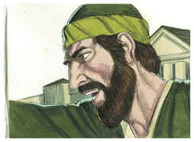

17	De sorte que disputava na sinagoga com os judeus e religiosos, e todos os dias na praça com os que se apresentavam.

18	E alguns dos filósofos epicureus e estóicos contendiam com ele; e uns diziam: Que quer dizer este paroleiro? E outros: Parece que é pregador de deuses estranhos; porque lhes anunciava a Jesus e a ressurreição.

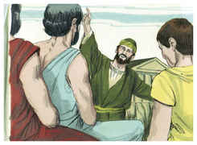

19	E tomando-o, o levaram ao Areópago, dizendo: Poderemos nós saber que nova doutrina é essa de que falas?

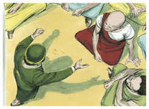

20	Pois coisas estranhas nos trazes aos ouvidos; queremos, pois, saber o que vem a ser isto

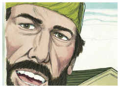

21	(Pois todos os atenienses e estrangeiros residentes, de nenhuma outra coisa se ocupavam, senão de dizer e ouvir alguma novidade).

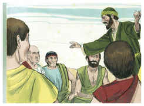

22	E, estando Paulo no meio do Areópago, disse: Homens atenienses, em tudo vos vejo um tanto supersticiosos;

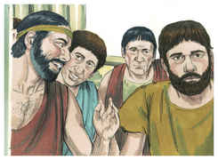

23	Porque, passando eu e vendo os vossos santuários, achei também um altar em que estava escrito: AO DEUS DESCONHECIDO. Esse, pois, que vós honrais, não o conhecendo, é o que eu vos anuncio.

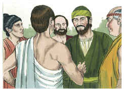

24	O Deus que fez o mundo e tudo que nele há, sendo Senhor do céu e da terra, não habita em templos feitos por mãos de homens;

25	Nem tampouco é servido por mãos de homens, como que necessitando de alguma coisa; pois ele mesmo é quem dá a todos a vida, e a respiração, e todas as coisas;

26	E de um só sangue fez toda a geração dos homens, para habitar sobre toda a face da terra, determinando os tempos já dantes ordenados, e os limites da sua habitação;

27	Para que buscassem ao Senhor, se porventura, tateando, o pudessem achar; ainda que não está longe de cada um de nós;

28	Porque nele vivemos, e nos movemos, e existimos; como também alguns dos vossos poetas disseram: Pois somos também sua geração.

29	Sendo nós, pois, geração de Deus, não havemos de cuidar que a Divindade seja semelhante ao ouro, ou à prata, ou à pedra esculpida por artifício e imaginação dos homens.

30	Mas Deus, não tendo em conta os tempos da ignorância, anuncia agora a todos os homens, e em todo o lugar, que se arrependam;

31	Porquanto tem determinado um dia em que com justiça há de julgar o mundo, por meio do homem que destinou; e disso deu certeza a todos, ressuscitando-o dentre os mortos.

32	E, como ouviram falar da ressurreição dos mortos, uns escarneciam, e outros diziam: Acerca disso te ouviremos outra vez.

33	E assim Paulo saiu do meio deles.

34	Todavia, chegando alguns homens a ele, creram; entre os quais foi Dionísio, areopagita, uma mulher por nome Dâmaris, e com eles outros.

