# Atos dos Apóstolos Capítulo 18

## 1
E DEPOIS disto partiu Paulo de Atenas, e chegou a Corinto.

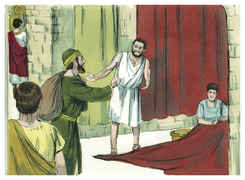

## 2
E, achando um certo judeu por nome Áqüila, natural do Ponto, que havia pouco tinha vindo da Itália, e Priscila, sua mulher (pois Cláudio tinha mandado que todos os judeus saíssem de Roma), ajuntou-se com eles,

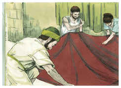

## 3
E, como era do mesmo ofício, ficou com eles, e trabalhava; pois tinham por ofício fazer tendas.

## 4
E todos os sábados disputava na sinagoga, e convencia a judeus e gregos.

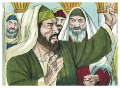

## 5
E, quando Silas e Timóteo desceram da Macedônia, foi Paulo impulsionado no espírito, testificando aos judeus que Jesus era o Cristo.

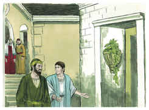

## 6
Mas, resistindo e blasfemando eles, sacudiu as vestes, e disse-lhes: O vosso sangue seja sobre a vossa cabeça; eu estou limpo, e desde agora parto para os gentios.

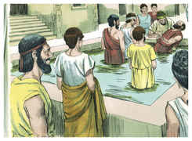

## 7
E, saindo dali, entrou em casa de um homem chamado Justo, que servia a Deus, e cuja casa estava junto da sinagoga.

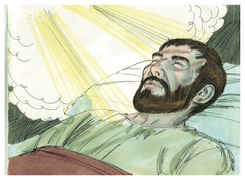

## 8
E Crispo, principal da sinagoga, creu no Senhor com toda a sua casa; e muitos dos coríntios, ouvindo-o, creram e foram batizados.

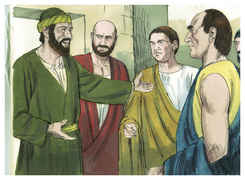

## 9
E disse o Senhor em visão a Paulo: Não temas, mas fala, e não te cales;

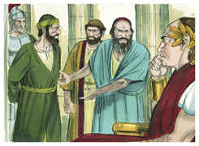

## 10
Porque eu sou contigo, e ninguém lançará mão de ti para te fazer mal, pois tenho muito povo nesta cidade.

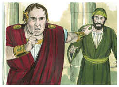

## 11
E ficou ali um ano e seis meses, ensinando entre eles a palavra de Deus.

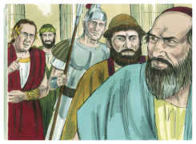

## 12
Mas, sendo Gálio procônsul da Acaia, levantaram-se os judeus concordemente contra Paulo, e o levaram ao tribunal,

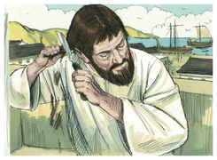

## 13
Dizendo: Este persuade os homens a servir a Deus contra a lei.

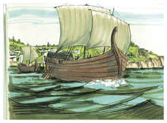

## 14
E, querendo Paulo abrir a boca, disse Gálio aos judeus: Se houvesse, ó judeus, algum agravo ou crime enorme, com razão vos sofreria,

## 15
Mas, se a questão é de palavras, e de nomes, e da lei que entre vós há, vede-o vós mesmos; porque eu não quero ser juiz dessas coisas.

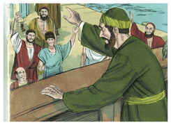

## 16
E expulsou-os do tribunal.

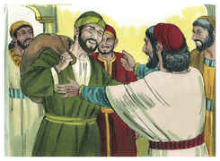

## 17
Então todos os gregos agarraram Sóstenes, principal da sinagoga, e o feriram diante do tribunal; e a Gálio nada destas coisas o incomodava.

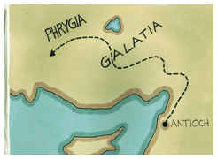

## 18
E Paulo, ficando ainda ali muitos dias, despediu-se dos irmãos, e dali navegou para a Síria, e com ele Priscila e Áqüila, tendo rapado a cabeça em Cencréia, porque tinha voto.

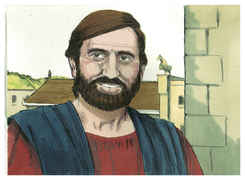

## 19
E chegou a Éfeso, e deixou-os ali; mas ele, entrando na sinagoga, disputava com os judeus.

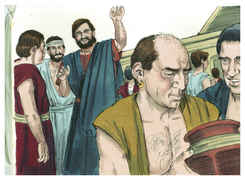

## 20
E, rogando-lhe eles que ficasse por mais algum tempo, não conveio nisso.

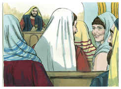

## 21
Antes se despediu deles, dizendo: É-me de todo preciso celebrar a solenidade que vem em Jerusalém; mas querendo Deus, outra vez voltarei a vós. E partiu de Éfeso.

## 22
E, chegando a Cesaréia, subiu a Jerusalém e, saudando a igreja, desceu a Antioquia.

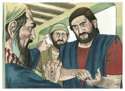

## 23
E, estando ali algum tempo, partiu, passando sucessivamente pela província da Galácia e da Frígia, confirmando a todos os discípulos.

## 24
E chegou a Éfeso um certo judeu chamado Apolo, natural de Alexandria, homem eloqüente e poderoso nas Escrituras.

## 25
Este era instruído no caminho do Senhor e, fervoroso de espírito, falava e ensinava diligentemente as coisas do Senhor, conhecendo somente o batismo de João.

## 26
Ele começou a falar ousadamente na sinagoga; e, quando o ouviram Priscila e Áqüila, o levaram consigo e lhe declararam mais precisamente o caminho de Deus.

## 27
Querendo ele passar à Acaia, o animaram os irmãos, e escreveram aos discípulos que o recebessem; o qual, tendo chegado, aproveitou muito aos que pela graça criam.

## 28
Porque com grande veemência, convencia publicamente os judeus, mostrando pelas Escrituras que Jesus era o Cristo.

