# Atos dos Apóstolos Capítulo 19

## 1
E SUCEDEU que, enquanto Apolo estava em Corinto, Paulo, tendo passado por todas as regiões superiores, chegou a Éfeso; e achando ali alguns discípulos,

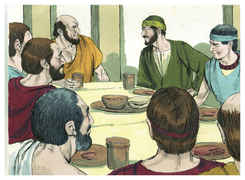

## 2
Disse-lhes: Recebestes vós já o Espírito Santo quando crestes? E eles disseram-lhe: Nós nem ainda ouvimos que haja Espírito Santo.

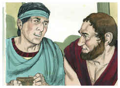

## 3
Perguntou-lhes, então: Em que sois batizados então? E eles disseram: No batismo de João.

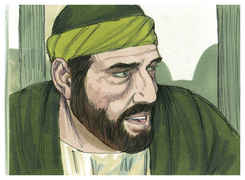

## 4
Mas Paulo disse: Certamente João batizou com o batismo de arrependimento, dizendo ao povo que cresse no que após ele havia de vir, isto é, em Jesus Cristo.

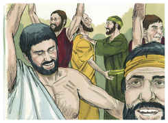

## 5
E os que ouviram foram batizados em nome do Senhor Jesus.

## 6
E, impondo-lhes Paulo as mãos, veio sobre eles o Espírito Santo; e falavam línguas, e profetizavam.

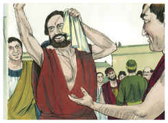

## 7
E estes eram, ao todo, uns doze homens.

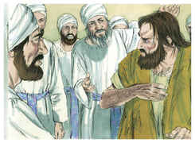

## 8
E, entrando na sinagoga, falou ousadamente por espaço de três meses, disputando e persuadindo-os acerca do reino de Deus.

## 9
Mas, como alguns deles se endurecessem e não obedecessem, falando mal do Caminho perante a multidão, retirou-se deles, e separou os discípulos, disputando todos os dias na escola de um certo Tirano.

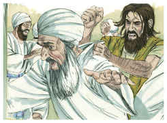

## 10
E durou isto por espaço de dois anos; de tal maneira que todos os que habitavam na Ásia ouviram a palavra do Senhor Jesus, assim judeus como gregos.

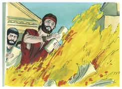

## 11
E Deus pelas mãos de Paulo fazia maravilhas extraordinárias.

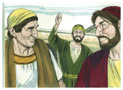

## 12
De sorte que até os lenços e aventais se levavam do seu corpo aos enfermos, e as enfermidades fugiam deles, e os espíritos malignos saíam.

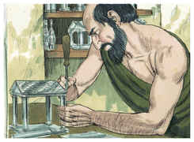

## 13
E alguns dos exorcistas judeus ambulantes tentavam invocar o nome do Senhor Jesus sobre os que tinham espíritos malignos, dizendo: Esconjuro-vos por Jesus a quem Paulo prega.

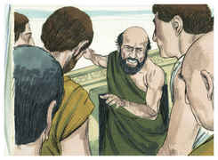

## 14
E os que faziam isto eram sete filhos de Ceva, judeu, principal dos sacerdotes.

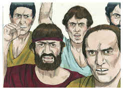

## 15
Respondendo, porém, o espírito maligno, disse: Conheço a Jesus, e bem sei quem é Paulo; mas vós quem sois?

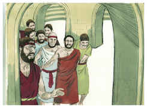

## 16
E, saltando neles o homem que tinha o espírito maligno, e assenhoreando-se de todos, pôde mais do que eles; de tal maneira que, nus e feridos, fugiram daquela casa.

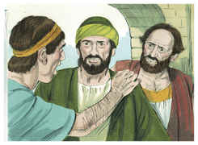

## 17
E foi isto notório a todos os que habitavam em Éfeso, tanto judeus como gregos; e caiu temor sobre todos eles, e o nome do Senhor Jesus era engrandecido.

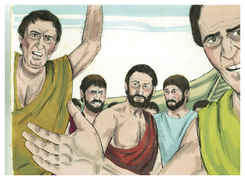

## 18
E muitos dos que tinham crido vinham, confessando e publicando os seus feitos.

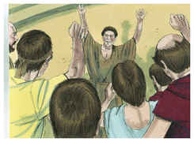

## 19
Também muitos dos que seguiam artes mágicas trouxeram os seus livros, e os queimaram na presença de todos e, feita a conta do seu preço, acharam que montava a cinqüenta mil peças de prata.

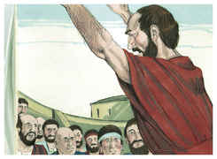

## 20
Assim a palavra do Senhor crescia poderosamente e prevalecia.

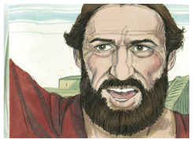

## 21
E, cumpridas estas coisas, Paulo propôs, em espírito, ir a Jerusalém, passando pela Macedônia e pela Acaia, dizendo: Depois que houver estado ali, importa-me ver também Roma.

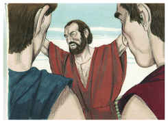

## 22
E, enviando à Macedônia dois daqueles que o serviam, Timóteo e Erasto, ficou ele por algum tempo na Ásia.

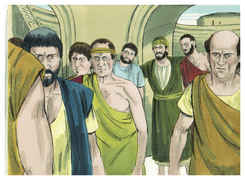

## 23
E, naquele mesmo tempo, houve um não pequeno alvoroço acerca do Caminho.

## 24
Porque um certo ourives da prata, por nome Demétrio, que fazia de prata nichos de Diana, dava não pouco lucro aos artífices,

## 25
Aos quais, havendo-os ajuntado com os oficiais de obras semelhantes, disse: Senhores, vós bem sabeis que deste ofício temos a nossa prosperidade;

## 26
E bem vedes e ouvis que não só em Éfeso, mas até quase em toda a Ásia, este Paulo tem convencido e afastado uma grande multidão, dizendo que não são deuses os que se fazem com as mãos.

## 27
E não somente há o perigo de que a nossa profissão caia em descrédito, mas também de que o próprio templo da grande deusa Diana seja estimado em nada, vindo a ser destruída a majestade daquela que toda a Ásia e o mundo veneram.

## 28
E, ouvindo-o, encheram-se de ira, e clamaram, dizendo: Grande é a Diana dos efésios.

## 29
E encheu-se de confusão toda a cidade e, unânimes, correram ao teatro, arrebatando a Gaio e a Aristarco, macedônios, companheiros de Paulo na viagem.

## 30
E, querendo Paulo apresentar-se ao povo, não lho permitiram os discípulos.

## 31
E também alguns dos principais da Ásia, que eram seus amigos, lhe rogaram que não se apresentasse no teatro.

## 32
Uns, pois, clamavam de uma maneira, outros de outra, porque o ajuntamento era confuso; e os mais deles não sabiam por que causa se tinham ajuntado.

## 33
Então tiraram Alexandre dentre a multidão, impelindo-o os judeus para diante; e Alexandre, acenando com a mão, queria dar razão disto ao povo.

## 34
Mas quando conheceram que era judeu, todos unanimemente levantaram a voz, clamando por espaço de quase duas horas: Grande é a Diana dos efésios.

## 35
Então o escrivão da cidade, tendo apaziguado a multidão, disse: Homens efésios, qual é o homem que não sabe que a cidade dos efésios é a guardadora do templo da grande deusa Diana, e da imagem que desceu de Júpiter?

## 36
Ora, não podendo isto ser contraditado, convém que vos aplaqueis e nada façais temerariamente;

## 37
Porque estes homens que aqui trouxestes nem são sacrílegos nem blasfemam da vossa deusa.

## 38
Mas, se Demétrio e os artífices que estão com ele têm alguma coisa contra alguém, há audiências e há procônsules; que se acusem uns aos outros;

## 39
E, se alguma outra coisa demandais, averiguar-se-á em legítima assembléia.

## 40
Na verdade até corremos perigo de que, por hoje, sejamos acusados de sedição, não havendo causa alguma com que possamos justificar este concurso.

## 41
E, tendo dito isto, despediu a assembléia.

