# Atos dos Apóstolos Capítulo 20

## 1
E, DEPOIS que cessou o alvoroço, Paulo chamou a si os discípulos e, abraçando-os, saiu para a Macedônia.

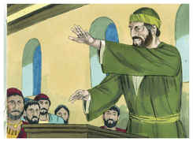

## 2
E, havendo andado por aquelas terras, exortando-os com muitas palavras, veio à Grécia.

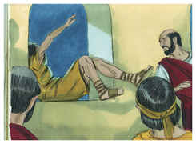

## 3
E, passando ali três meses, e sendo-lhe pelos judeus postas ciladas, como tivesse de navegar para a Síria, determinou voltar pela Macedônia.

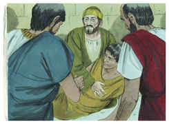

## 4
E acompanhou-o, até à Ásia, Sópater, de Beréia, e, dos de Tessalônica, Aristarco, e Segundo, e Gaio de Derbe, e Timóteo, e, dos da Ásia, Tíquico e Trófimo.

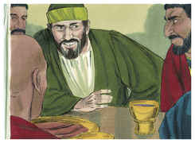

## 5
Estes, indo adiante, nos esperaram em Trôade.

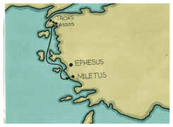

## 6
E, depois dos dias dos pães ázimos, navegamos de Filipos, e em cinco dias fomos ter com eles a Trôade, onde estivemos sete dias.

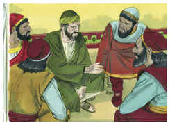

## 7
E no primeiro dia da semana, ajuntando-se os discípulos para partir o pão, Paulo, que havia de partir no dia seguinte, falava com eles; e prolongou a prática até à meia-noite.

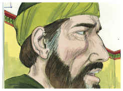

## 8
E havia muitas luzes no cenáculo onde estavam juntos.

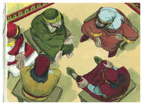

## 9
E, estando um certo jovem, por nome Êutico, assentado numa janela, caiu do terceiro andar, tomado de um sono profundo que lhe sobreveio durante o extenso discurso de Paulo; e foi levantado morto.

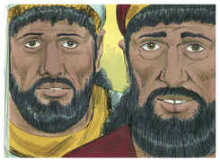

## 10
Paulo, porém, descendo, inclinou-se sobre ele e, abraçando-o, disse: Não vos perturbeis, que a sua alma nele está.

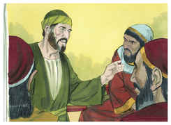

## 11
E subindo, e partindo o pão, e comendo, ainda lhes falou largamente até à alvorada; e assim partiu.

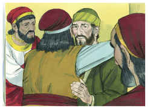

## 12
E levaram vivo o jovem, e ficaram não pouco consolados.

## 13
Nós, porém, subindo ao navio, navegamos até Assôs, onde devíamos receber a Paulo, porque assim o ordenara, indo ele por terra.

## 14
E, logo que se ajuntou conosco em Assôs, o recebemos, e fomos a Mitilene.

## 15
E, navegando dali, chegamos no dia seguinte defronte de Quios, e no outro aportamos a Samos e, ficando em Trogílio, chegamos no dia seguinte a Mileto.

## 16
Porque já Paulo tinha determinado passar ao largo de Éfeso, para não gastar tempo na Ásia. Apressava-se, pois, para estar, se lhe fosse possível, em Jerusalém no dia de Pentecostes.

## 17
E de Mileto mandou a Éfeso, a chamar os anciãos da igreja.

## 18
E, logo que chegaram junto dele, disse-lhes: Vós bem sabeis, desde o primeiro dia em que entrei na Ásia, como em todo esse tempo me portei no meio de vós,

## 19
Servindo ao Senhor com toda a humildade, e com muitas lágrimas e tentações, que pelas ciladas dos judeus me sobrevieram;

## 20
Como nada, que útil seja, deixei de vos anunciar, e ensinar publicamente e pelas casas,

## 21
Testificando, tanto aos judeus como aos gregos, a conversão a Deus, e a fé em nosso Senhor Jesus Cristo.

## 22
E agora, eis que, ligado eu pelo espírito, vou para Jerusalém, não sabendo o que lá me há de acontecer,

## 23
Senão o que o Espírito Santo de cidade em cidade me revela, dizendo que me esperam prisões e tribulações.

## 24
Mas de nada faço questão, nem tenho a minha vida por preciosa, contanto que cumpra com alegria a minha carreira, e o ministério que recebi do Senhor Jesus, para dar testemunho do evangelho da graça de Deus.

## 25
E agora, na verdade, sei que todos vós, por quem passei pregando o reino de Deus, não vereis mais o meu rosto.

## 26
Portanto, no dia de hoje, vos protesto que estou limpo do sangue de todos.

## 27
Porque nunca deixei de vos anunciar todo o conselho de Deus.

## 28
Olhai, pois, por vós, e por todo o rebanho sobre que o Espírito Santo vos constituiu bispos, para apascentardes a igreja de Deus, que ele resgatou com seu próprio sangue.

## 29
Porque eu sei isto que, depois da minha partida, entrarão no meio de vós lobos cruéis, que não pouparão ao rebanho;

## 30
E que de entre vós mesmos se levantarão homens que falarão coisas perversas, para atraírem os discípulos após si.

## 31
Portanto, vigiai, lembrando-vos de que durante três anos, não cessei, noite e dia, de admoestar com lágrimas a cada um de vós.

## 32
Agora, pois, irmãos, encomendo-vos a Deus e à palavra da sua graça; a ele que é poderoso para vos edificar e dar herança entre todos os santificados.

## 33
De ninguém cobicei a prata, nem o ouro, nem o vestuário.

## 34
Sim, vós mesmos sabeis que para o que me era necessário a mim, e aos que estão comigo, estas mãos me serviram.

## 35
Tenho-vos mostrado em tudo que, trabalhando assim, é necessário auxiliar os enfermos, e recordar as palavras do Senhor Jesus, que disse: Mais bem-aventurada coisa é dar do que receber.

## 36
E, havendo dito isto, pôs-se de joelhos, e orou com todos eles.

## 37
E levantou-se um grande pranto entre todos e, lançando-se ao pescoço de Paulo, o beijavam,

## 38
Entristecendo-se muito, principalmente pela palavra que dissera, que não veriam mais o seu rosto. E acompanharam-no até o navio.

